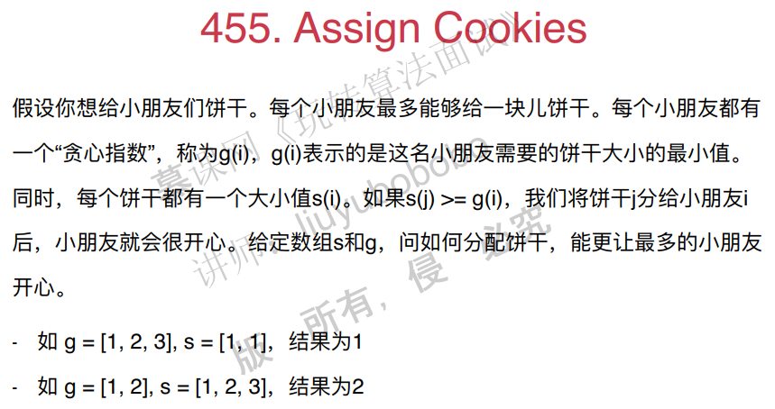
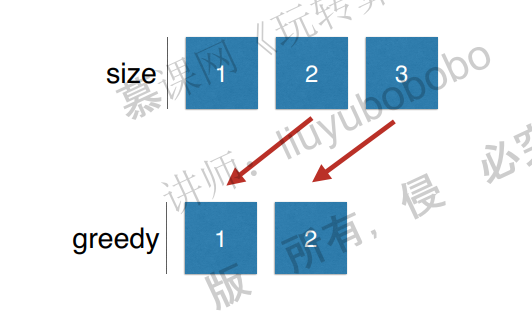
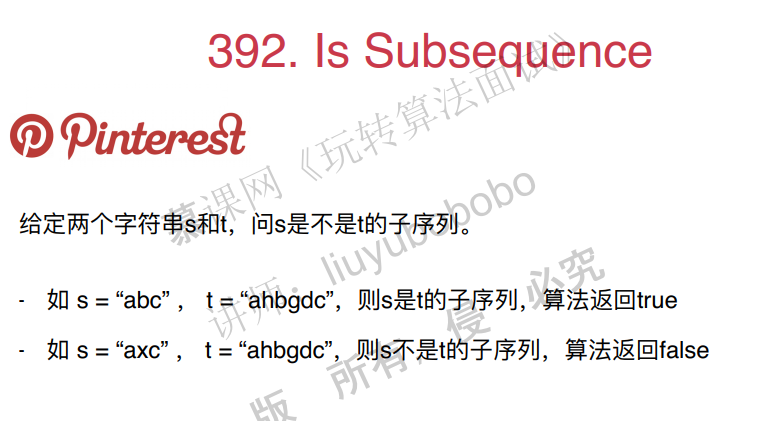

# 贪心算法

## 1. 贪心基础

面试题：

思路：

把size最大的饼干给最贪心的小朋友，这样实际上在这一步就已经最优了。

解题步骤：

1. 排序。时间复杂度nlog(n)。
2. 给最贪心的小朋友先分配，不行再给次贪心的小朋友分配。

c++代码：

~~~c++
#include <iostream>
#include <vector>
#include <algorithm>

using namespace std;

/// 455. Assign Cookies
/// https://leetcode.com/problems/assign-cookies/description/
/// 先尝试满足最贪心的小朋友
/// 时间复杂度: O(nlogn)
/// 空间复杂度: O(1)
class Solution {
public:
    int findContentChildren(vector<int>& g, vector<int>& s) {
		//从大到小的排序！！！
        sort(g.begin(), g.end(), greater<int>());
        sort(s.begin(), s.end(), greater<int>());

        int gi = 0, si = 0;
        int res = 0;
        while(gi < g.size() && si < s.size()){
            if(s[si] >= g[gi]){
                res ++;
                si ++;
                gi ++;
            }
            else
                gi ++;
        }

        return res;
    }
};

int main() {

    int g1[] = {1, 2, 3};
    vector<int> gv1(g1, g1 + sizeof(g1)/sizeof(int));
    int s1[] = {1, 1};
    vector<int> sv1(s1, s1 + sizeof(s1)/sizeof(int));
    cout << Solution().findContentChildren(gv1, sv1) << endl;

    int g2[] = {1, 2};
    vector<int> gv2(g2, g2 + sizeof(g2)/sizeof(int));
    int s2[] = {1, 2, 3};
    vector<int> sv2(s2, s2 + sizeof(s2)/sizeof(int));
    cout << Solution().findContentChildren(gv2, sv2) << endl;

    return 0;
}
~~~

其他面试题：

## 2. 贪心算法和动态规划的关系

## 3. 贪心选择性质的证明

