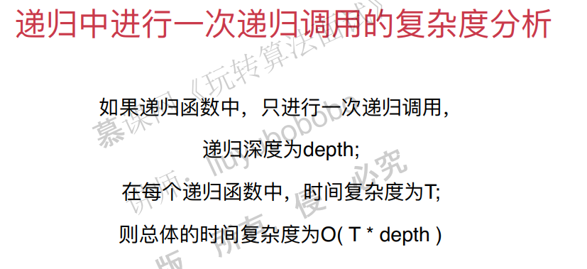
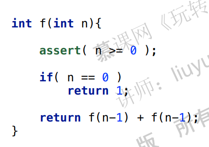
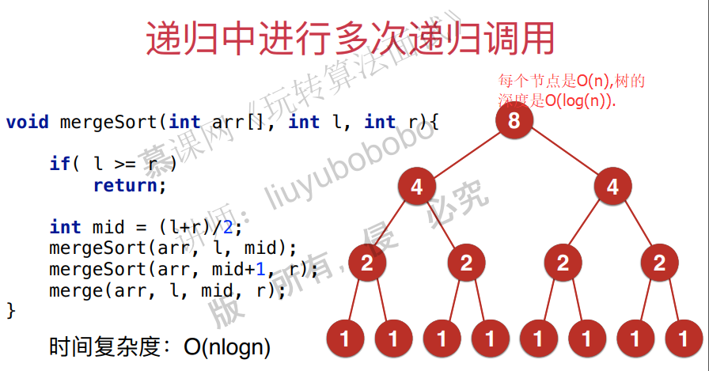
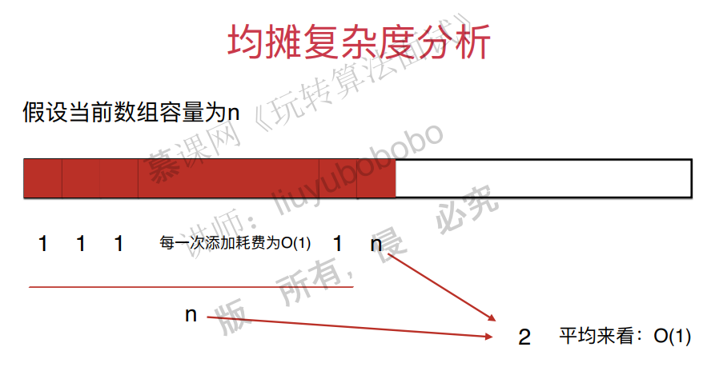
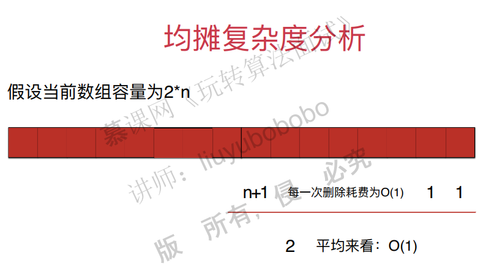
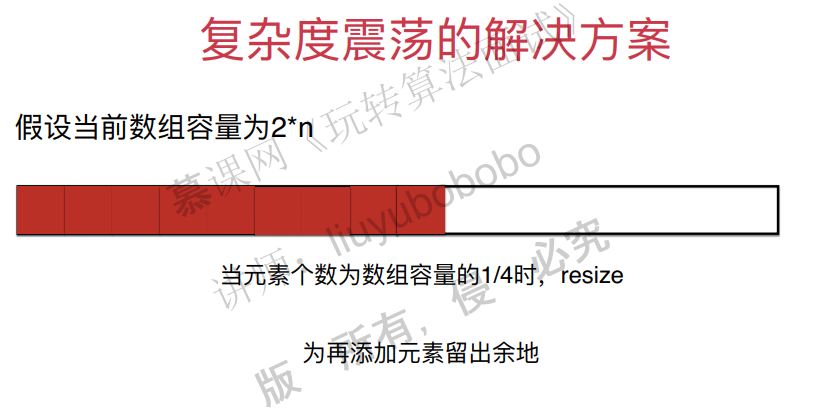

## 二、面试中的复杂度分析

### 时间复杂度自己的理解

时间复杂度自己的理解：

如果$f(n)=n^2+2n+3$ ，如果能够找到一个$g(n)$能使极限$lim_{n→0}f(n)/g(n)=0$，则时间复杂度为：$O(g(n))$ 。

### 递归算法的复杂度分析

主要考虑两种情况：

多次调用的情况。

假设：

时间复杂度分析：

计算时间复杂度，就是计算总运算的数量。实际上只要计算每一层的节点数目就可以代表相应数字运行的次数。

归并排序的情况：

### 均摊复杂度分析

典型例子，动态数组（vector）:

### 防止复杂度震荡

