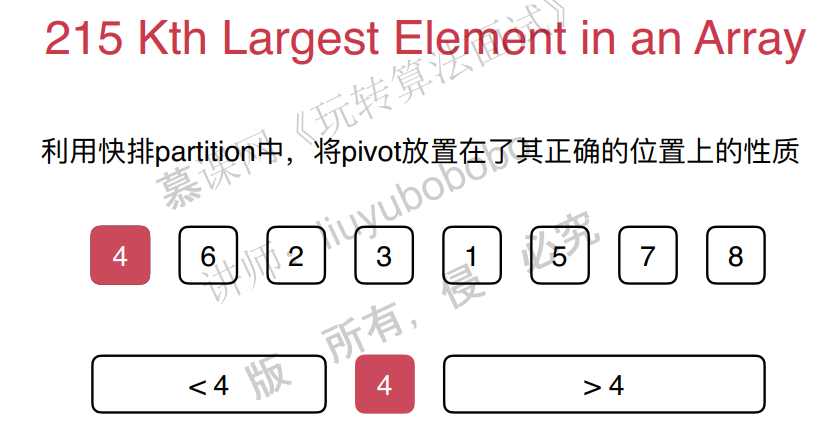
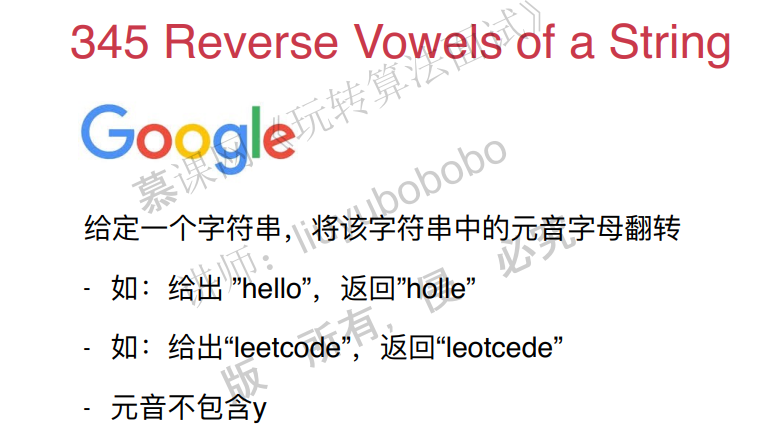

## 三、数组中的问题最常见

### 1. 从二分查找法看如任何写出正确的程序

数组看上去简单，实际上在很多场景都有应用。

比如，在排序中：选择排序，插入排序，归并排序，快速排序。

查找：二分查找

数据结构中的底层实现：栈，队列，堆

**二分查找**

二分查找条件：有序数列

二分查找需要定义好变量，明确边界。

代码如下：

```c++
#include <iostream>
#include <cmath>
#include <cassert>
#include <ctime>
#include "util.h"

using namespace std;

template<typename T>
int binarySearch(T arr[], int n, T target){

    int l = 0, r = n - 1; // 在[l...r]的范围里寻找target
    while(l <= r){    // 当 l == r时,区间[l...r]依然是有效的
        int mid = l + (r - l) / 2;
        if(arr[mid] == target) return mid;
        if(target > arr[mid])
            l = mid + 1;  // target在[mid+1...r]中; [l...mid]一定没有target
        else    // target < arr[mid]
            r = mid - 1;  // target在[l...mid-1]中; [mid...r]一定没有target
    }

    return -1;
}

int main() {

    int n = pow(10, 7);
    int* data = MyUtil::generateOrderedArray(n);

    clock_t startTime = clock();
    for(int i = 0 ; i < n ; i ++)
        assert(i == binarySearch(data, n, i));
    clock_t endTime = clock();

    cout << "Binary Search test complete." << endl;
    cout << "Time cost: " << double(endTime - startTime) / CLOCKS_PER_SEC << " s" << endl;

    return 0;
}
```

### 2. 改变变量的定义，依然可以写出正确的算法

pass

### 3. 在leetcode上解决第一个问题move zeros


这个题目有好几个思路：

思路1：将非零元素拷贝的一个新的数组中，完了之后，将这个数组拷贝回原数组，并且末尾的元素赋值为0。

```c++
#include <iostream>
#include <vector>

using namespace std;

// 283. Move Zeroes
// https://leetcode.com/problems/move-zeroes/description/
// 时间复杂度: O(n)
// 空间复杂度: O(n)
class Solution {
public:
    void moveZeroes(vector<int>& nums) {

        vector<int> nonZeroElements;

        // 将vec中所有非0元素放入nonZeroElements中
        for(int i = 0 ; i < nums.size() ; i ++)
            if(nums[i])
                nonZeroElements.push_back(nums[i]);

        // 将nonZeroElements中的所有元素依次放入到nums开始的位置
        for(int i = 0 ; i < nonZeroElements.size() ; i ++)
            nums[i] = nonZeroElements[i];

        // 将nums剩余的位置放置为0
        for(int i = nonZeroElements.size() ; i < nums.size() ; i ++)
            nums[i] = 0;
    }
};

int main() {

    int arr[] = {0, 1, 0, 3, 12};
    vector<int> vec(arr, arr + sizeof(arr)/sizeof(int));

    Solution().moveZeroes(vec);

    for(int i = 0 ; i < vec.size() ; i ++)
        cout << vec[i] << " ";
    cout << endl;

    return 0;
}
```

思路2：原地赋值。

遍历数组，如果元素非零，赋值给索引k的位置，同时k++。如果为零，则不用赋值，同时k也不做操作。宗旨就是，遍历快的那个元素，遇到零了就不要去做什么动作。

```c++
#include <iostream>
#include <vector>

using namespace std;

// 283. Move Zeroes
// https://leetcode.com/problems/move-zeroes/description/
//
// 原地(in place)解决该问题
// 时间复杂度: O(n)
// 空间复杂度: O(1)
class Solution {
public:
    void moveZeroes(vector<int>& nums) {

        int k = 0; // nums中, [0...k)的元素均为非0元素

        // 遍历到第i个元素后,保证[0...i]中所有非0元素
        // 都按照顺序排列在[0...k)中
        for(int i = 0 ; i < nums.size() ; i ++)
            if(nums[i])
                nums[k++] = nums[i];

        // 将nums剩余的位置放置为0
        for(int i = k ; i < nums.size() ; i ++)
            nums[i] = 0;
    }
};

int main() {

    int arr[] = {0, 1, 0, 3, 12};
    vector<int> vec(arr, arr + sizeof(arr) / sizeof(int));

    Solution().moveZeroes(vec);

    for(int i = 0 ; i < vec.size() ; i ++)
        cout << vec[i] << " ";
    cout << endl;

    return 0;
}
```

### 4. 即使简单的问题，也有很多优化的思路

思路3：原地交换

将零元素和非零元素进行交换位置。注意一点：遍历快的那个索引，如果遇到0，遍历慢的那个索引就不需要加1。

```c++
#include <iostream>
#include <vector>

using namespace std;

// 283. Move Zeroes
// https://leetcode.com/problems/move-zeroes/description/
//
// 原地(in place)解决该问题
// 时间复杂度: O(n)
// 空间复杂度: O(1)
class Solution {
public:
    void moveZeroes(vector<int>& nums) {

        int k = 0; // nums中, [0...k)的元素均为非0元素

        // 遍历到第i个元素后,保证[0...i]中所有非0元素
        // 都按照顺序排列在[0...k)中
        // 同时, [k...i] 为 0
        for(int i = 0 ; i < nums.size() ; i ++)
            if(nums[i])
                swap(nums[k++] , nums[i]);

    }
};

int main() {

    int arr[] = {0, 1, 0, 3, 12};
    vector<int> vec(arr, arr + sizeof(arr) / sizeof(int));

    Solution().moveZeroes(vec);

    for(int i = 0 ; i < vec.size() ; i ++)
        cout << vec[i] << " ";
    cout << endl;

    return 0;
}
```

### 5. 三路快排partition思路的应用Sort colors


看到这个题目，如果没有思路，可以直接使用常规的排序方法。

但是这一题有特殊条件的，因此，一定可以有更好的解法。

思路1：使用统计的方法，分别统计出三个数字的总数，然后将原数组赋值就可以了。

```c++
#include <iostream>
#include <vector>
#include <cassert>

using namespace std;

// 75. Sort Colors
// https://leetcode.com/problems/sort-colors/description/
//
// 计数排序的思路
// 对整个数组遍历了两遍
// 时间复杂度: O(n)
// 空间复杂度: O(k), k为元素的取值范围
class Solution {
public:
    void sortColors(vector<int> &nums) {

        int count[3] = {0};    // 存放0, 1, 2三个元素的频率
        for(int i = 0 ; i < nums.size() ; i ++){
            assert(nums[i] >= 0 && nums[i] <= 2);
            count[nums[i]] ++;
        }

        int index = 0;
        for(int i = 0 ; i < count[0] ; i ++)
            nums[index++] = 0;
        for(int i = 0 ; i < count[1] ; i ++)
            nums[index++] = 1;
        for(int i = 0 ; i < count[2] ; i ++)
            nums[index++] = 2;

        // 小练习: 自学编写计数排序算法
    }
};

int main() {

    int nums[] = {2, 2, 2, 1, 1, 0};
    vector<int> vec = vector<int>(nums, nums + sizeof(nums)/sizeof(int));

    Solution().sortColors(vec);
    for(int i = 0 ; i < vec.size() ; i ++)
        cout << vec[i] << " ";
    cout << endl;

    return 0;
}
```

通过思路1能够解决问题，但是假设我们想只遍历一遍，需要怎么做？

思路2：三路快排。

pass


其他面试题：




### 6. 对撞指针Two sum

Two sum


注意条件：1. 有序。2. 返回两个元素。

思路1：暴力解法，双层遍历，O(n2)。超时的。

```c++
// 167. Two Sum II - Input array is sorted
// https://leetcode.com/problems/two-sum-ii-input-array-is-sorted/description/
//
// 暴力枚举法
// 时间复杂度: O(n^2)
// 空间复杂度: O(1)
class Solution {
public:
    vector<int> twoSum(vector<int>& numbers, int target) {

        assert(numbers.size() >= 2);
        // assert(isSorted(numbers));

        for(int i = 0 ; i < numbers.size() ; i ++)
            for(int j = i+1 ; j < numbers.size() ; j ++)
                if(numbers[i] + numbers[j] == target){
                    int res[2] = {i+1, j+1};
                    return vector<int>(res, res+2);
                }

        throw invalid_argument("the input has no solution");
    }

private:
    bool isSorted(const vector<int>& numbers){
        for(int i = 1 ; i < numbers.size() ; i ++)
            if(numbers[i] < numbers[i-1])
                return false;
        return true;
    }
};
```

思路2：考虑到数组是有序的，对i个元素，剩下元素通过二分查找。O(nlogn)


思路3：由于有序，考虑使用指针对撞的方法。O(n)

```c++
// 167. Two Sum II - Input array is sorted
// https://leetcode.com/problems/two-sum-ii-input-array-is-sorted/description/
//
// 对撞指针
// 时间复杂度: O(n)
// 空间复杂度: O(1)
class Solution {

public:
    vector<int> twoSum(vector<int>& numbers, int target) {

        assert(numbers.size() >= 2);
        // assert(isSorted(numbers));

        int l = 0, r = numbers.size() - 1;
        while(l < r){

            if(numbers[l] + numbers[r] == target){
                int res[2] = {l+1, r+1};
                return vector<int>(res, res+2);
            }
            else if(numbers[l] + numbers[r] < target)
                l ++;
            else // numbers[l] + numbers[r] > target
                r --;
        }

        throw invalid_argument("the input has no solution");
    }

private:
    bool isSorted(const vector<int>& numbers){
        for(int i = 1 ; i < numbers.size() ; i ++)
            if(numbers[i] < numbers[i-1])
                return false;
        return true;
    }

};
```

其他的题目：





###  


