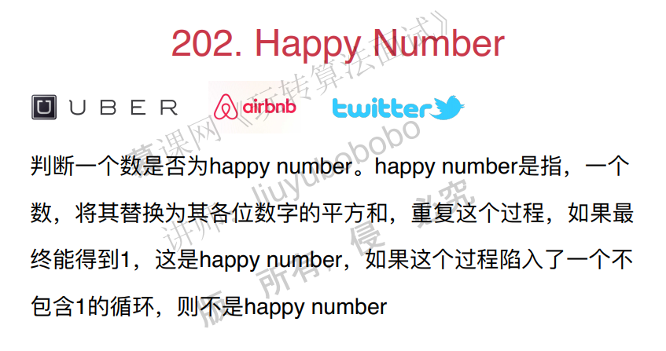
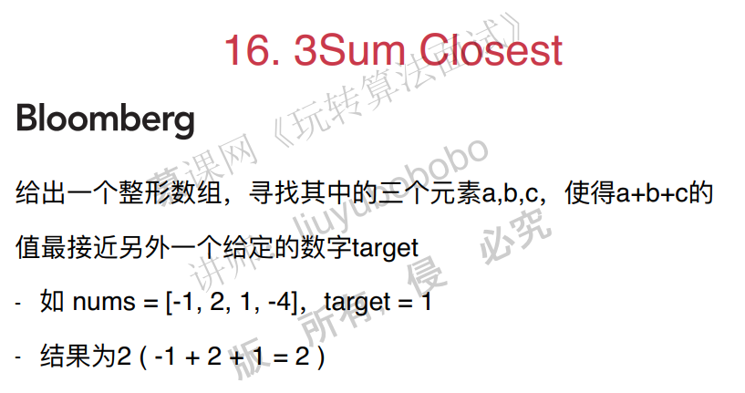
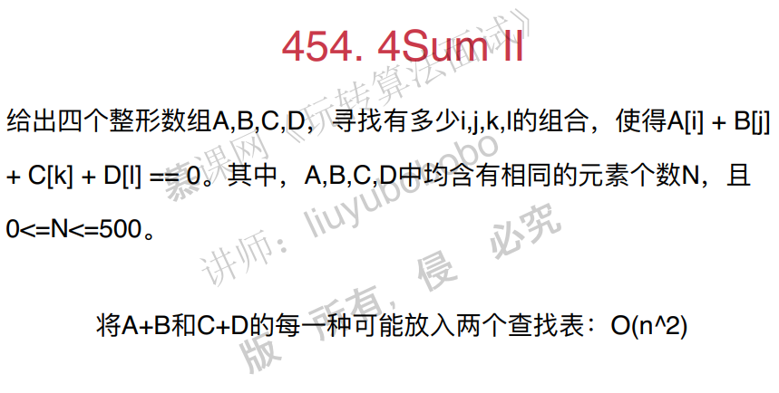

## 二、查找表相关问题

### 1. set的使用Intersection of Two array

#### 1.1 什么是查找问题

查找问题可以分为两类：

1. 查找有无，元素‘a’是否存在。对应数据结构为set，集合。
2. 查找对应关系（键值对应），元素‘a’出现了多少次？对应的数据结构为map，字典。

#### 1.2 set和map的常用函数

set和map在很多语言的标准库中都有，它们屏蔽了实现细节。不过我们要知道这些数据结构是怎么用的。

set和map的常见操作包括：

- insert：插入一个元素
- find：查找一个元素是否存在
- erase：清除元素
- change（map），改变键对应的值

#### 1.3 面试题：Intersection of two arrays


**思路**

思路1（自己的解决方法）：使用暴力方法解决，遍历nums1，看nums1中的元素是否存在于nums2数组中，若存在则保存下来，注意要保存在set当中，因为不能出现重复。

```c++
// 时间复杂度：O(n2),vector的查找时间复杂度O(n)
class Solution {
public:
    vector<int> intersection(vector<int>& nums1, vector<int>& nums2) {
        //set<int> record(nums1.begin(),nums1.end());
        set<int> result;
        for(int i=0;i<nums2.size();i++){
            if(find(nums1.begin(),nums1.end(),nums2[i])!=nums1.end()){
                result.insert(nums2[i]);
            }
        }
        return vector<int>(result.begin(),result.end());

    }
};
```

思路2，使用set解决。将nums1放入set中，对于nums2中的每个元素都在nums1中进行查找，如果找到了就放到set中。

实现代码1：

```c++
#include <iostream>
#include <vector>
#include <set>

using namespace std;

// 349. Intersection of Two Arrays
// https://leetcode.com/problems/intersection-of-two-arrays/description/
// 时间复杂度: O(nlogn)
// 空间复杂度: O(n)
class Solution {
public:
    vector<int> intersection(vector<int>& nums1, vector<int>& nums2) {

        set<int> record;
        for( int i = 0 ; i < nums1.size() ; i ++ )
            record.insert(nums1[i]);

        set<int> resultSet;
        for( int i = 0 ; i < nums2.size() ; i ++ )
            if(record.find(nums2[i]) != record.end())
                resultSet.insert(nums2[i]);

        vector<int> resultVector;
        for(set<int>::iterator iter = resultSet.begin(); iter != resultSet.end(); iter ++ )
            resultVector.push_back(*iter);

        return resultVector;
    }
};

int main() {

    int nums1[] = {1, 2, 2, 1};
    vector<int> vec1(nums1, nums1 + sizeof(nums1)/sizeof(int));

    int nums2[] = {2, 2};
    vector<int> vec2(nums2, nums2 + sizeof(nums2)/sizeof(int));

    vector<int> res = Solution().intersection(vec1, vec2);
    for(int i = 0 ; i < res.size() ; i ++ )
        cout << res[i] << " ";
    cout << endl;

    return 0;
}
```

实现代码2：

```c++
#include <iostream>
#include <vector>
#include <set>
using namespace std;

// 349. Intersection of Two Arrays
// https://leetcode.com/problems/intersection-of-two-arrays/description/
// 时间复杂度: O(nlogn)
// 空间复杂度: O(n)
class Solution {
public:
    vector<int> intersection(vector<int>& nums1, vector<int>& nums2) {

        set<int> record(nums1.begin(), nums1.end());

        set<int> resultSet;
        for( int i = 0 ; i < nums2.size() ; i ++ )
            if( record.find(nums2[i]) != record.end() )
                resultSet.insert( nums2[i] );

        return vector<int>(resultSet.begin(), resultSet.end());
    }
};

int main() {

    int nums1[] = {1, 2, 2, 1};
    vector<int> vec1(nums1, nums1 + sizeof(nums1)/sizeof(int));

    int nums2[] = {2, 2};
    vector<int> vec2(nums2, nums2 + sizeof(nums2)/sizeof(int));

    vector<int> res = Solution().intersection(vec1, vec2);
    for(int i = 0 ; i < res.size() ; i ++ )
        cout<<res[i]<<" ";
    cout<<endl;

    return 0;
}
```

### 2. map的使用Intersection of Two arrays II

#### 2.1 map的坑

需要特别的注意，在c++中，map的值有默认值，如果是int的话是0。 map的key一旦被访问（myMap[42]，这样叫访问）过，就会添加默认的(key, value)对在map中!

```c++
#include <iostream>
#include <vector>
#include <map>

using namespace std;

int main() {

    map<int,int> myMap;
    if(myMap.find(42) == myMap.end())
        cout << "Can not find element 42" << endl;
    else
        cout << "Element 42 is in the map" << endl;

    cout << myMap[42] << endl; // 输出 0

    // 注意: 在C++中, map的key一旦被访问过, 就会添加默认的(key, value)对在map中!
    // 以下代码将找到42, 因为之前使用myMap[42]的方式对42进行了访问!
    if(myMap.find(42) == myMap.end())
        cout << "Can not find element 42" << endl;
    else
        cout << "Element 42 is in the map" << endl;

    myMap[42] ++;
    cout << myMap[42] << endl; // 输出 1
    if(myMap.find(42) == myMap.end())
        cout << "Can not find element 42" << endl;
    else
        cout << "Element 42 is in the map" << endl;

    myMap[42] --;
    cout << myMap[42] << endl; // 输出 0

    // 注意: key对应的值为0, 不代表key不存在
    if(myMap.find(42) == myMap.end())
        cout << "Can not find element 42" << endl;
    else
        cout << "Element 42 is in the map" << endl;

    // 使用erase删除一个key
    myMap.erase(42);
    if(myMap.find(42) == myMap.end())
        cout << "Can not find element 42" << endl;
    else
        cout << "Element 42 is in the map" << endl;

    return 0;
}
```

#### 2.2 面试题：Intersection of two arrays II


自己的思路：

1.使用vector解决：遍历vec1，查找vec2中是否有这个元素，有就push到一个新的vec中。这种做法是错误的，因为不确定查找的那个vec有多少个待寻找的元素。

2.将nums1，nums2都加入的map中，然后比较map中一样的键，取相应小的那个值，推入到vec中就可以了。

使用map解决：

思路：将nums1数组放入map中，计数。然后遍历nums2，查找map中相应的值是否>0，是的话，将这个元素push到一个vector，相应的值减1，否则不push。

```c++
#include <iostream>
#include <vector>
#include <map>

using namespace std;

// 350. Intersection of Two Arrays II
// https://leetcode.com/problems/intersection-of-two-arrays-ii/description/
// 时间复杂度: O(nlogn)
// 空间复杂度: O(n)
class Solution {
public:
    vector<int> intersect(vector<int>& nums1, vector<int>& nums2) {

        map<int, int> record;
        for(int i = 0 ; i < nums1.size() ; i ++)
            record[nums1[i]] += 1;
        vector<int> resultVector;
        for(int i = 0 ; i < nums2.size() ; i ++)
            if(record[nums2[i]] > 0){
                resultVector.push_back(nums2[i]);
                record[nums2[i]] --;
            }
        return resultVector;
    }
};

int main() {

    int nums1[] = {1, 2, 2, 1};
    vector<int> vec1(nums1, nums1 + sizeof(nums1)/sizeof(int));

    int nums2[] = {2, 2};
    vector<int> vec2(nums2, nums2 + sizeof(nums2)/sizeof(int));

    vector<int> res = Solution().intersect(vec1, vec2);
    for(int i = 0 ; i < res.size() ; i ++)
        cout << res[i] << " ";
    cout << endl;
    return 0;
}
```

注意，以上方法存在一个问题，就是键访问过后，相应的值就为默认值0。因此可以进行改良，不直接访问map。

```c++
#include <iostream>
#include <vector>
#include <map>

using namespace std;

// 350. Intersection of Two Arrays II
// https://leetcode.com/problems/intersection-of-two-arrays-ii/description/
// 时间复杂度: O(nlogn)
// 空间复杂度: O(n)
class Solution {
public:
    vector<int> intersect(vector<int>& nums1, vector<int>& nums2) {

        map<int, int> record;
        for(int i = 0 ; i < nums1.size() ; i ++)
            if(record.find(nums1[i]) == record.end())
                //建立这个键值对，不通过record[idx]的方式来访问。
                record.insert(make_pair(nums1[i],1));
            else
                record[nums1[i]] += 1;

        vector<int> resultVector;
        for(int i = 0 ; i < nums2.size() ; i ++)
            if(record.find(nums2[i]) != record.end() &&
               record[nums2[i]] > 0){

                resultVector.push_back(nums2[i]);
                record[nums2[i]] --;
                //如果键对应的值是0，则删除这个键值对
                if(record[nums2[i]] == 0)
                    record.erase(nums2[i]);
            }

        return resultVector;
    }
};

int main() {

    int nums1[] = {1, 2, 2, 1};
    vector<int> vec1(nums1, nums1 + sizeof(nums1)/sizeof(int));

    int nums2[] = {2, 2};
    vector<int> vec2(nums2, nums2 + sizeof(nums2)/sizeof(int));

    vector<int> res = Solution().intersect(vec1, vec2);
    for(int i = 0 ; i < res.size() ; i ++)
        cout << res[i] << " ";
    cout << endl;

    return 0;
}
```

还有通过multiset来进行解决。

```c++
pass
```


### 3. set和map不同的底层实现的区别

普通数组，就最简单的那种数组。插入一个元素直接在尾巴加。查找需要遍历数组，删除也要移动数组。

顺序数组，就是数组的数字都有顺序。插入一个元素需要遍历数组进行比较。查找数组可以用二分查找，复杂度为log(n)，删除元素需要移动。

二分搜索树，插入，查找和删除的时间复杂度都是log(n)

哈希表：哈希表的插入查找删除的时间复杂度都是O(1)，但是哈希表的缺点是没有顺序。


数据的顺序性有很多好处：


当我们对顺序没有要求的时候，可以考虑使用unorder_set或者unorder_map，它们的底层实现是哈希表，时间复杂度为O(1)，因此是性能非常好的数据结构。不过由于一般的map和set的底层实现是二分搜索树，时间复杂度是O(logn)级别，复杂度还算挺好的，所以用map和set也不错。

使用unorder_set和unorder_map的实现：

set

```c++
#include <iostream>
#include <vector>
#include <unordered_set>
using namespace std;

// 349. Intersection of Two Arrays
// https://leetcode.com/problems/intersection-of-two-arrays/description/
// 时间复杂度: O(len(nums1)+len(nums2))
// 空间复杂度: O(len(nums1))
class Solution {
public:
    vector<int> intersection(vector<int>& nums1, vector<int>& nums2) {

        unordered_set<int> record(nums1.begin(), nums1.end());

        unordered_set<int> resultSet;
        for(int i = 0; i < nums2.size(); i ++ )
            if(record.find(nums2[i]) != record.end())
                resultSet.insert(nums2[i]);

        return vector<int>(resultSet.begin(), resultSet.end());
    }
};

int main() {

    int nums1[] = {1, 2, 2, 1};
    vector<int> vec1(nums1, nums1 + sizeof(nums1)/sizeof(int));

    int nums2[] = {2, 2};
    vector<int> vec2(nums2, nums2 + sizeof(nums2)/sizeof(int));

    vector<int> res = Solution().intersection(vec1, vec2);
    for(int i = 0 ; i < res.size() ; i ++ )
        cout << res[i] << " ";
    cout << endl;

    return 0;
}
```

map

```c++
#include <iostream>
#include <vector>
#include <unordered_map>
using namespace std;

// 350. Intersection of Two Arrays II
// https://leetcode.com/problems/intersection-of-two-arrays-ii/description/
// 时间复杂度: O(len(nums1)+len(nums2))
// 空间复杂度: O(len(nums1))
class Solution {
public:
    vector<int> intersect(vector<int>& nums1, vector<int>& nums2) {

        unordered_map<int, int> record;
        for( int i = 0 ; i < nums1.size() ; i ++ )
            record[nums1[i]] += 1;

        vector<int> resultVector;
        for(int i = 0; i < nums2.size(); i ++)
            if(record[ nums2[i] ] > 0){
                resultVector.push_back(nums2[i]);
                record[nums2[i]] --;
            }

        return resultVector;
    }
};

int main() {

    int nums1[] = {1, 2, 2, 1};
    vector<int> vec1(nums1, nums1 + sizeof(nums1)/sizeof(int));

    int nums2[] = {2, 2};
    vector<int> vec2(nums2, nums2 + sizeof(nums2)/sizeof(int));

    vector<int> res = Solution().intersect(vec1, vec2);
    for(int i = 0; i < res.size(); i ++)
        cout << res[i] << " ";
    cout << endl;

    return 0;
}
```

其他面试题：


重新将字符串打乱。

解答1：将其加入到map当中。然后--，出现-1就false。

```c++
/// Source : https://leetcode.com/problems/valid-anagram/
/// Author : liuyubobobo
/// Time   : 2017-01-17

#include <iostream>

using namespace std;

/// Using Hashtable
/// Time Complexity: O(n)
/// Space Complexity: O(26)
class Solution {
public:
    bool isAnagram(string s, string t) {
        //注意s和t一定要size相等。
        if( s.size() != t.size() )
            return false;

        int freq[26] = {0};
        for( int i = 0 ; i < s.size() ; i ++ )
            freq[s[i]-'a'] ++;

        for( int i = 0 ; i < t.size() ; i ++ ){
            freq[t[i]-'a'] --;
            if( freq[t[i]-'a'] < 0 )
                return false;
        }

        return true;
    }
};
```

解法2：直接排序，然后看是否相等。

```c++
/// Source : https://leetcode.com/problems/valid-anagram/
/// Author : liuyubobobo
/// Time   : 2018-08-13

#include <iostream>

using namespace std;

/// Sorting
/// Time Complexity: O(nlogn)
/// Space Complexity: O(1)
class Solution {
public:
    bool isAnagram(string s, string t) {

        sort(s.begin(), s.end());
        sort(t.begin(), t.end());

        return s == t;
    }
};
```

思路：计算一个数字的平方和，加入到set当中。




```c++
/// Source : https://leetcode.com/problems/happy-number/
/// Author : liuyubobobo
/// Time   : 2017-01-18

#include <iostream>
#include <unordered_set>

using namespace std;

/// Using HashTable
/// Time Complexity: O(?)
/// Space Complexity: O(?)
class Solution {
public:
    bool isHappy(int n) {

        unordered_set<int> record;
        record.insert(n);
        while(n != 1){
            n = op(n);
            if( record.find(n) == record.end() )
                record.insert(n);
            else
                return false;
        }

        return true;
    }

private:
    int op(int x){
        int res = 0;
        while(x){
            int t = x % 10;
            res += t * t;
            x /= 10;
        }
        return res;
    }
};
```


### 4. 使用查找表的经典问题

面试题：Two sum


注意，这个数组没有说是有序的，如果有序，直接用双指针对撞技术就可以了。

思路：

1. 暴力解法，时间复杂度O(n2)
2. 排序后，使用双指针对撞，O(nlog(n))+O(n)=O(nlog(n))，问题是这样需要储存相应的索引。
3. 将元素放入查找表（o(n)）。之后对于每个元素a，查找target-a是否存在（o（n）），其中键表示元素，值表示元素的索引。但这里仍然有一个问题，假设使用的是unordered_map这个查找表，那么将元素放入表中会可能存在有两个相同元素作为键的情况，这样后一个元素的索引会覆盖前一个元素的索引，这样在后续的查找中就会出现问题。因此要考虑其他的方法。

```c++
//依照3的解法，在leetcode上是可以接受的，因为加了record[comp]!=i这个判断就不用管覆盖的问题。
class Solution {
public:
    vector<int> twoSum(vector<int>& nums, int target) {
        unordered_map<int,int> record;
        for(int i=0;i<nums.size();i++){
            record[nums[i]]=i;
        }
        for(int i=0;i<nums.size();i++){
            int comp=target-nums[i];
            if(record.find(comp)!=record.end()&&record[comp]!=i){
                vector<int> res={i,record[comp]};
                return res;
            }
        }
    }
};
```

这个时候考虑，在查找元素的时候，让它和它前面的查找表进行对比，如果找到就返回。


代码：

```c++
#include <iostream>
#include <vector>
#include <cassert>
#include <unordered_map>

using namespace std;

// 1. Two Sum
// https://leetcode.com/problems/two-sum/description/
// 时间复杂度：O(n)
// 空间复杂度：O(n)
class Solution {
public:
    vector<int> twoSum(vector<int>& nums, int target) {

        unordered_map<int,int> record;
        for(int i = 0 ; i < nums.size() ; i ++){

            int complement = target - nums[i];
            if(record.find(complement) != record.end()){
                int res[] = {i, record[complement]};
                return vector<int>(res, res + 2);
            }

            record[nums[i]] = i;
        }

        throw invalid_argument("the input has no solution");
    }
};
```

总结：将一个问题转化为查找问题（索引和值对换！），速度可能会很快。

其他题目：


自己的解答：

~~~c++
//程序正确，但是超时。
class Solution {
public:
    vector<vector<int>> threeSum(vector<int>& nums) {
        vector<vector<int>> result;
        set<vector<int>> set_;
        for(int i=0;i<nums.size();i++){
            for(int j=i+1;j<nums.size();j++){
                for(int k=j+1;k<nums.size();k++){
                    if(nums[i]+nums[j]+nums[k]==0){
                        vector<int> vec={nums[i],nums[j],nums[k]};
                        sort(vec.begin(),vec.end());
                        set_.insert(vec);
                    }
                }
            }
        }
        result=vector<vector<int>>(set_.begin(),set_.end());
        return result;
    }
};
~~~

波波的解答：

~~~c++
/// Source : https://leetcode.com/problems/3sum/
/// Author : liuyubobobo
/// Time   : 2016-12-03

#include <iostream>
#include <vector>
#include <unordered_map>

using namespace std;

/// Using Hash Table to store all the numbers
///
/// Time Complexity: O(n^2)
/// Space Complexity: O(n)
class Solution {

public:
    vector<vector<int>> threeSum(vector<int>& nums) {
		//将所有元素加入到map中
        unordered_map<int, int> counter;
        for(int i = 0 ; i < nums.size() ; i ++)
            counter[nums[i]] ++;

        vector<vector<int>> res;

        if(counter[0] >= 3)
            res.push_back({0, 0, 0});

        // 去除重复元素操作。
        sort(nums.begin(), nums.end());
        vector<int>::iterator iter = unique(nums.begin(), nums.end());
        nums.erase(iter, nums.end());

        for(int i = 0 ; i < nums.size() ; i ++)
            for(int j = i + 1 ; j < nums.size() ; j ++){

                if(nums[i] * 2 + nums[j] == 0 && counter[nums[i]] >= 2)
                    res.push_back({nums[i], nums[i], nums[j]});

                if(nums[i] + nums[j] * 2 == 0 && counter[nums[j]] >= 2)
                    res.push_back({nums[i], nums[j], nums[j]});

                int c = 0 - nums[i] - nums[j];
                if(c > nums[j] && counter[c] != 0)
                    res.push_back({nums[i], nums[j], c});
            }

        return res;
    }
};

int main() {

    vector<int> nums1 = {-1, 0, 1, 2, -1, -4};
    vector<vector<int>> res = Solution().threeSum(nums1);
    for( int i = 0 ; i < res.size() ; i ++ ){
        for( int j = 0 ; j < res[i].size() ; j ++ )
            cout<<res[i][j]<<" ";
        cout<<endl;
    }

    return 0;
}
~~~




### 5. 灵活选择键值4sum II

面试题：4sum II


解决思路：

思路1：使用暴力解法，这种解法的时间复杂度为o(n4)，肯定超时。

思路2： 将D中的元素放入到查找表中，时间复杂度为O(n3)，这个也会超时。

思路3：将C+D的每一种可能放入查找表中，时间复杂度O(n2)。

此类问题是典型的拿空间换时间！

代码：

```c++
#include <iostream>
#include <vector>
#include <unordered_map>
#include <cassert>

using namespace std;

// 454. 4Sum II
// https://leetcode.com/problems/4sum-ii/description/
// 时间复杂度: O(n^2)
// 空间复杂度: O(n^2)
class Solution {
public:
    int fourSumCount(vector<int>& A, vector<int>& B, vector<int>& C, vector<int>& D) {

        unordered_map<int,int> hashtable;
        for(int i = 0 ; i < C.size() ; i ++)
            for(int j = 0 ; j < D.size() ; j ++)
                hashtable[C[i]+D[j]] += 1;

        int res = 0;
        for(int i = 0 ; i < A.size() ; i ++)
            for(int j = 0 ; j < B.size() ; j ++)
                if(hashtable.find(-A[i]-B[j]) != hashtable.end())
                    res += hashtable[-A[i]-B[j]];

        return res;
    }
};
```

还可以这么做：



代码：

```c++
#include <iostream>
#include <vector>
#include <unordered_map>
#include <cassert>
#include <stdexcept>

using namespace std;

// 454. 4Sum II
// https://leetcode.com/problems/4sum-ii/description/
// 时间复杂度: O(n^2)
// 空间复杂度: O(n^2)
class Solution {
public:
    int fourSumCount(vector<int>& A, vector<int>& B, vector<int>& C, vector<int>& D) {

        unordered_map<int,int> hashtable1;
        unordered_map<int,int> hashtable2;

        for(int i = 0 ; i < A.size() ; i ++)
            for(int j = 0 ; j < B.size() ; j ++)
                hashtable1[A[i]+B[j]] += 1;

        for(int i = 0 ; i < C.size() ; i ++)
            for(int j = 0 ; j < D.size() ; j ++)
                hashtable2[C[i]+D[j]] += 1;

        int res = 0;
        for(unordered_map<int,int>::iterator iter = hashtable1.begin() ; iter != hashtable1.end() ; iter ++)
            if(hashtable2.find(-(iter->first)) != hashtable2.end())
                res += iter->second * hashtable2[-(iter->first)];

        return res;
    }
};
```


### 6. 灵活选择键值 II Number of boomerangs

面试题目：


思路：

思路1：暴力解法O(n3)。

思路2：观察到i是一个枢纽，对于每个点i，遍历其余点到i的距离，O(n2)。


代码：

```c++
#include <iostream>
#include <vector>
#include <unordered_map>
#include <cassert>
#include <stdexcept>

using namespace std;

// 447. Number of Boomerangs
// https://leetcode.com/problems/number-of-boomerangs/description/
// 时间复杂度: O(n^2)
// 空间复杂度: O(n)
class Solution {
public:
    int numberOfBoomerangs(vector<pair<int, int>>& points) {

        int res = 0;
        for( int i = 0 ; i < points.size() ; i ++ ){

            // record中存储 点i 到所有其他点的距离出现的频次
            unordered_map<int, int> record;
            for(int j = 0 ; j < points.size() ; j ++)
                if(j != i)
                    // 计算距离时不进行开根运算, 以保证精度
                    record[dis(points[i], points[j])] += 1;

            for(unordered_map<int, int>::iterator iter = record.begin() ; iter != record.end() ; iter ++)
                res += (iter->second) * (iter->second - 1);
        }
        return res;
    }

private:
    int dis(const pair<int,int> &pa, const pair<int,int> &pb){
        return (pa.first - pb.first) * (pa.first - pb.first) +
               (pa.second - pb.second) * (pa.second - pb.second);
    }
};
```


### 7. 查找表和滑动窗口Contain duplicate II


### 8. 二分搜索树底层实现的顺序性Contain duplicate II