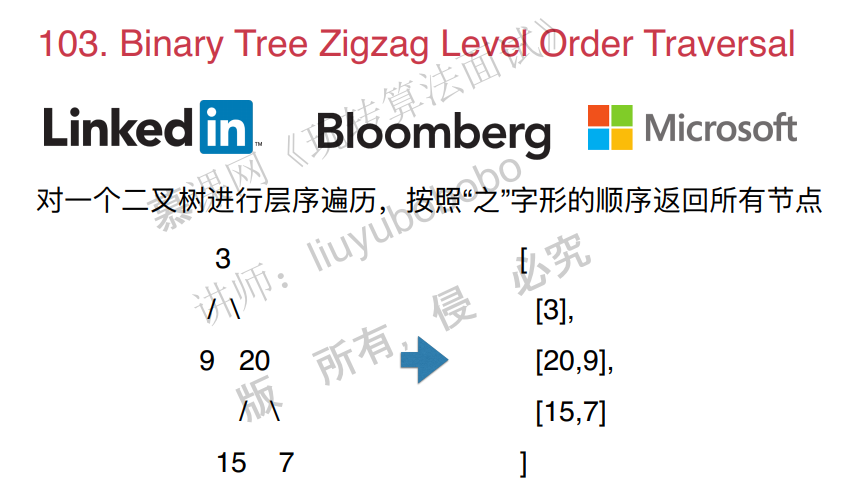
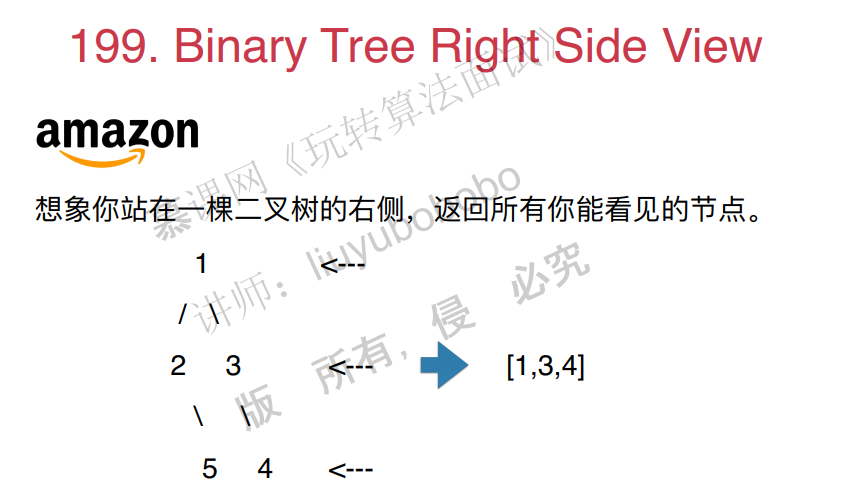

# 栈，队列和优先队列

## 1. 栈的基础应用 Valid parentheses

面试题：

~~~c++
#include <iostream>
#include <stack>
#include <cassert>

using namespace std;

// 20. Valid Parentheses
// https://leetcode.com/problems/valid-parentheses/description/
// 时间复杂度: O(n)
// 空间复杂度: O(n)
class Solution {
public:
    bool isValid(string s) {

        stack<char> stack;
        for( int i = 0 ; i < s.size() ; i ++ )
            if( s[i] == '(' || s[i] == '{' || s[i] == '[')
                stack.push(s[i]);
            else{

                if( stack.size() == 0 )
                    return false;

                char c = stack.top();
                stack.pop();

                char match;
                if( s[i] == ')' )
                    match = '(';
                else if( s[i] == ']' )
                    match = '[';
                else{
                    assert( s[i] == '}' );
                    match = '{';
                }

                if(c != match)
                    return false;
            }

        if( stack.size() != 0 )
            return false;

        return true;
    }
};
~~~

其他问题：

## 2. 栈和递归的紧密关系

二叉树的前中后序遍历。

前序遍历

~~~c++
#include <iostream>
#include <vector>

using namespace std;

/// 144. Binary Tree Preorder Traversal
/// https://leetcode.com/problems/binary-tree-preorder-traversal/description/
/// 二叉树的前序遍历
/// 时间复杂度: O(n), n为树的节点个数
/// 空间复杂度: O(h), h为树的高度

/// Definition for a binary tree node.
struct TreeNode {
    int val;
    TreeNode *left;
    TreeNode *right;
    TreeNode(int x) : val(x), left(NULL), right(NULL) {}
};

class Solution {
public:
    vector<int> preorderTraversal(TreeNode* root) {

        vector<int> res;
        __preorderTraversal(root, res);
        return res;
    }

private:
    void __preorderTraversal(TreeNode* node, vector<int> &res){

        if(node){
            res.push_back(node->val);
            __preorderTraversal(node->left, res);
            __preorderTraversal(node->right, res);
        }
    }
};

int main() {

    return 0;
}

~~~

中序遍历：

~~~c++
#include <iostream>
#include <vector>

using namespace std;

/// 94. Binary Tree Inorder Traversal
/// https://leetcode.com/problems/binary-tree-inorder-traversal/solution/
/// 二叉树的中序遍历
/// 时间复杂度: O(n), n为树的节点个数
/// 空间复杂度: O(h), h为树的高度

/// Definition for a binary tree node.
struct TreeNode {
    int val;
    TreeNode *left;
    TreeNode *right;
    TreeNode(int x) : val(x), left(NULL), right(NULL) {}
};

class Solution {
public:
    vector<int> inorderTraversal(TreeNode* root) {

        vector<int> res;
        __inorderTraversal(root, res);
        return res;
    }

private:
    void __inorderTraversal(TreeNode* node, vector<int> &res){

        if( node ){
            __inorderTraversal(node->left, res);
            res.push_back( node->val );
            __inorderTraversal(node->right, res);
        }
    }
};

int main() {

    return 0;
}
~~~

后序遍历：

~~~c++
#include <iostream>
#include <vector>

using namespace std;

/// 145. Binary Tree Postorder Traversal
/// https://leetcode.com/problems/binary-tree-postorder-traversal/description/
/// 二叉树的后序遍历
/// 时间复杂度: O(n), n为树的节点个数
/// 空间复杂度: O(h), h为树的高度

/// Definition for a binary tree node.
struct TreeNode {
    int val;
    TreeNode *left;
    TreeNode *right;
    TreeNode(int x) : val(x), left(NULL), right(NULL) {}
};

class Solution {
public:
    vector<int> postorderTraversal(TreeNode* root) {

        vector<int> res;
        __postorderTraversal(root, res);
        return res;
    }

private:
    void __postorderTraversal(TreeNode* node, vector<int> &res){

        if( node ){
            __postorderTraversal(node->left, res);
            __postorderTraversal(node->right, res);
            res.push_back(node->val);
        }
    }
};

int main() {

    return 0;
}
~~~

## 3. 运用栈模拟递归

运用栈来进行前序，中序和后序遍历

pass

其他面试题：

## 4. 队列的典型应用

​	

~~~c++
#include <iostream>
#include <vector>
#include <queue>
#include <cassert>

using namespace std;

/// 102. Binary Tree Level Order Traversal
/// https://leetcode.com/problems/binary-tree-level-order-traversal/description/
/// 二叉树的层序遍历
/// 时间复杂度: O(n), n为树的节点个数
/// 空间复杂度: O(n)

/// Definition for a binary tree node.
struct TreeNode {
    int val;
    TreeNode *left;
    TreeNode *right;
    TreeNode(int x) : val(x), left(NULL), right(NULL) {}
};

class Solution {
public:
    vector<vector<int>> levelOrder(TreeNode* root) {

        vector<vector<int>> res;
        if(root == NULL)
            return res;

        queue<pair<TreeNode*,int>> q;
        q.push(make_pair(root, 0));

        while(!q.empty()){

            TreeNode* node = q.front().first;
            int level = q.front().second;
            q.pop();
			//注意添加这句！因为还有可能没有建立这个vector.
            if(level == res.size())
                res.push_back(vector<int>());
            assert( level < res.size() );

            res[level].push_back(node->val);
            if(node->left)
                q.push(make_pair(node->left, level + 1 ));
            if(node->right)
                q.push(make_pair(node->right, level + 1 ));
        }

        return res;
    }
};

int main() {

    return 0;
}
~~~

其他面试题：

## 5. BFS和图的最短路径

## 6. 优先队列

优先队列是通过堆来实现的。堆的实现很重要，要求白板编程。

下面熟悉一下优先队列在c++中的使用。

~~~c++
#include <iostream>
#include <queue>
#include <ctime>

using namespace std;

bool myCmp(int a , int b){

    if(a%10 != b%10)
        return a%10 > b%10;
    return a > b;
}

int main() {

    srand(time(NULL));

    // 默认的priority queue, 底层是最大堆
    priority_queue<int> pq;

    for(int i = 0 ; i < 10 ; i ++){
        int num = rand() % 100;
        pq.push(num);
        cout << "insert " << num << " in priority queue." << endl;
    }

    while(!pq.empty()){
        cout << pq.top() << " ";
        pq.pop();
    }

    cout << endl << endl;

    // 使用greater的priority queue, 底层是最小堆
    priority_queue<int, vector<int>, greater<int>> pq2;

    for(int i = 0; i < 10; i ++){
        int num = rand() % 100;
        pq2.push(num);
        cout << "insert " << num << " in priority queue." << endl;
    }

    while(!pq2.empty()){
        cout << pq2.top() << " ";
        pq2.pop();
    }

    cout << endl << endl;

    // 使用自定义Comparator的priority queue
    priority_queue<int, vector<int>, function<bool(int,int)>> pq3(myCmp);

    for(int i = 0; i < 10; i ++){
        int num = rand() % 100;
        pq3.push(num);
        cout << "insert " << num << " in priority queue." << endl;
    }

    while(!pq3.empty()){
        cout << pq3.top() << " ";
        pq3.pop();
    }

    return 0;
}
~~~

## 7. 优先队列的相关算法问题

面试题：

~~~c++
#include <iostream>
#include <vector>
#include <queue>
#include <unordered_map>
#include <cassert>

using namespace std;

// 347. Top K Frequent Elements
// https://leetcode.com/problems/top-k-frequent-elements/description/
// 时间复杂度: O(nlogk)
// 空间复杂度: O(n + k)
class Solution {
public:
    vector<int> topKFrequent(vector<int>& nums, int k) {

        assert(k > 0);

        // 统计每个元素出现的频率
        unordered_map<int,int> freq;
        for(int i = 0 ; i < nums.size() ; i ++ )
            freq[nums[i]] ++;

        assert(k <= freq.size());

        // 扫描freq,维护当前出现频率最高的k个元素
        // 在优先队列中,按照频率排序,所以数据对是 (频率,元素) 的形式
        priority_queue<pair<int,int>, vector<pair<int,int>>, greater<pair<int,int>>> pq;
		// 遍历的时间复杂度是n，加入优先队列是logk,总的是nlogk
        for(unordered_map<int,int>::iterator iter = freq.begin();
             iter != freq.end(); iter ++ ){
            if(pq.size() == k){
                if(iter->second > pq.top().first){
                    pq.pop();
                    pq.push( make_pair(iter->second, iter->first));
                }
            }
            else
                pq.push(make_pair(iter->second , iter->first));
        }

        vector<int> res;
        while(!pq.empty()){
            res.push_back(pq.top().second);
            pq.pop();
        }

        return res;
    }
};

int main() {

    int nums[] = {1, 1, 1, 2, 2, 3};
    vector<int> vec(nums, nums + sizeof(nums)/sizeof(int));
    int k = 2;

    vector<int> res = Solution().topKFrequent(vec, 2);
    for( int i = 0 ; i < res.size() ; i ++ )
        cout<<res[i]<<" ";
    cout<<endl;

    return 0;
}
~~~

其他面试题：

