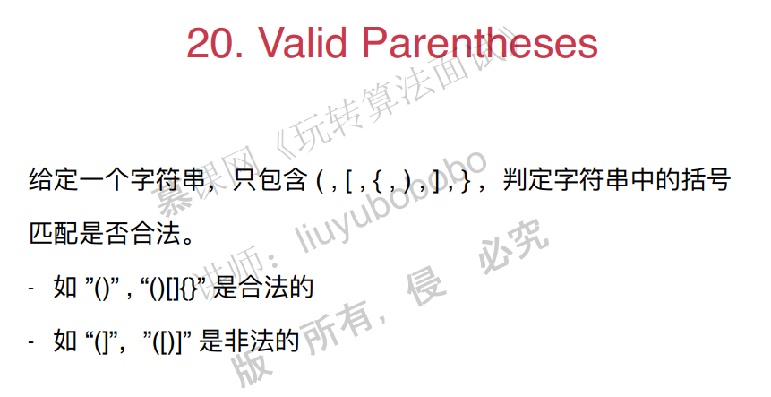
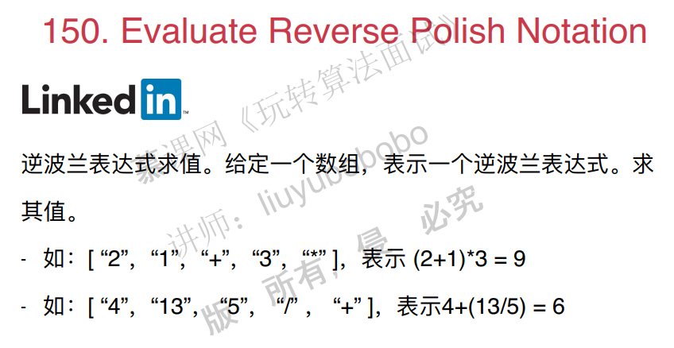
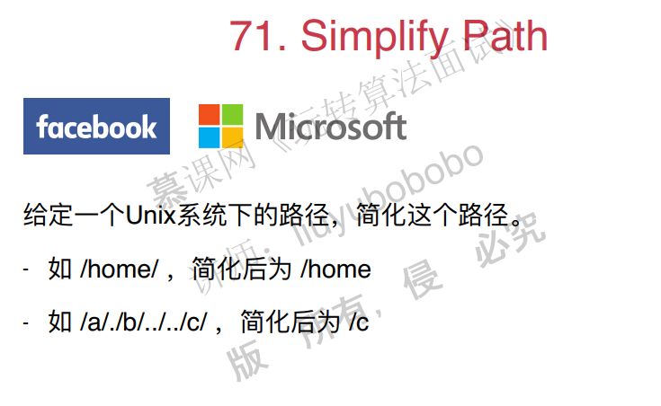
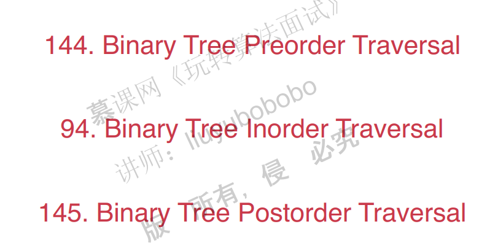
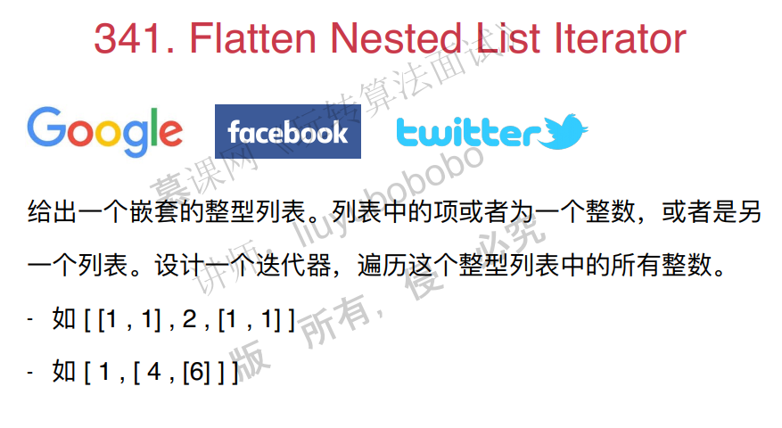

# 栈，队列和优先队列

## 1. 栈的基础应用 Valid parentheses

面试题：

~~~c++
#include <iostream>
#include <stack>
#include <cassert>

using namespace std;

// 20. Valid Parentheses
// https://leetcode.com/problems/valid-parentheses/description/
// 时间复杂度: O(n)
// 空间复杂度: O(n)
class Solution {
public:
    bool isValid(string s) {

        stack<char> stack;
        for( int i = 0 ; i < s.size() ; i ++ )
            if( s[i] == '(' || s[i] == '{' || s[i] == '[')
                stack.push(s[i]);
            else{

                if( stack.size() == 0 )
                    return false;

                char c = stack.top();
                stack.pop();

                char match;
                if( s[i] == ')' )
                    match = '(';
                else if( s[i] == ']' )
                    match = '[';
                else{
                    assert( s[i] == '}' );
                    match = '{';
                }

                if(c != match)
                    return false;
            }

        if( stack.size() != 0 )
            return false;

        return true;
    }
};
~~~

其他问题：

## 2. 栈和递归的紧密关系

二叉树的前中后序遍历。

前序遍历

~~~c++
#include <iostream>
#include <vector>

using namespace std;

/// 144. Binary Tree Preorder Traversal
/// https://leetcode.com/problems/binary-tree-preorder-traversal/description/
/// 二叉树的前序遍历
/// 时间复杂度: O(n), n为树的节点个数
/// 空间复杂度: O(h), h为树的高度

/// Definition for a binary tree node.
struct TreeNode {
    int val;
    TreeNode *left;
    TreeNode *right;
    TreeNode(int x) : val(x), left(NULL), right(NULL) {}
};

class Solution {
public:
    vector<int> preorderTraversal(TreeNode* root) {

        vector<int> res;
        __preorderTraversal(root, res);
        return res;
    }

private:
    void __preorderTraversal(TreeNode* node, vector<int> &res){

        if(node){
            res.push_back(node->val);
            __preorderTraversal(node->left, res);
            __preorderTraversal(node->right, res);
        }
    }
};

int main() {

    return 0;
}

~~~

中序遍历：

~~~c++
#include <iostream>
#include <vector>

using namespace std;

/// 94. Binary Tree Inorder Traversal
/// https://leetcode.com/problems/binary-tree-inorder-traversal/solution/
/// 二叉树的中序遍历
/// 时间复杂度: O(n), n为树的节点个数
/// 空间复杂度: O(h), h为树的高度

/// Definition for a binary tree node.
struct TreeNode {
    int val;
    TreeNode *left;
    TreeNode *right;
    TreeNode(int x) : val(x), left(NULL), right(NULL) {}
};

class Solution {
public:
    vector<int> inorderTraversal(TreeNode* root) {

        vector<int> res;
        __inorderTraversal(root, res);
        return res;
    }

private:
    void __inorderTraversal(TreeNode* node, vector<int> &res){

        if( node ){
            __inorderTraversal(node->left, res);
            res.push_back( node->val );
            __inorderTraversal(node->right, res);
        }
    }
};

int main() {

    return 0;
}
~~~

后序遍历：

~~~c++
#include <iostream>
#include <vector>

using namespace std;

/// 145. Binary Tree Postorder Traversal
/// https://leetcode.com/problems/binary-tree-postorder-traversal/description/
/// 二叉树的后序遍历
/// 时间复杂度: O(n), n为树的节点个数
/// 空间复杂度: O(h), h为树的高度

/// Definition for a binary tree node.
struct TreeNode {
    int val;
    TreeNode *left;
    TreeNode *right;
    TreeNode(int x) : val(x), left(NULL), right(NULL) {}
};

class Solution {
public:
    vector<int> postorderTraversal(TreeNode* root) {

        vector<int> res;
        __postorderTraversal(root, res);
        return res;
    }

private:
    void __postorderTraversal(TreeNode* node, vector<int> &res){

        if( node ){
            __postorderTraversal(node->left, res);
            __postorderTraversal(node->right, res);
            res.push_back(node->val);
        }
    }
};

int main() {

    return 0;
}
~~~

## 3. 运用栈模拟递归

运用栈来进行前序，中序和后序遍历

pass

其他面试题：

## 4. 队列的典型应用

## 5. BFS和图的最短路径

## 6. 优先队列

## 7. 优先队列的相关算法问题