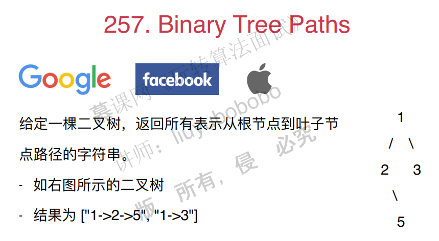
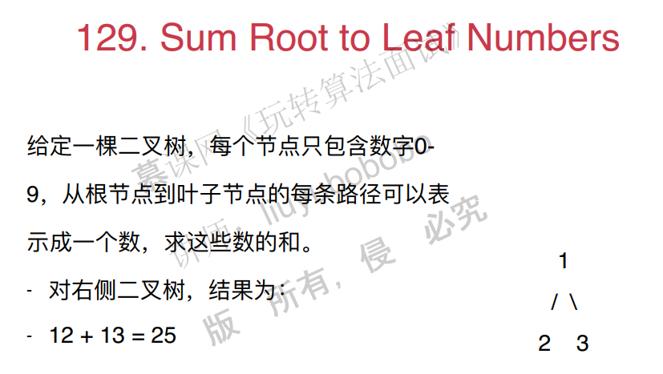

# 第七章、二叉树和递归

## 7.1 二叉树天然的递归结构

二叉树有天然的递归结构：父亲节点，左子树，右子树。

比如说前序遍历：

注意，定义好递归的终止条件，然后是递归过程，还有就是要定义好递归函数的含义。

还有，找树种的某个节点是否包含key：

删除树中的节点：

面试题：

~~~c++
#include <iostream>

using namespace std;

// 104. Maximum Depth of Binary Tree
// https://leetcode.com/problems/maximum-depth-of-binary-tree/description/
// 时间复杂度: O(n), n是树中的节点个数
// 空间复杂度: O(h), h是树的高度

/// Definition for a binary tree node.
struct TreeNode {
    int val;
    TreeNode *left;
    TreeNode *right;
    TreeNode(int x) : val(x), left(NULL), right(NULL) {}
};

class Solution {
public:
    int maxDepth(TreeNode* root) {

        if(root == NULL)
            return 0;

        return 1 + max(maxDepth(root->left), maxDepth(root->right));
    }
};
~~~

其他面试题：

## 7.2 一个简单的二叉树引发的血案

面试题：

分析：这道题目曾经难倒了一个大牛。

思路其实很简单，如果一个节点是空，返回空。如果节点没有左右子树，返回该节点。否则交换左右子树。

~~~c++
#include <iostream>

using namespace std;

/// 226. Invert Binary Tree
/// https://leetcode.com/problems/invert-binary-tree/description/
/// 时间复杂度: O(n), n为树中节点个数
/// 空间复杂度: O(h), h为树的高度

/// Definition for a binary tree node.
struct TreeNode {
    int val;
    TreeNode *left;
    TreeNode *right;
    TreeNode(int x) : val(x), left(NULL), right(NULL) {}
};

class Solution {
public:
    TreeNode* invertTree(TreeNode* root) {

        if(root == NULL)
            return NULL;
	    //特别注意：不需要返回root节点
        invertTree(root->left);
        invertTree(root->right);
        swap(root->left, root->right);

        return root;
    }
};

int main() {

    return 0;
}
~~~

其他面试题：

## 7.3 注意递归的终止条件

c++代码：

~~~C++
#include <iostream>

using namespace std;

/// Definition for a binary tree node.
struct TreeNode {
    int val;
    TreeNode *left;
    TreeNode *right;
    TreeNode(int x) : val(x), left(NULL), right(NULL) {}
};

/// 112. Path Sum
/// https://leetcode.com/problems/path-sum/description/
/// 时间复杂度: O(n), n为树的节点个数
/// 空间复杂度: O(h), h为树的高度
class Solution {
public:
    bool hasPathSum(TreeNode* root, int sum) {

        if(root == NULL)
            return false;
       //特别注意这个！因为我如果节点为空的话就返回false会忽略节点值刚好等于的情况。
        if(root->left == NULL && root->right == NULL)
            return sum == root->val;

        return hasPathSum(root->left, sum - root->val)
                || hasPathSum(root->right, sum - root->val);
    }
};

int main() {

    return 0;
}
~~~

## 7.4 定义递归问题

面试题：

其他面试题：

## 7.5 稍复杂的递归逻辑

面试题：

这题有点难，pass

## 7.6 二分搜索树中的问题

什么是二分搜索树：

二分搜索树基本操作：

二分搜索树因为其特殊性，计算复杂度为log(n)，因此非常重要！是很多数据结构的底层数据结构（set和map）。基于二分搜索树还有红黑树，平衡二叉树等。

分析：

1. 假设两个节点都大于或者都小于root节点，则公共祖先在子树中。
2. 如果root节点本身就是祖先，那么root就是两个节点的最近祖先。
3. 如果两个节点一大一小，则root节点也就是两个节点的最近祖先。

~~~c++
#include <iostream>
#include <cassert>

using namespace std;

/// 235. Lowest Common Ancestor of a Binary Search Tree
/// https://leetcode.com/problems/lowest-common-ancestor-of-a-binary-search-tree/description/
/// 时间复杂度: O(lgn), 其中n为树的节点个数
/// 空间复杂度: O(h), 其中h为树的高度

/// Definition for a binary tree node.
struct TreeNode {
    int val;
    TreeNode *left;
    TreeNode *right;
    TreeNode(int x) : val(x), left(NULL), right(NULL) {}
};

class Solution {
public:
    TreeNode* lowestCommonAncestor(TreeNode* root, TreeNode* p, TreeNode* q) {

        assert(p != NULL && q != NULL);

        if(root == NULL)
            return NULL;

        if(p->val < root->val && q->val < root->val)
            return lowestCommonAncestor(root->left, p, q);
        if(p->val > root->val && q->val > root->val)
            return lowestCommonAncestor(root->right, p, q);

        assert(p->val == root->val || q->val == root->val
                || (root->val - p->val) * (root->val - q->val) < 0);

        return root;
    }
};

int main() {

    return 0;
}
~~~

其他面试题：

