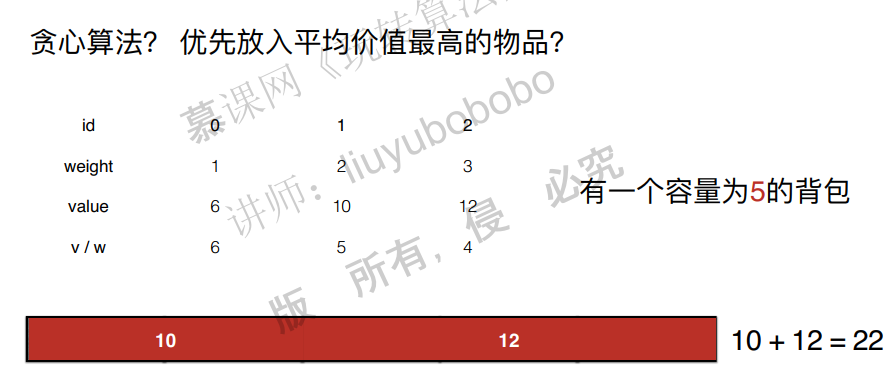
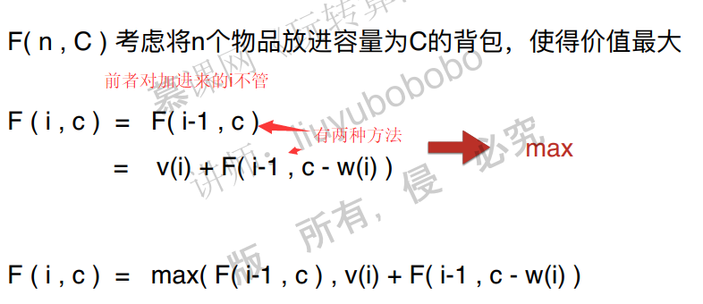

# 动态规划基础

## 1. 什么是动态规划

### 例子：斐波那契数列

首先看一个斐波那契数的例子。


斐波那契数可以用递归来做，但是递归会存在大量重复的计算，因此时间复杂度很高，是2的n次方，这非影响性能。


可以通过一个办法来解决，就是用记忆化搜索的方法，也就是，如果计算过了，就保存起来，到时候直接调用就可以。


**递归方法**是一个**自上而下**的解决问题的方式，也就是说，从大的问题开始解决，然后解决小的问题。递归方法很可能会遇到重复子问题，这样时间复杂度很高，也会大量浪费系统栈资源。可以通过记忆化的搜索方法降低时间复杂度。

**动态规划**则是**自下而上**的方法来解决问题。也就是将复杂问题转为若干简单的问题，简单问题先解决了，然后结果进行保存，复杂问题的解决可以用到这些简单问题的结果。这样，对于斐波那契数问题，时间复杂度就变成了o(n)级别。

注意：只要能自上而下的解决问题，就能自下而上的解决问题。


那么什么是动态规划问题：


递归和动态规划的关系：


## 2. 第一个动态规划问题

### 面试题：爬台阶问题

每次只能向上爬一个台阶，或者两个台阶，请问爬n阶台阶有几种爬法？
递归方法：要爬上n台阶，可以在n-1台阶的时候往上爬一步，或者在n-2台阶的时候往上爬二步两种方法，那如果知道n-1和n-2台阶的时候方法数，那加起来就可以了。
这个问题实际上就是斐波那契的问题。


首先，这个问题可以转化为子问题来求解，因此是一个递归问题。


同时它存在很多重叠子问题，因此可以使用记忆化搜索的方法。


既然是一个递归问题，而且有很多重叠子问题，因此就可以使用动态规划的方法求解。

递归c++代码：

~~~c++
//代码运行超时
class Solution {
public:
    int climbStairs(int n) {
        return calcWays(n);
    }
    
    int calcWays(int n){
        if(n==1){
            return 1;
        }
        if (n==2){
            return 2;
        }
        return calcWays(n-1)+calcWays(n-2);
    }
};

~~~

记忆化搜索代码：

~~~c++
class Solution {
private:
    vector<int> memo;
public:
    int climbStairs(int n) {
        memo=vector<int>(n,-1);
        return calcWays(n);
    }
    
    int calcWays(int n){
        if(n==1){
            memo[0]=1;
        }
        if (n==2){
            memo[1]=2;
        }
        if(memo[n-1]==-1){
            memo[n-1]=calcWays(n-1)+calcWays(n-2);
        }
        return memo[n-1];
    }
};
~~~

动态规划代码：

~~~c++
#include <iostream>
#include <vector>

using namespace std;

/// 70. Climbing Stairs
/// https://leetcode.com/problems/climbing-stairs/description/
/// 动态规划
/// 时间复杂度: O(n)
/// 空间复杂度: O(n)
class Solution {

public:
    int climbStairs(int n) {

        vector<int> memo(n + 1, -1);
        memo[0] = 1;
        memo[1] = 1;
        for(int i = 2 ; i <= n ; i ++)
            memo[i] = memo[i - 1] + memo[i - 2];
        return memo[n];
    }
    // int climbStairs(int n) {
    //     memo=vector<int>(n,-1);
    //     memo[0]=1;
    //     memo[1]=2;
    //     for(int i=2;i<n;i++){
    //         memo[i]=memo[i-1]+memo[i-2];
    //     }
    //     return memo[n-1];
    // }
};

int main() {

    cout << Solution().climbStairs(10) << endl;
    return 0;
}
~~~

其他面试题


自己用记忆化搜索的答案：

~~~c++
class Solution {
private:
    vector<vector<int>> memo;
private:
    int fib(int i,int j, vector<vector<int>>& triangle,vector<vector<int>> &memo) {
	if (i == triangle.size()-1) {
		return triangle[i][j];
	}
    if(memo[i][j]==-1){
        memo[i][j]=triangle[i][j]+min(fib(i + 1, j, triangle,memo), fib(i + 1, j + 1, triangle,memo));
        return memo[i][j];
    }else{
        return memo[i][j];
    }
}
public:
    int minimumTotal(vector<vector<int>>& triangle) {
        memo=vector<vector<int>>(triangle.size(),vector<int>(triangle.size(),-1));
        return fib(0,0,triangle,memo);
    }
};
~~~

bobo动态规划的解法：

思路：

1. 为了节约内存，将相加结果保存在triangle上。


2. 三角形两边特殊对待。
3. 对最后的结果取最小。

~~~c++
/// Source : https://leetcode.com/problems/triangle/description/
/// Author : liuyubobobo
/// Time   : 2018-03-26

#include <iostream>
#include <vector>

using namespace std;

/// Dynamic Programming
/// Time Complexity: O(n^2)
/// Space Complexity: O(1)
class Solution {
public:
    int minimumTotal(vector<vector<int>>& triangle) {

        int n = triangle.size();
        for(int i = 1 ; i < n ; i ++){

            triangle[i][0] += triangle[i-1][0];
            triangle[i][i] += triangle[i-1][i-1];
            for(int j = 1 ; j < i ; j ++)
                triangle[i][j] += min(triangle[i-1][j-1], triangle[i-1][j]);
        }

        return *min_element(triangle[n-1].begin(), triangle[n-1].end());
    }
};

int main() {

    vector<vector<int>> triangle = { {2},
                                     {3, 4},
                                     {6,5,7},
                                     {4,1,8,3}};
    cout << Solution().minimumTotal(triangle) << endl;

    return 0;
}
~~~


最小路径和：


自己写的记忆化搜索的方法：

~~~c++
class Solution {    
private:
	int f(int i, int j, vector<vector<int>> &grid, vector<vector<int>> &memo) {
		//处理特殊情况
		if (grid.size() == 0) {
			return 0;
		}
		// 记忆化搜索
		if (memo[i][j]!=-1) {
			return memo[i][j];
		}
		// 递归终止条件
		if (i == (grid.size() - 1) && j == (grid[0].size() - 1)) {
			memo[i][j] = memo[i][j];
			return grid[i][j];
		}
		//边界处理
		if (i == grid.size() - 1) {
			memo[i][j] = grid[i][j] + f(i, j + 1, grid, memo);
			return memo[i][j];
		}
		if (j == grid[0].size() - 1) {
			memo[i][j] = grid[i][j] + f(i + 1, j, grid, memo);
			return memo[i][j];
		}
		// 递归计算
		memo[i][j] = grid[i][j] + min(f(i, j + 1, grid, memo), f(i + 1, j, grid, memo));
		return memo[i][j];
	}

public:
    int minPathSum(vector<vector<int>>& grid) {
        vector<vector<int>> memo=vector<vector<int>>(grid.size(),vector<int>(grid[0].size(),-1));
        return f(0,0,grid,memo);
    }
};
~~~


## 3. 发现重叠子问题

面试题：


解题思路：

1. 暴力解决，时间复杂度O(2^n)
2. 递归：递归结构，重复子问题，最优子结构


上图表明，存在很多重复子问题，存在递归的结构，有最优子问题。

什么是最优子问题：


之前的动态规划：


具有最优子结构的动态规划：


c++代码：

递归解法

~~~c++
#include <iostream>
#include <cassert>

using namespace std;

/// 343. Integer Break
/// https://leetcode.com/problems/integer-break/description/
/// 暴力搜索
/// 在Leetcode中提交这个版本的代码会超时! (Time Limit Exceeded)
/// 时间复杂度: O(n^n)
/// 空间复杂度: O(n)
class Solution {

private:
    int max3(int a, int b, int c){
        return max(a, max(b, c));
    }

    // 将n进行分割(至少分割两部分), 可以获得的最大乘积
    int breakInteger(int n){
		//注意递归终止条件：只要考虑n=1的情况，因为n=2的时候实际上就可以通过i*breakInteger(1)求。菲波那切数列则需要1,2的情况都考虑。
        if(n == 1)
            return 1;

        int res = -1;
        for(int i = 1 ; i <= n - 1 ; i ++)
		   //注意：这里有一个陷阱，就是我们默认一定过啊将n-i进行分割，但是实际上也不一定要分割，直接i*(n-i)就可以了。所以这里一定要注意明确递归函数的定义！！！！
            res = max3(res, i * (n - i), i * breakInteger(n - i));
        return res;
    }

public:
    int integerBreak(int n) {
        assert(n >= 1);
        return breakInteger(n);
    }
};

int main() {

    cout << Solution().integerBreak(2) << endl;
    cout << Solution().integerBreak(10) << endl;

    return 0;
}

~~~

记忆化搜索的解法：

~~~c++
#include <iostream>
#include <vector>
#include <cassert>

using namespace std;

/// 343. Integer Break
/// https://leetcode.com/problems/integer-break/description/
/// 记忆化搜索
/// 时间复杂度: O(n^2)
/// 空间复杂度: O(n)
class Solution {
private:
    vector<int> memo;

    int max3(int a, int b, int c){
        return max(a, max(b, c));
    }

    // 将n进行分割(至少分割两部分), 可以获得的最大乘积
    int breakInteger(int n){

        if(n == 1)
            return 1;

        if(memo[n] != -1)
            return memo[n];

        int res = -1;
        for(int i = 1 ; i <= n - 1 ; i ++)
            res = max3(res, i * (n - i) , i * breakInteger(n - i));
        memo[n] = res;
        return res;
    }

public:
    int integerBreak(int n) {
        assert(n >= 1);
        memo.clear();
        for(int i = 0 ; i < n + 1 ; i ++)
            memo.push_back(-1);
        return breakInteger(n);
    }
};

int main() {

    cout << Solution().integerBreak(2) << endl;
    cout << Solution().integerBreak(10) << endl;

    return 0;
}
~~~

递归解法：

~~~c++
#include <iostream>
#include <vector>

using namespace std;

/// 343. Integer Break
/// https://leetcode.com/problems/integer-break/description/
/// 动态规划
/// 时间复杂度: O(n^2)
/// 空间复杂度: O(n)
class Solution {

private:
    int max3(int a, int b, int c ){
        return max(max(a, b), c);
    }

public:
    int integerBreak(int n) {

        assert(n >= 1);

        // memo[i] 表示将数字i分割(至少分割成两部分)后得到的最大乘积
        vector<int> memo(n + 1, -1);

        memo[1] = 1;
        for(int i = 2 ; i <= n ; i ++)
            // 求解memo[i]
            for(int j = 1 ; j <= i - 1 ; j ++)
                memo[i] = max3(memo[i], j * (i - j), j * memo[i - j]);

        return memo[n];
    }
};

int main() {

    cout << Solution().integerBreak(2) << endl;
    cout << Solution().integerBreak(3) << endl;
    cout << Solution().integerBreak(4) << endl;
    cout << Solution().integerBreak(10) << endl;

    return 0;
}
~~~

其他面试题：


图的解决思路：


## 4. 状态定义和状态转移

面试题：


暴力解法：


分析问题：


不懂为什么不选前面的。

递归代码：


记忆化搜索代码：


动态规划代码：


定义状态的其他方式：


其他面试题：


## 5. 0-1背包问题

面试题：


看到这样的题目，一个很自然的想法就是能否用贪心算法求解。但实际上，动态规划方法是很难达到最优解的。如下：





定义状态和状态转移方程：



代码：

递归解法：

~~~c++

~~~


## 6. 0-1背包问题的优化和变种

## 7. 面试中的0-1背包问题

## 8. LIS问题

面试题：


暴力解法，得到所有的子序列：


注意：


~~~c++
#include <iostream>
#include <vector>
using namespace std;

/// 300. Longest Increasing Subsequence
/// https://leetcode.com/problems/longest-increasing-subsequence/description/
/// 记忆化搜索
/// 时间复杂度: O(n^2)
/// 空间复杂度: O(n)
class Solution {

private:
    vector<int> memo;

    // 以 nums[index] 为结尾的最长上升子序列的长度
    int getMaxLength(const vector<int> &nums, int index){

        if(memo[index] != -1)
            return memo[index];

        int res = 1;
        for(int i = 0 ; i <= index-1 ; i ++)
            if(nums[index] > nums[i])
                res = max(res, 1 + getMaxLength(nums, i));

        memo[index] = res;
        return res;
    }

public:
    int lengthOfLIS(vector<int>& nums) {

        if(nums.size() == 0)
            return 0;

        memo = vector<int>(nums.size(), -1);
        int res = 1;
        for(int i = 0 ; i < nums.size() ; i ++)
            res = max(res, getMaxLength(nums, i));

        return res;
    }
};

int main() {

    int nums1[] = {10, 9, 2, 5, 3, 7, 101, 18};
    vector<int> vec1(nums1, nums1 + sizeof(nums1)/sizeof(int));
    cout << Solution().lengthOfLIS(vec1) << endl;
    // 4

    // ---

    int nums2[] = {4, 10, 4, 3, 8, 9};
    vector<int> vec2(nums2, nums2 + sizeof(nums2)/sizeof(int));
    cout << Solution().lengthOfLIS(vec2) << endl;
    // 3

    // ---

    int nums3[] = {2, 2};
    vector<int> vec3(nums3, nums3 + sizeof(nums3)/sizeof(int));
    cout << Solution().lengthOfLIS(vec3) << endl;
    // 1

    // ---

    int nums4[] = {1, 3, 6, 7, 9, 4, 10, 5, 6};
    vector<int> vec4(nums4, nums4 + sizeof(nums4)/sizeof(int));
    cout << Solution().lengthOfLIS(vec4) << endl;
    // 6

    return 0;
}
~~~

非动态规划的解法：


~~~c++
#include <iostream>
#include <vector>
using namespace std;

/// 300. Longest Increasing Subsequence
/// https://leetcode.com/problems/longest-increasing-subsequence/description/
/// 动态规划
/// 时间复杂度: O(n^2)
/// 空间复杂度: O(n)
class Solution {

public:
    int lengthOfLIS(vector<int>& nums) {

        if(nums.size() == 0)
            return 0;

        // memo[i] 表示以 nums[i] 为结尾的最长上升子序列的长度
        vector<int> memo(nums.size(), 1);
        for(int i = 1 ; i < nums.size() ; i ++)
            for(int j = 0 ; j < i ; j ++)
                if(nums[i] > nums[j])
                    memo[i] = max(memo[i], 1 + memo[j]);

        int res = memo[0];
        for(int i = 1 ; i < nums.size() ; i ++)
            res = max(res, memo[i]);

        return res;
    }
};

int main() {

    int nums1[] = {10, 9, 2, 5, 3, 7, 101, 18};
    vector<int> vec1(nums1, nums1 + sizeof(nums1)/sizeof(int));
    cout << Solution().lengthOfLIS(vec1) << endl;
    // 4

    // ---

    int nums2[] = {4, 10, 4, 3, 8, 9};
    vector<int> vec2(nums2, nums2 + sizeof(nums2)/sizeof(int));
    cout << Solution().lengthOfLIS(vec2) << endl;
    // 3

    // ---

    int nums3[] = {2, 2};
    vector<int> vec3(nums3, nums3 + sizeof(nums3)/sizeof(int));
    cout << Solution().lengthOfLIS(vec3) << endl;
    // 1

    // ---

    int nums4[] = {1, 3, 6, 7, 9, 4, 10, 5, 6};
    vector<int> vec4(nums4, nums4 + sizeof(nums4)/sizeof(int));
    cout << Solution().lengthOfLIS(vec4) << endl;
    // 6

    return 0;
}int main() {

    int nums1[] = {10, 9, 2, 5, 3, 7, 101, 18};
    vector<int> vec1(nums1, nums1 + sizeof(nums1)/sizeof(int));
    cout << Solution().lengthOfLIS(vec1) << endl;
    // 4

    // ---

    int nums2[] = {4, 10, 4, 3, 8, 9};
    vector<int> vec2(nums2, nums2 + sizeof(nums2)/sizeof(int));
    cout << Solution().lengthOfLIS(vec2) << endl;
    // 3

    // ---

    int nums3[] = {2, 2};
    vector<int> vec3(nums3, nums3 + sizeof(nums3)/sizeof(int));
    cout << Solution().lengthOfLIS(vec3) << endl;
    // 1

    // ---

    int nums4[] = {1, 3, 6, 7, 9, 4, 10, 5, 6};
    vector<int> vec4(nums4, nums4 + sizeof(nums4)/sizeof(int));
    cout << Solution().lengthOfLIS(vec4) << endl;
    // 6

    return 0;
}
~~~

其他面试题：


## 9. LVS，最短路，求动态规划的具体解以及更多


应用在基因工程：


定义状态和状态转移方程：


举个具体的实例：


# 参考

参考链接：https://blog.csdn.net/baidu_28312631/article/details/47418773

首先，我们看一下这道题（此题目来源于北大POJ）：

数字三角形


**    **在上面的数字三角形中寻找一条从顶部到底边的路径，使得路径上所经过的数字之和最大。路径上的每一步都只能往左下或 右下走。只需要求出这个最大和即可，不必给出具体路径。 三角形的行数大于1小于等于100，数字为 0 - 99

​    输入格式：

​    5      //表示三角形的行数    接下来输入三角形

​    7

​    3   8

​    8   1   0

​    2   7   4   4

​    4   5   2   6   5

​    要求输出最大和

​    接下来，我们来分析一下解题思路：

​    首先，肯定得用二维数组来存放数字三角形

​    然后我们用D( r, j) 来表示第r行第 j 个数字(r,j从1开始算)

​    我们用MaxSum(r, j)表示从D(r,j)到底边的各条路径中，最佳路径的数字之和。

​    因此，此题的最终问题就变成了求 MaxSum(1,1)

​    当我们看到这个题目的时候，首先想到的就是可以用简单的递归来解题：

​    D(r, j)出发，下一步只能走D(r+1,j)或者D(r+1, j+1)。故对于N行的三角形，我们可以写出如下的递归式：   

```c++
if ( r == N)                


	MaxSum(r,j) = D(r,j)  

else      

	MaxSum( r, j) = Max{ MaxSum(r＋1,j), MaxSum(r+1,j+1) } + D(r,j) 
```

​    根据上面这个简单的递归式，我们就可以很轻松地写出完整的递归代码： 

```
#include <iostream>  


#include <algorithm> 


#define MAX 101  


using namespace std; 


int D[MAX][MAX];  


int n;  


int MaxSum(int i, int j){    


	if(i==n)  


		return D[i][j];    


	int x = MaxSum(i+1,j);    


	int y = MaxSum(i+1,j+1);    


	return max(x,y)+D[i][j];  


}


int main(){    


	int i,j;    


	cin >> n;    


	for(i=1;i<=n;i++)   


		for(j=1;j<=i;j++)        


			cin >> D[i][j];    


	cout << MaxSum(1,1) << endl;  


}      
```

​    对于如上这段递归的代码，当我提交到POJ时，会显示如下结果：

​    

​    对的，代码运行超时了，为什么会超时呢？

​    答案很简单，因为我们重复计算了，当我们在进行递归时，计算机帮我们计算的过程如下图：

​    

​    就拿第三行数字1来说，当我们计算从第2行的数字3开始的MaxSum时会计算出从1开始的MaxSum，当我们计算从第二行的数字8开始的MaxSum的时候又会计算一次从1开始的MaxSum，也就是说有重复计算。这样就浪费了大量的时间。也就是说如果采用递规的方法，深度遍历每条路径，存在大量重复计算。则时间复杂度为 2的n次方,对于 n = 100 行，肯定超时。 

​    接下来，我们就要考虑如何进行改进，我们自然而然就可以想到如果每算出一个MaxSum(r,j)就保存起来，下次用到其值的时候直接取用，则可免去重复计算。那么可以用n方的时间复杂度完成计算。因为三角形的数字总数是 n(n+1)/2

​    根据这个思路，我们就可以将上面的代码进行改进，使之成为记忆递归型的动态规划程序： 

```
#include <iostream>  


#include <algorithm> 


using namespace std;


 


#define MAX 101


  


int D[MAX][MAX];    


int n;  


int maxSum[MAX][MAX];


 


int MaxSum(int i, int j){      


	if( maxSum[i][j] != -1 )         


		return maxSum[i][j];      


	if(i==n)   


		maxSum[i][j] = D[i][j];     


	else{    


		int x = MaxSum(i+1,j);       


		int y = MaxSum(i+1,j+1);       


		maxSum[i][j] = max(x,y)+ D[i][j];     


	}     


	return maxSum[i][j]; 


} 


int main(){    


	int i,j;    


	cin >> n;    


	for(i=1;i<=n;i++)   


		for(j=1;j<=i;j++) {       


			cin >> D[i][j];       


			maxSum[i][j] = -1;   


		}    


	cout << MaxSum(1,1) << endl; 


} 
```

​    当我们提交如上代码时，结果就是一次AC

​    
​    虽然在短时间内就AC了。但是，我们并不能满足于这样的代码，因为递归总是需要使用大量堆栈上的空间，很容易造成栈溢出，我们现在就要考虑如何把递归转换为递推，让我们一步一步来完成这个过程。

​    我们首先需要计算的是最后一行，因此可以把最后一行直接写出，如下图：

​    

​    现在开始分析倒数第二行的每一个数，现分析数字2，2可以和最后一行4相加，也可以和最后一行的5相加，但是很显然和5相加要更大一点，结果为7，我们此时就可以将7保存起来，然后分析数字7，7可以和最后一行的5相加，也可以和最后一行的2相加，很显然和5相加更大，结果为12，因此我们将12保存起来。以此类推。。我们可以得到下面这张图：

​    

​    然后按同样的道理分析倒数第三行和倒数第四行，最后分析第一行，我们可以依次得到如下结果：

​    

​    

​    上面的推导过程相信大家不难理解，理解之后我们就可以写出如下的递推型动态规划程序： 

```
#include <iostream>  


#include <algorithm> 


using namespace std; 


 


#define MAX 101  


 


int D[MAX][MAX];   


int n;  


int maxSum[MAX][MAX]; 


int main(){    


	int i,j;    


	cin >> n;    


	for(i=1;i<=n;i++)   


		for(j=1;j<=i;j++)        


			cin >> D[i][j];   


	for( int i = 1;i <= n; ++ i )     


		maxSum[n][i] = D[n][i];   


	for( int i = n-1; i>= 1;  --i )     


		for( int j = 1; j <= i; ++j )         


			maxSum[i][j] = max(maxSum[i+1][j],maxSum[i+1][j+1]) + D[i][j];    


	cout << maxSum[1][1] << endl;  


} 
```

​     我们的代码仅仅是这样就够了吗？当然不是，我们仍然可以继续优化，而这个优化当然是对于空间进行优化，其实完全没必要用二维maxSum数组存储每一个MaxSum(r,j),只要从底层一行行向上递推，那么只要一维数组maxSum[100]即可,即只要存储一行的MaxSum值就可以。

​     对于空间优化后的具体递推过程如下：

​    

​    

​    

​    

​    

​    

​    接下里的步骤就按上图的过程一步一步推导就可以了。进一步考虑，我们甚至可以连maxSum数组都可以不要，直接用D的第n行直接替代maxSum即可。但是这里需要强调的是：虽然节省空间，但是时间复杂度还是不变的。

​    依照上面的方式，我们可以写出如下代码：    

```
#include <iostream>  


#include <algorithm> 


using namespace std; 


 


#define MAX 101  


 


int D[MAX][MAX];  


int n; 


int * maxSum; 


 


int main(){    


	int i,j;    


	cin >> n;    


	for(i=1;i<=n;i++)   


		for(j=1;j<=i;j++)        


			cin >> D[i][j];   


	maxSum = D[n]; //maxSum指向第n行    


	for( int i = n-1; i>= 1;  --i )     


		for( int j = 1; j <= i; ++j )       


			maxSum[j] = max(maxSum[j],maxSum[j+1]) + D[i][j];    


	cout << maxSum[1] << endl;  


}
```

​    接下来，我们就进行一下总结：

**    递归到动规的一般转化方法**

​    递归函数有n个参数，就定义一个n维的数组，数组的下标是递归函数参数的取值范围，数组元素的值是递归函数的返回值，这样就可以从边界值开始， 逐步填充数组，相当于计算递归函数值的逆过程。

**    动规解题的一般思路**

**    1. 将原问题分解为子问题**

- ​    把原问题分解为若干个子问题，子问题和原问题形式相同或类似，只不过规模变小了。子问题都解决，原问题即解决(数字三角形例）。
- ​    子问题的解一旦求出就会被保存，所以每个子问题只需求 解一次。

**    2.确定状态**

- ​    在用动态规划解题时，我们往往将和子问题相关的各个变量的一组取值，称之为一个“状 态”。一个“状态”对应于一个或多个子问题， 所谓某个“状态”下的“值”，就是这个“状 态”所对应的子问题的解。
- ​    所有“状态”的集合，构成问题的“状态空间”。“状态空间”的大小，与用动态规划解决问题的时间复杂度直接相关。 在数字三角形的例子里，一共有N×(N+1)/2个数字，所以这个问题的状态空间里一共就有N×(N+1)/2个状态。

​    整个问题的时间复杂度是状态数目乘以计算每个状态所需时间。在数字三角形里每个“状态”只需要经过一次，且在每个状态上作计算所花的时间都是和N无关的常数。

**    3.确定一些初始状态（边界状态）的值**

​    以“数字三角形”为例，初始状态就是底边数字，值就是底边数字值。

**    4. 确定状态转移方程**

​     定义出什么是“状态”，以及在该“状态”下的“值”后，就要找出不同的状态之间如何迁移――即如何从一个或多个“值”已知的 “状态”，求出另一个“状态”的“值”(递推型)。状态的迁移可以用递推公式表示，此递推公式也可被称作“状态转移方程”。

​    数字三角形的状态转移方程:

​    

**    能用动规解决的问题的特点**

​    1) 问题具有最优子结构性质。如果问题的最优解所包含的 子问题的解也是最优的，我们就称该问题具有最优子结 构性质。

​    2) 无后效性。当前的若干个状态值一旦确定，则此后过程的演变就只和这若干个状态的值有关，和之前是采取哪种手段或经过哪条路径演变到当前的这若干个状态，没有关系。