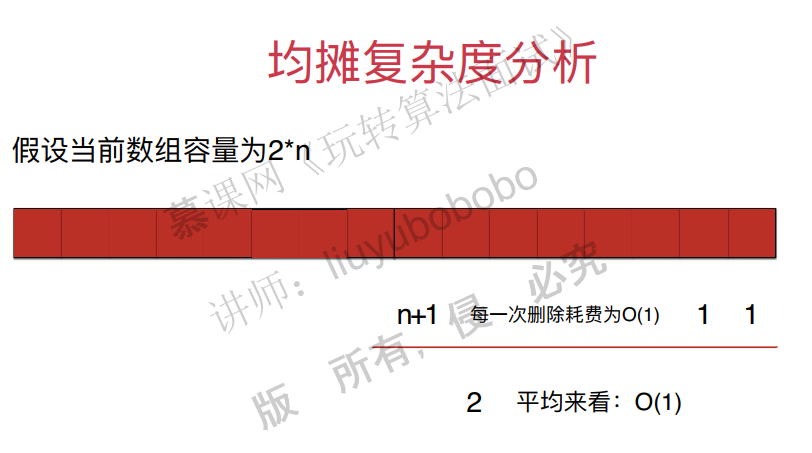
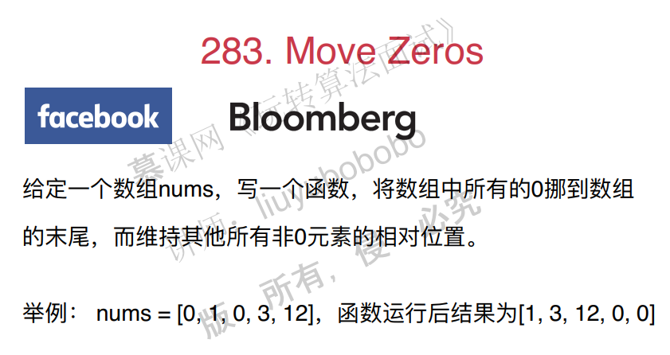
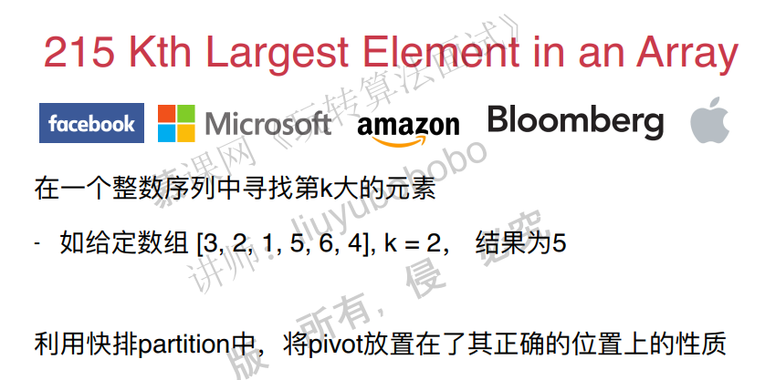
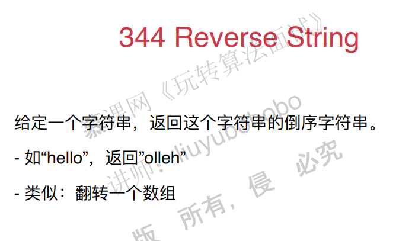
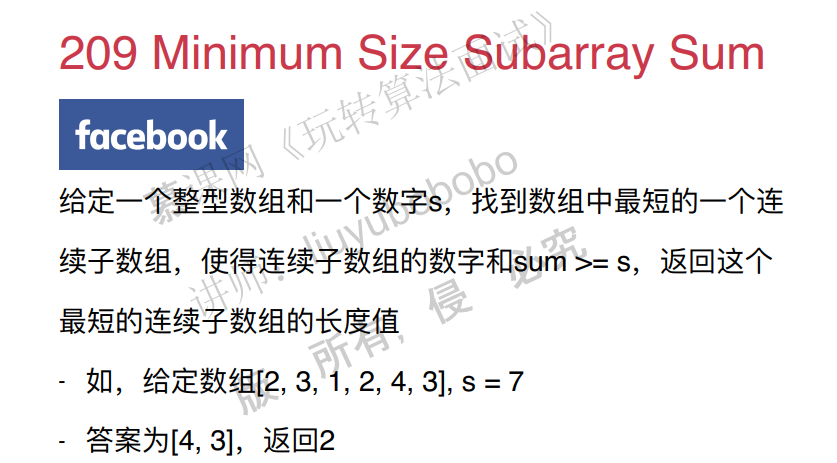
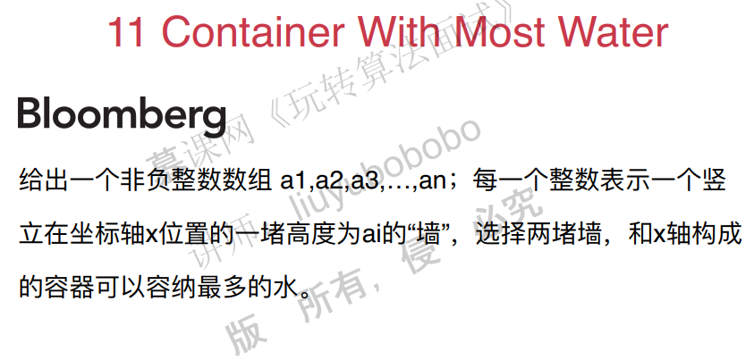
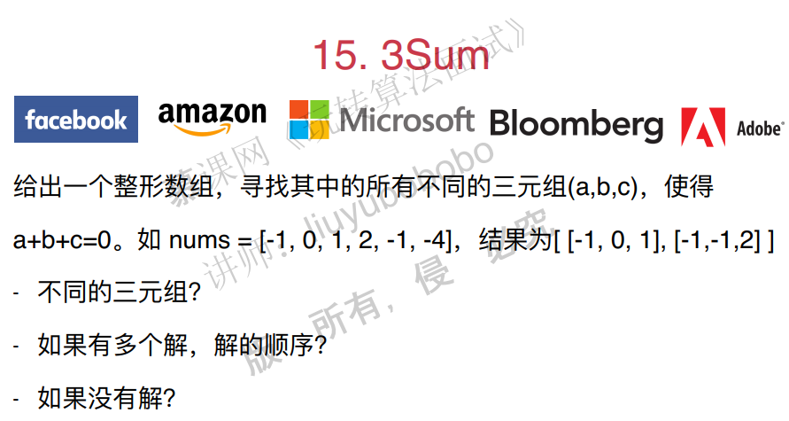
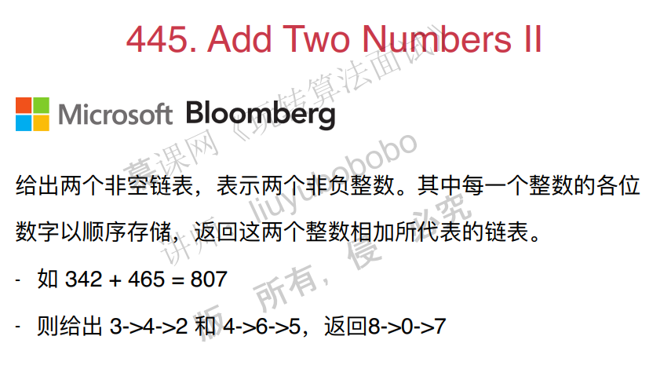

# Leetcode 笔记

## 二、面试中的复杂度分析

### 时间复杂度自己的理解

时间复杂度自己的理解：

如果$f(n)=n^2+2n+3$ ，如果能够找到一个$g(n)$能使极限$lim_{n→0}f(n)/g(n)=0$，则时间复杂度为：$O(g(n))$ 。

### 递归算法的复杂度分析

主要考虑两种情况：


多次调用的情况。

假设：


时间复杂度分析：


计算时间复杂度，就是计算总运算的数量。实际上只要计算每一层的节点数目就可以代表相应数字运行的次数。

归并排序的情况：


### 均摊复杂度分析

典型例子，动态数组（vector）:




### 防止复杂度震荡


## 三、数组中的问题最常见

### 1. 从二分查找法看如任何写出正确的程序

数组看上去简单，实际上在很多场景都有应用。

比如，在排序中：选择排序，插入排序，归并排序，快速排序。

查找：二分查找

数据结构中的底层实现：栈，队列，堆

**二分查找**

二分查找条件：有序数列

二分查找需要定义好变量，明确边界。

代码如下：

~~~c++
#include <iostream>
#include <cmath>
#include <cassert>
#include <ctime>
#include "util.h"

using namespace std;

template<typename T>
int binarySearch(T arr[], int n, T target){

    int l = 0, r = n - 1; // 在[l...r]的范围里寻找target
    while(l <= r){    // 当 l == r时,区间[l...r]依然是有效的
        int mid = l + (r - l) / 2;
        if(arr[mid] == target) return mid;
        if(target > arr[mid])
            l = mid + 1;  // target在[mid+1...r]中; [l...mid]一定没有target
        else    // target < arr[mid]
            r = mid - 1;  // target在[l...mid-1]中; [mid...r]一定没有target
    }

    return -1;
}

int main() {

    int n = pow(10, 7);
    int* data = MyUtil::generateOrderedArray(n);

    clock_t startTime = clock();
    for(int i = 0 ; i < n ; i ++)
        assert(i == binarySearch(data, n, i));
    clock_t endTime = clock();

    cout << "Binary Search test complete." << endl;
    cout << "Time cost: " << double(endTime - startTime) / CLOCKS_PER_SEC << " s" << endl;

    return 0;
}
~~~

### 2. 改变变量的定义，依然可以写出正确的算法

pass

### 3. 在leetcode上解决第一个问题move zeros



这个题目有好几个思路：

思路1：将非零元素拷贝的一个新的数组中，完了之后，将这个数组拷贝回原数组，并且末尾的元素赋值为0。

~~~c++
#include <iostream>
#include <vector>

using namespace std;

// 283. Move Zeroes
// https://leetcode.com/problems/move-zeroes/description/
// 时间复杂度: O(n)
// 空间复杂度: O(n)
class Solution {
public:
    void moveZeroes(vector<int>& nums) {

        vector<int> nonZeroElements;

        // 将vec中所有非0元素放入nonZeroElements中
        for(int i = 0 ; i < nums.size() ; i ++)
            if(nums[i])
                nonZeroElements.push_back(nums[i]);

        // 将nonZeroElements中的所有元素依次放入到nums开始的位置
        for(int i = 0 ; i < nonZeroElements.size() ; i ++)
            nums[i] = nonZeroElements[i];

        // 将nums剩余的位置放置为0
        for(int i = nonZeroElements.size() ; i < nums.size() ; i ++)
            nums[i] = 0;
    }
};

int main() {

    int arr[] = {0, 1, 0, 3, 12};
    vector<int> vec(arr, arr + sizeof(arr)/sizeof(int));

    Solution().moveZeroes(vec);

    for(int i = 0 ; i < vec.size() ; i ++)
        cout << vec[i] << " ";
    cout << endl;

    return 0;
}
~~~

思路2：原地赋值。

遍历数组，如果元素非零，赋值给索引k的位置，同时k++。如果为零，则不用赋值，同时k也不做操作。宗旨就是，遍历快的那个元素，遇到零了就不要去做什么动作。

~~~c++
#include <iostream>
#include <vector>

using namespace std;

// 283. Move Zeroes
// https://leetcode.com/problems/move-zeroes/description/
//
// 原地(in place)解决该问题
// 时间复杂度: O(n)
// 空间复杂度: O(1)
class Solution {
public:
    void moveZeroes(vector<int>& nums) {

        int k = 0; // nums中, [0...k)的元素均为非0元素

        // 遍历到第i个元素后,保证[0...i]中所有非0元素
        // 都按照顺序排列在[0...k)中
        for(int i = 0 ; i < nums.size() ; i ++)
            if(nums[i])
                nums[k++] = nums[i];

        // 将nums剩余的位置放置为0
        for(int i = k ; i < nums.size() ; i ++)
            nums[i] = 0;
    }
};

int main() {

    int arr[] = {0, 1, 0, 3, 12};
    vector<int> vec(arr, arr + sizeof(arr) / sizeof(int));

    Solution().moveZeroes(vec);

    for(int i = 0 ; i < vec.size() ; i ++)
        cout << vec[i] << " ";
    cout << endl;

    return 0;
}
~~~

### 4. 即使简单的问题，也有很多优化的思路

思路3：原地交换

将零元素和非零元素进行交换位置。注意一点：遍历快的那个索引，如果遇到0，遍历慢的那个索引就不需要加1。

~~~c++
#include <iostream>
#include <vector>

using namespace std;

// 283. Move Zeroes
// https://leetcode.com/problems/move-zeroes/description/
//
// 原地(in place)解决该问题
// 时间复杂度: O(n)
// 空间复杂度: O(1)
class Solution {
public:
    void moveZeroes(vector<int>& nums) {

        int k = 0; // nums中, [0...k)的元素均为非0元素

        // 遍历到第i个元素后,保证[0...i]中所有非0元素
        // 都按照顺序排列在[0...k)中
        // 同时, [k...i] 为 0
        for(int i = 0 ; i < nums.size() ; i ++)
            if(nums[i])
                swap(nums[k++] , nums[i]);

    }
};

int main() {

    int arr[] = {0, 1, 0, 3, 12};
    vector<int> vec(arr, arr + sizeof(arr) / sizeof(int));

    Solution().moveZeroes(vec);

    for(int i = 0 ; i < vec.size() ; i ++)
        cout << vec[i] << " ";
    cout << endl;

    return 0;
}
~~~

### 5. 三路快排partition思路的应用Sort colors


看到这个题目，如果没有思路，可以直接使用常规的排序方法。

但是这一题有特殊条件的，因此，一定可以有更好的解法。

思路1：使用统计的方法，分别统计出三个数字的总数，然后将原数组赋值就可以了。

~~~c++
#include <iostream>
#include <vector>
#include <cassert>

using namespace std;

// 75. Sort Colors
// https://leetcode.com/problems/sort-colors/description/
//
// 计数排序的思路
// 对整个数组遍历了两遍
// 时间复杂度: O(n)
// 空间复杂度: O(k), k为元素的取值范围
class Solution {
public:
    void sortColors(vector<int> &nums) {

        int count[3] = {0};    // 存放0, 1, 2三个元素的频率
        for(int i = 0 ; i < nums.size() ; i ++){
            assert(nums[i] >= 0 && nums[i] <= 2);
            count[nums[i]] ++;
        }

        int index = 0;
        for(int i = 0 ; i < count[0] ; i ++)
            nums[index++] = 0;
        for(int i = 0 ; i < count[1] ; i ++)
            nums[index++] = 1;
        for(int i = 0 ; i < count[2] ; i ++)
            nums[index++] = 2;

        // 小练习: 自学编写计数排序算法
    }
};

int main() {

    int nums[] = {2, 2, 2, 1, 1, 0};
    vector<int> vec = vector<int>(nums, nums + sizeof(nums)/sizeof(int));

    Solution().sortColors(vec);
    for(int i = 0 ; i < vec.size() ; i ++)
        cout << vec[i] << " ";
    cout << endl;

    return 0;
}

~~~

通过思路1能够解决问题，但是假设我们想只遍历一遍，需要怎么做？

思路2：三路快排。

pass


其他面试题：





### 6. 对撞指针Two sum

Two sum


注意条件：1. 有序。2. 返回两个元素。

思路1：暴力解法，双层遍历，O(n2)。超时的。

~~~c++
// 167. Two Sum II - Input array is sorted
// https://leetcode.com/problems/two-sum-ii-input-array-is-sorted/description/
//
// 暴力枚举法
// 时间复杂度: O(n^2)
// 空间复杂度: O(1)
class Solution {
public:
    vector<int> twoSum(vector<int>& numbers, int target) {

        assert(numbers.size() >= 2);
        // assert(isSorted(numbers));

        for(int i = 0 ; i < numbers.size() ; i ++)
            for(int j = i+1 ; j < numbers.size() ; j ++)
                if(numbers[i] + numbers[j] == target){
                    int res[2] = {i+1, j+1};
                    return vector<int>(res, res+2);
                }

        throw invalid_argument("the input has no solution");
    }

private:
    bool isSorted(const vector<int>& numbers){
        for(int i = 1 ; i < numbers.size() ; i ++)
            if(numbers[i] < numbers[i-1])
                return false;
        return true;
    }
};
~~~

思路2：考虑到数组是有序的，对i个元素，剩下元素通过二分查找。O(nlogn)


思路3：由于有序，考虑使用指针对撞的方法。O(n)

~~~c++
// 167. Two Sum II - Input array is sorted
// https://leetcode.com/problems/two-sum-ii-input-array-is-sorted/description/
//
// 对撞指针
// 时间复杂度: O(n)
// 空间复杂度: O(1)
class Solution {

public:
    vector<int> twoSum(vector<int>& numbers, int target) {

        assert(numbers.size() >= 2);
        // assert(isSorted(numbers));

        int l = 0, r = numbers.size() - 1;
        while(l < r){

            if(numbers[l] + numbers[r] == target){
                int res[2] = {l+1, r+1};
                return vector<int>(res, res+2);
            }
            else if(numbers[l] + numbers[r] < target)
                l ++;
            else // numbers[l] + numbers[r] > target
                r --;
        }

        throw invalid_argument("the input has no solution");
    }

private:
    bool isSorted(const vector<int>& numbers){
        for(int i = 1 ; i < numbers.size() ; i ++)
            if(numbers[i] < numbers[i-1])
                return false;
        return true;
    }

};
~~~

其他的题目：





### 







## 二、查找表相关问题

### 1. set的使用Intersection of Two array

#### 1.1 什么是查找问题

查找问题可以分为两类：

1. 查找有无，元素‘a’是否存在。对应数据结构为set，集合。

2. 查找对应关系（键值对应），元素‘a’出现了多少次？对应的数据结构为map，字典。

#### 1.2 set和map的常用函数

set和map在很多语言的标准库中都有，它们屏蔽了实现细节。不过我们要知道这些数据结构是怎么用的。

set和map的常见操作包括：

- insert：插入一个元素
- find：查找一个元素是否存在
- erase：清除元素
- change（map），改变键对应的值

#### 1.3 面试题：Intersection of two arrays


**思路**

思路1（自己的解决方法）：使用暴力方法解决，遍历nums1，看nums1中的元素是否存在于nums2数组中，若存在则保存下来，注意要保存在set当中，因为不能出现重复。

~~~c++
// 时间复杂度：O(n2),vector的查找时间复杂度O(n)
class Solution {
public:
    vector<int> intersection(vector<int>& nums1, vector<int>& nums2) {
        //set<int> record(nums1.begin(),nums1.end());
        set<int> result;
        for(int i=0;i<nums2.size();i++){
            if(find(nums1.begin(),nums1.end(),nums2[i])!=nums1.end()){
                result.insert(nums2[i]);
            }
        }
        return vector<int>(result.begin(),result.end());

    }
};
~~~

思路2，使用set解决。将nums1放入set中，对于nums2中的每个元素都在nums1中进行查找，如果找到了就放到set中。

实现代码1：

~~~c++
#include <iostream>
#include <vector>
#include <set>

using namespace std;

// 349. Intersection of Two Arrays
// https://leetcode.com/problems/intersection-of-two-arrays/description/
// 时间复杂度: O(nlogn)
// 空间复杂度: O(n)
class Solution {
public:
    vector<int> intersection(vector<int>& nums1, vector<int>& nums2) {

        set<int> record;
        for( int i = 0 ; i < nums1.size() ; i ++ )
            record.insert(nums1[i]);

        set<int> resultSet;
        for( int i = 0 ; i < nums2.size() ; i ++ )
            if(record.find(nums2[i]) != record.end())
                resultSet.insert(nums2[i]);

        vector<int> resultVector;
        for(set<int>::iterator iter = resultSet.begin(); iter != resultSet.end(); iter ++ )
            resultVector.push_back(*iter);

        return resultVector;
    }
};

int main() {

    int nums1[] = {1, 2, 2, 1};
    vector<int> vec1(nums1, nums1 + sizeof(nums1)/sizeof(int));

    int nums2[] = {2, 2};
    vector<int> vec2(nums2, nums2 + sizeof(nums2)/sizeof(int));

    vector<int> res = Solution().intersection(vec1, vec2);
    for(int i = 0 ; i < res.size() ; i ++ )
        cout << res[i] << " ";
    cout << endl;

    return 0;
}
~~~

实现代码2：

~~~c++
#include <iostream>
#include <vector>
#include <set>
using namespace std;

// 349. Intersection of Two Arrays
// https://leetcode.com/problems/intersection-of-two-arrays/description/
// 时间复杂度: O(nlogn)
// 空间复杂度: O(n)
class Solution {
public:
    vector<int> intersection(vector<int>& nums1, vector<int>& nums2) {

        set<int> record(nums1.begin(), nums1.end());

        set<int> resultSet;
        for( int i = 0 ; i < nums2.size() ; i ++ )
            if( record.find(nums2[i]) != record.end() )
                resultSet.insert( nums2[i] );

        return vector<int>(resultSet.begin(), resultSet.end());
    }
};

int main() {

    int nums1[] = {1, 2, 2, 1};
    vector<int> vec1(nums1, nums1 + sizeof(nums1)/sizeof(int));

    int nums2[] = {2, 2};
    vector<int> vec2(nums2, nums2 + sizeof(nums2)/sizeof(int));

    vector<int> res = Solution().intersection(vec1, vec2);
    for(int i = 0 ; i < res.size() ; i ++ )
        cout<<res[i]<<" ";
    cout<<endl;

    return 0;
}
~~~

### 2. map的使用Intersection of Two arrays II

#### 2.1 map的坑

需要特别的注意，在c++中，map的值有默认值，如果是int的话是0。 map的key一旦被访问（myMap[42]，这样叫访问）过，就会添加默认的(key, value)对在map中!

~~~c++
#include <iostream>
#include <vector>
#include <map>

using namespace std;

int main() {

    map<int,int> myMap;
    if(myMap.find(42) == myMap.end())
        cout << "Can not find element 42" << endl;
    else
        cout << "Element 42 is in the map" << endl;

    cout << myMap[42] << endl; // 输出 0

    // 注意: 在C++中, map的key一旦被访问过, 就会添加默认的(key, value)对在map中!
    // 以下代码将找到42, 因为之前使用myMap[42]的方式对42进行了访问!
    if(myMap.find(42) == myMap.end())
        cout << "Can not find element 42" << endl;
    else
        cout << "Element 42 is in the map" << endl;

    myMap[42] ++;
    cout << myMap[42] << endl; // 输出 1
    if(myMap.find(42) == myMap.end())
        cout << "Can not find element 42" << endl;
    else
        cout << "Element 42 is in the map" << endl;

    myMap[42] --;
    cout << myMap[42] << endl; // 输出 0

    // 注意: key对应的值为0, 不代表key不存在
    if(myMap.find(42) == myMap.end())
        cout << "Can not find element 42" << endl;
    else
        cout << "Element 42 is in the map" << endl;

    // 使用erase删除一个key
    myMap.erase(42);
    if(myMap.find(42) == myMap.end())
        cout << "Can not find element 42" << endl;
    else
        cout << "Element 42 is in the map" << endl;

    return 0;
}
~~~

#### 2.2 面试题：Intersection of two arrays II


自己的思路：

1.使用vector解决：遍历vec1，查找vec2中是否有这个元素，有就push到一个新的vec中。这种做法是错误的，因为不确定查找的那个vec有多少个待寻找的元素。

2.将nums1，nums2都加入的map中，然后比较map中一样的键，取相应小的那个值，推入到vec中就可以了。

使用map解决：

思路：将nums1数组放入map中，计数。然后遍历nums2，查找map中相应的值是否>0，是的话，将这个元素push到一个vector，相应的值减1，否则不push。

~~~c++
#include <iostream>
#include <vector>
#include <map>

using namespace std;

// 350. Intersection of Two Arrays II
// https://leetcode.com/problems/intersection-of-two-arrays-ii/description/
// 时间复杂度: O(nlogn)
// 空间复杂度: O(n)
class Solution {
public:
    vector<int> intersect(vector<int>& nums1, vector<int>& nums2) {

        map<int, int> record;
        for(int i = 0 ; i < nums1.size() ; i ++)
            record[nums1[i]] += 1;
        vector<int> resultVector;
        for(int i = 0 ; i < nums2.size() ; i ++)
            if(record[nums2[i]] > 0){
                resultVector.push_back(nums2[i]);
                record[nums2[i]] --;
            }
        return resultVector;
    }
};

int main() {

    int nums1[] = {1, 2, 2, 1};
    vector<int> vec1(nums1, nums1 + sizeof(nums1)/sizeof(int));

    int nums2[] = {2, 2};
    vector<int> vec2(nums2, nums2 + sizeof(nums2)/sizeof(int));

    vector<int> res = Solution().intersect(vec1, vec2);
    for(int i = 0 ; i < res.size() ; i ++)
        cout << res[i] << " ";
    cout << endl;
    return 0;
}
~~~

注意，以上方法存在一个问题，就是键访问过后，相应的值就为默认值0。因此可以进行改良，不直接访问map。

~~~c++
#include <iostream>
#include <vector>
#include <map>

using namespace std;

// 350. Intersection of Two Arrays II
// https://leetcode.com/problems/intersection-of-two-arrays-ii/description/
// 时间复杂度: O(nlogn)
// 空间复杂度: O(n)
class Solution {
public:
    vector<int> intersect(vector<int>& nums1, vector<int>& nums2) {

        map<int, int> record;
        for(int i = 0 ; i < nums1.size() ; i ++)
            if(record.find(nums1[i]) == record.end())
                //建立这个键值对，不通过record[idx]的方式来访问。
                record.insert(make_pair(nums1[i],1));
            else
                record[nums1[i]] += 1;

        vector<int> resultVector;
        for(int i = 0 ; i < nums2.size() ; i ++)
            if(record.find(nums2[i]) != record.end() &&
               record[nums2[i]] > 0){

                resultVector.push_back(nums2[i]);
                record[nums2[i]] --;
                //如果键对应的值是0，则删除这个键值对
                if(record[nums2[i]] == 0)
                    record.erase(nums2[i]);
            }

        return resultVector;
    }
};

int main() {

    int nums1[] = {1, 2, 2, 1};
    vector<int> vec1(nums1, nums1 + sizeof(nums1)/sizeof(int));

    int nums2[] = {2, 2};
    vector<int> vec2(nums2, nums2 + sizeof(nums2)/sizeof(int));

    vector<int> res = Solution().intersect(vec1, vec2);
    for(int i = 0 ; i < res.size() ; i ++)
        cout << res[i] << " ";
    cout << endl;

    return 0;
}
~~~

还有通过multiset来进行解决。

~~~c++
pass
~~~


### 3. set和map不同的底层实现的区别

普通数组，就最简单的那种数组。插入一个元素直接在尾巴加。查找需要遍历数组，删除也要移动数组。

顺序数组，就是数组的数字都有顺序。插入一个元素需要遍历数组进行比较。查找数组可以用二分查找，复杂度为log(n)，删除元素需要移动。

二分搜索树，插入，查找和删除的时间复杂度都是log(n)

哈希表：哈希表的插入查找删除的时间复杂度都是O(1)，但是哈希表的缺点是没有顺序。


数据的顺序性有很多好处：


当我们对顺序没有要求的时候，可以考虑使用unorder_set或者unorder_map，它们的底层实现是哈希表，时间复杂度为O(1)，因此是性能非常好的数据结构。不过由于一般的map和set的底层实现是二分搜索树，时间复杂度是O(logn)级别，复杂度还算挺好的，所以用map和set也不错。

使用unorder_set和unorder_map的实现：

set

```c++
#include <iostream>
#include <vector>
#include <unordered_set>
using namespace std;

// 349. Intersection of Two Arrays
// https://leetcode.com/problems/intersection-of-two-arrays/description/
// 时间复杂度: O(len(nums1)+len(nums2))
// 空间复杂度: O(len(nums1))
class Solution {
public:
    vector<int> intersection(vector<int>& nums1, vector<int>& nums2) {

        unordered_set<int> record(nums1.begin(), nums1.end());

        unordered_set<int> resultSet;
        for(int i = 0; i < nums2.size(); i ++ )
            if(record.find(nums2[i]) != record.end())
                resultSet.insert(nums2[i]);

        return vector<int>(resultSet.begin(), resultSet.end());
    }
};

int main() {

    int nums1[] = {1, 2, 2, 1};
    vector<int> vec1(nums1, nums1 + sizeof(nums1)/sizeof(int));

    int nums2[] = {2, 2};
    vector<int> vec2(nums2, nums2 + sizeof(nums2)/sizeof(int));

    vector<int> res = Solution().intersection(vec1, vec2);
    for(int i = 0 ; i < res.size() ; i ++ )
        cout << res[i] << " ";
    cout << endl;

    return 0;
}
```

map

```c++
#include <iostream>
#include <vector>
#include <unordered_map>
using namespace std;

// 350. Intersection of Two Arrays II
// https://leetcode.com/problems/intersection-of-two-arrays-ii/description/
// 时间复杂度: O(len(nums1)+len(nums2))
// 空间复杂度: O(len(nums1))
class Solution {
public:
    vector<int> intersect(vector<int>& nums1, vector<int>& nums2) {

        unordered_map<int, int> record;
        for( int i = 0 ; i < nums1.size() ; i ++ )
            record[nums1[i]] += 1;

        vector<int> resultVector;
        for(int i = 0; i < nums2.size(); i ++)
            if(record[ nums2[i] ] > 0){
                resultVector.push_back(nums2[i]);
                record[nums2[i]] --;
            }

        return resultVector;
    }
};

int main() {

    int nums1[] = {1, 2, 2, 1};
    vector<int> vec1(nums1, nums1 + sizeof(nums1)/sizeof(int));

    int nums2[] = {2, 2};
    vector<int> vec2(nums2, nums2 + sizeof(nums2)/sizeof(int));

    vector<int> res = Solution().intersect(vec1, vec2);
    for(int i = 0; i < res.size(); i ++)
        cout << res[i] << " ";
    cout << endl;

    return 0;
}
```

其他面试题：


重新将字符串打乱。

解答1：将其加入到map当中。然后--，出现-1就false。

~~~c++
/// Source : https://leetcode.com/problems/valid-anagram/
/// Author : liuyubobobo
/// Time   : 2017-01-17

#include <iostream>

using namespace std;

/// Using Hashtable
/// Time Complexity: O(n)
/// Space Complexity: O(26)
class Solution {
public:
    bool isAnagram(string s, string t) {
        //注意s和t一定要size相等。
        if( s.size() != t.size() )
            return false;

        int freq[26] = {0};
        for( int i = 0 ; i < s.size() ; i ++ )
            freq[s[i]-'a'] ++;

        for( int i = 0 ; i < t.size() ; i ++ ){
            freq[t[i]-'a'] --;
            if( freq[t[i]-'a'] < 0 )
                return false;
        }

        return true;
    }
};
~~~

解法2：直接排序，然后看是否相等。

~~~c++
/// Source : https://leetcode.com/problems/valid-anagram/
/// Author : liuyubobobo
/// Time   : 2018-08-13

#include <iostream>

using namespace std;

/// Sorting
/// Time Complexity: O(nlogn)
/// Space Complexity: O(1)
class Solution {
public:
    bool isAnagram(string s, string t) {

        sort(s.begin(), s.end());
        sort(t.begin(), t.end());

        return s == t;
    }
};
~~~

思路：计算一个数字的平方和，加入到set当中。


~~~c++
/// Source : https://leetcode.com/problems/happy-number/
/// Author : liuyubobobo
/// Time   : 2017-01-18

#include <iostream>
#include <unordered_set>

using namespace std;

/// Using HashTable
/// Time Complexity: O(?)
/// Space Complexity: O(?)
class Solution {
public:
    bool isHappy(int n) {

        unordered_set<int> record;
        record.insert(n);
        while(n != 1){
            n = op(n);
            if( record.find(n) == record.end() )
                record.insert(n);
            else
                return false;
        }

        return true;
    }

private:
    int op(int x){
        int res = 0;
        while(x){
            int t = x % 10;
            res += t * t;
            x /= 10;
        }
        return res;
    }
};

~~~


### 4. 使用查找表的经典问题

面试题：Two sum


注意，这个数组没有说是有序的，如果有序，直接用双指针对撞技术就可以了。

思路：

1. 暴力解法，时间复杂度O(n2)
2. 排序后，使用双指针对撞，O(nlog(n))+O(n)=O(nlog(n))，问题是这样需要储存相应的索引。
3. 将元素放入查找表（o(n)）。之后对于每个元素a，查找target-a是否存在（o（n）），其中键表示元素，值表示元素的索引。但这里仍然有一个问题，假设使用的是unordered_map这个查找表，那么将元素放入表中会可能存在有两个相同元素作为键的情况，这样后一个元素的索引会覆盖前一个元素的索引，这样在后续的查找中就会出现问题。因此要考虑其他的方法。


~~~c++
//依照3的解法，在leetcode上是可以接受的，因为加了record[comp]!=i这个判断就不用管覆盖的问题。
class Solution {
public:
    vector<int> twoSum(vector<int>& nums, int target) {
        unordered_map<int,int> record;
        for(int i=0;i<nums.size();i++){
            record[nums[i]]=i;
        }
        for(int i=0;i<nums.size();i++){
            int comp=target-nums[i];
            if(record.find(comp)!=record.end()&&record[comp]!=i){
                vector<int> res={i,record[comp]};
                return res;
            }
        }
    }
};
~~~

这个时候考虑，在查找元素的时候，让它和它前面的查找表进行对比，如果找到就返回。


代码：

~~~c++
#include <iostream>
#include <vector>
#include <cassert>
#include <unordered_map>

using namespace std;

// 1. Two Sum
// https://leetcode.com/problems/two-sum/description/
// 时间复杂度：O(n)
// 空间复杂度：O(n)
class Solution {
public:
    vector<int> twoSum(vector<int>& nums, int target) {

        unordered_map<int,int> record;
        for(int i = 0 ; i < nums.size() ; i ++){

            int complement = target - nums[i];
            if(record.find(complement) != record.end()){
                int res[] = {i, record[complement]};
                return vector<int>(res, res + 2);
            }

            record[nums[i]] = i;
        }

        throw invalid_argument("the input has no solution");
    }
};
~~~

总结：将一个问题转化为查找问题（索引和值对换！），速度可能会很快。

其他题目：





### 5. 灵活选择键值4sum II

面试题：4sum II


解决思路：

思路1：使用暴力解法，这种解法的时间复杂度为o(n4)，肯定超时。

思路2： 将D中的元素放入到查找表中，时间复杂度为O(n3)，这个也会超时。

思路3：将C+D的每一种可能放入查找表中，时间复杂度O(n2)。

此类问题是典型的拿空间换时间！

代码：

~~~c++
#include <iostream>
#include <vector>
#include <unordered_map>
#include <cassert>

using namespace std;

// 454. 4Sum II
// https://leetcode.com/problems/4sum-ii/description/
// 时间复杂度: O(n^2)
// 空间复杂度: O(n^2)
class Solution {
public:
    int fourSumCount(vector<int>& A, vector<int>& B, vector<int>& C, vector<int>& D) {

        unordered_map<int,int> hashtable;
        for(int i = 0 ; i < C.size() ; i ++)
            for(int j = 0 ; j < D.size() ; j ++)
                hashtable[C[i]+D[j]] += 1;

        int res = 0;
        for(int i = 0 ; i < A.size() ; i ++)
            for(int j = 0 ; j < B.size() ; j ++)
                if(hashtable.find(-A[i]-B[j]) != hashtable.end())
                    res += hashtable[-A[i]-B[j]];

        return res;
    }
};
~~~

还可以这么做：


代码：

~~~c++
#include <iostream>
#include <vector>
#include <unordered_map>
#include <cassert>
#include <stdexcept>

using namespace std;

// 454. 4Sum II
// https://leetcode.com/problems/4sum-ii/description/
// 时间复杂度: O(n^2)
// 空间复杂度: O(n^2)
class Solution {
public:
    int fourSumCount(vector<int>& A, vector<int>& B, vector<int>& C, vector<int>& D) {

        unordered_map<int,int> hashtable1;
        unordered_map<int,int> hashtable2;

        for(int i = 0 ; i < A.size() ; i ++)
            for(int j = 0 ; j < B.size() ; j ++)
                hashtable1[A[i]+B[j]] += 1;

        for(int i = 0 ; i < C.size() ; i ++)
            for(int j = 0 ; j < D.size() ; j ++)
                hashtable2[C[i]+D[j]] += 1;

        int res = 0;
        for(unordered_map<int,int>::iterator iter = hashtable1.begin() ; iter != hashtable1.end() ; iter ++)
            if(hashtable2.find(-(iter->first)) != hashtable2.end())
                res += iter->second * hashtable2[-(iter->first)];

        return res;
    }
};
~~~


### 6. 灵活选择键值 II Number of boomerangs

面试题目：


思路：

思路1：暴力解法O(n3)。

思路2：观察到i是一个枢纽，对于每个点i，遍历其余点到i的距离，O(n2)。


代码：

~~~c++
#include <iostream>
#include <vector>
#include <unordered_map>
#include <cassert>
#include <stdexcept>

using namespace std;

// 447. Number of Boomerangs
// https://leetcode.com/problems/number-of-boomerangs/description/
// 时间复杂度: O(n^2)
// 空间复杂度: O(n)
class Solution {
public:
    int numberOfBoomerangs(vector<pair<int, int>>& points) {

        int res = 0;
        for( int i = 0 ; i < points.size() ; i ++ ){

            // record中存储 点i 到所有其他点的距离出现的频次
            unordered_map<int, int> record;
            for(int j = 0 ; j < points.size() ; j ++)
                if(j != i)
                    // 计算距离时不进行开根运算, 以保证精度
                    record[dis(points[i], points[j])] += 1;

            for(unordered_map<int, int>::iterator iter = record.begin() ; iter != record.end() ; iter ++)
                res += (iter->second) * (iter->second - 1);
        }
        return res;
    }

private:
    int dis(const pair<int,int> &pa, const pair<int,int> &pb){
        return (pa.first - pb.first) * (pa.first - pb.first) +
               (pa.second - pb.second) * (pa.second - pb.second);
    }
};
~~~


### 7. 查找表和滑动窗口Contain duplicate II

### 8. 二分搜索树底层实现的顺序性Contain duplicate II

## 三、

### 1. 在链表中穿针引线

一个面试题：将链表进行反转，注意只能将指针指向发生变化，而不能进行赋值等操作。


注意，在做链表相关题目的时候，一定要定义好cur，next，prev，明确它们代表的意义。之后的代码根据这些定义来写就可以了。

~~~c++
#include <iostream>
using namespace std;
struct ListNode {
    int val;
    ListNode *next;
    ListNode(int x) : val(x), next(NULL) {}
};
// 206. Reverse Linked List
// https://leetcode.com/problems/reverse-linked-list/description/
// 时间复杂度: O(n)
// 空间复杂度: O(1)
class Solution {
public:
    ListNode* reverseList(ListNode* head) {
        ListNode* pre = NULL;
        ListNode* cur = head;
        while(cur != NULL){
            //特别注意：cur在一开始有可能是空的，这样cur->next就没有意义了，因此在while循环里来进行赋值。
            ListNode* next = cur->next;
            cur->next = pre;
            pre = cur;
            cur = next;
        }
        return pre;
    }
};
int main() {
    return 0;
}
~~~

也可以用递归的方式来解决：

~~~c++
#include <iostream>
using namespace std;
struct ListNode {
    int val;
    ListNode *next;
    ListNode(int x) : val(x), next(NULL) {}
};

// 206. Reverse Linked List
// https://leetcode.com/problems/reverse-linked-list/description/
//
// 递归的方式反转链表
// 时间复杂度: O(n)
// 空间复杂度: O(1)
class Solution {
public:
    ListNode* reverseList(ListNode* head) {

        // 递归终止条件
        if(head == NULL || head->next == NULL)
            return head;

        ListNode* rhead = reverseList(head->next);

        // head->next此刻指向head后面的链表的尾节点
        // head->next->next = head把head节点放在了尾部
        head->next->next = head;
        head->next = NULL;

        return rhead;
    }
};

int main() {
    return 0;
}
~~~

其他题目：


自己的代码(超时了，需要改进)：

~~~c++
/**
 * Definition for singly-linked list.
 * struct ListNode {
 *     int val;
 *     ListNode *next;
 *     ListNode(int x) : val(x), next(NULL) {}
 * };
 */
class Solution {
public:
    ListNode* reverseBetween(ListNode* head, int m, int n) {
        ListNode* pre = NULL;
        ListNode* cur = head;
        ListNode* next=NULL;
        int count=1;
        while(count<=n){
            
            if(count>=m){
                next= cur->next;
                cur->next = pre;
                // pre = cur;
                // cur = next;
            }
            pre=cur;
            cur=cur->next;
            count++; 
        }

        return head;
    }
};
~~~

### 2. 测试你的程序 

根据数组创建链表和打印链表的两个函数的实践。

其他题目：




### 3. 设立链表的虚拟头结点

如果不设立链表的虚拟头结点，需要对头结点进行单独处理，这样导致非常多的操作，而且还可能存在大量的陷阱。可以通过虚拟头结点来很好地解决这个问题。

题目：


代码：

~~~c++
// 203. Remove Linked List Elements
// https://leetcode.com/problems/remove-linked-list-elements/description/
// 不使用虚拟头结点
// 时间复杂度: O(n)
// 空间复杂度: O(1)
class Solution {
public:
    ListNode* removeElements(ListNode* head, int val) {

        // 需要对头结点进行特殊处理
        while(head != NULL && head->val == val){
            ListNode* node = head;
            head = head->next;
            delete node;
        }

        if(head == NULL)
            return head;

        ListNode* cur = head;
        while(cur->next != NULL){
            if(cur->next->val == val){
                ListNode* delNode = cur->next;
                cur->next = delNode->next;
                delete delNode;
            }
            else
                cur = cur->next;
        }

        return head;
    }
};
~~~

使用虚拟头结点代码：

~~~c++
// 203. Remove Linked List Elements
// https://leetcode.com/problems/remove-linked-list-elements/description/
// 使用虚拟头结点
// 时间复杂度: O(n)
// 空间复杂度: O(1)
class Solution {
public:
    ListNode* removeElements(ListNode* head, int val) {

        // 创建虚拟头结点
        ListNode* dummyHead = new ListNode(0);
        dummyHead->next = head;

        ListNode* cur = dummyHead;
        while(cur->next != NULL){
            if(cur->next->val == val){
                ListNode* delNode = cur->next;
                cur->next = delNode->next;
                delete delNode;
            }
            else
                cur = cur->next;
        }

        ListNode* retNode = dummyHead->next;
        delete dummyHead;

        return retNode;
    }
};
~~~

其他题目：


### 4. 复杂的穿针引线

题目：


解决思路，设立多个指针：


~~~c++
// 24. Swap Nodes in Pairs
// https://leetcode.com/problems/swap-nodes-in-pairs/description/
// 时间复杂度: O(n)
// 空间复杂度: O(1)
class Solution {
public:
    ListNode* swapPairs(ListNode* head) {

        ListNode* dummyHead = new ListNode(0);
        dummyHead->next = head;

        ListNode* p = dummyHead;
        while(p->next && p->next->next){
            ListNode* node1 = p->next;
            ListNode* node2 = node1->next;
            ListNode* next = node2->next;
            node2->next = node1;
            node1->next = next;
            p->next = node2;
            p = node1;
        }

        ListNode* retHead = dummyHead->next;
        delete dummyHead;

        return retHead;
    }
};

int main() {

    int arr[] = {1, 2, 3, 4};
    int n = sizeof(arr) / sizeof(int);

    ListNode* head = createLinkedList(arr, n);
    printLinkedList(head);

    head = Solution().swapPairs(head);
    printLinkedList(head);

    deleteLinkedList(head);

    return 0;
}
~~~

其他题目：


### 5. 不仅仅是穿针引线

题目：


思路：将该节点的下一个节点赋值给这个节点，然后删除下一个节点。

代码：

~~~c++
// 237. Delete Node in a Linked List
// https://leetcode.com/problems/delete-node-in-a-linked-list/description/
// 时间复杂度: O(1)
// 空间复杂度: O(1)
class Solution {
public:
    void deleteNode(ListNode* node) {

        // 注意: 这个方法对尾节点不适用。题目中要求了给定的node不是尾节点
        // 在assert中, 我们使用node->next != NULL确保了node不是尾节点
        assert(node != NULL && node->next != NULL);

        node->val = node->next->val;
        ListNode* delNode = node->next;
        node->next = delNode->next;

        delete delNode;

        return;
    }
};
~~~

### 6. 链表与双指针技术

当你不知道一个链表的size，但是又要取到倒数第几个节点的时候，这个时候就可以用双指针技术。如果不使用双指针技术的话，你得先遍历一次数组，得到它的size，然后再从头找到倒数第n个元素，这样明显就增加了计算量。


做法参看下图：


对链表遍历两次的做法，这个做法也是能通过leetcode的。

~~~c++
// 19. Remove Nth Node From End of List
// https://leetcode.com/problems/remove-nth-node-from-end-of-list/description/
//
// 先记录链表总长度
// 需要对链表进行两次遍历
// 时间复杂度: O(n)
// 空间复杂度: O(1)
class Solution {
public:
    ListNode* removeNthFromEnd(ListNode* head, int n) {

        ListNode* dummyHead = new ListNode(0);
        dummyHead->next = head;

        int length = 0;
        for(ListNode* cur = dummyHead->next ; cur != NULL ; cur = cur->next)
            length ++;

        int k = length - n;
        assert(k >= 0);
        ListNode* cur = dummyHead;
        for(int i = 0 ; i < k ; i ++)
            cur = cur->next;

        ListNode* delNode = cur->next;
        cur->next = delNode->next;
        delete delNode;

        ListNode* retNode = dummyHead->next;
        delete dummyHead;
        return retNode;
    }
};
~~~

双指针技术的做法：

~~~c++
// 19. Remove Nth Node From End of List
// https://leetcode.com/problems/remove-nth-node-from-end-of-list/description/
//
// 使用双指针, 对链表只遍历了一遍
// 时间复杂度: O(n)
// 空间复杂度: O(1)
class Solution {
public:
    ListNode* removeNthFromEnd(ListNode* head, int n) {

        ListNode* dummyHead = new ListNode(0);
        dummyHead->next = head;

        ListNode* p = dummyHead;
        ListNode* q = dummyHead;
        for( int i = 0 ; i < n + 1 ; i ++ ){
            assert(q);
            q = q->next;
        }

        while(q){
            p = p->next;
            q = q->next;
        }

        ListNode* delNode = p->next;
        p->next = delNode->next;
        delete delNode;

        ListNode* retNode = dummyHead->next;
        delete dummyHead;

        return retNode;
    }
};
~~~

其他题目：


