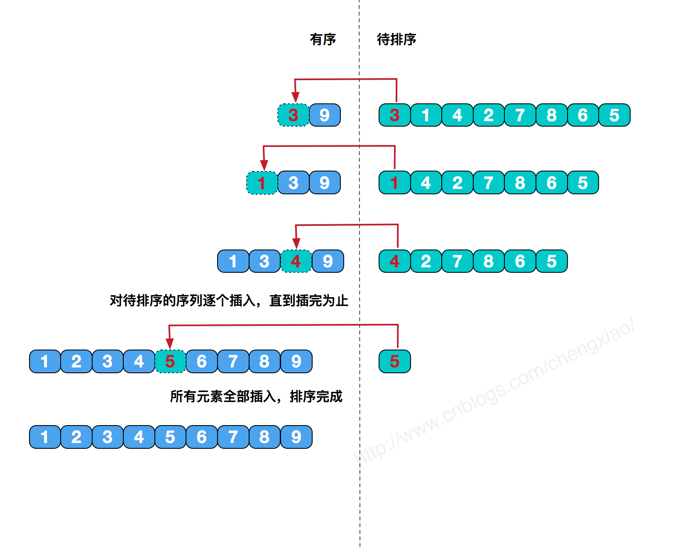
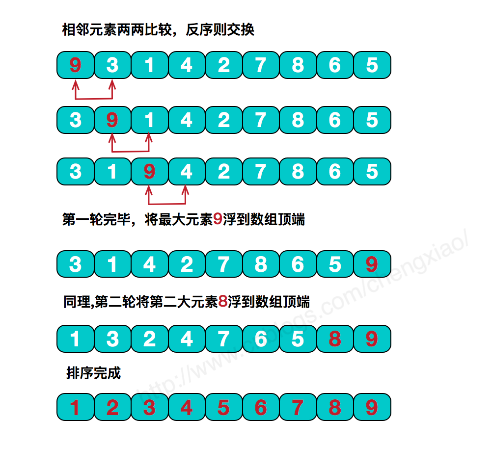

# 排序算法

## O(n2)排序算法

### 为什么要学习O(n2)的排序算法

### 选择排序

简单选择排序是最简单直观的一种算法，基本思想为每一趟从待排序的数据元素中选择最小（或最大）的一个元素作为首元素，直到所有元素排完为止，简单选择排序是不稳定排序。

选择排序：每次都遍历数组，找出最小的，和最前面未排序的数字对换位置。不断重复就可以了。

选择排序的意思？选择最小的放在前面？

~~~c++
#include <iostream>
#include <algorithm>

using namespace std;

void selectionSort(int arr[], int n){

    for(int i = 0 ; i < n ; i ++){
        // 寻找[i, n)区间里的最小值
        int minIndex = i;
        for( int j = i + 1 ; j < n ; j ++ )
            if( arr[j] < arr[minIndex] )
                minIndex = j;
		//注意使用swap的时候需要#include<algorithm>
        swap( arr[i] , arr[minIndex] );
    }

}

int main() {

    int a[10] = {10,9,8,7,6,5,4,3,2,1};
    selectionSort(a,10);
    for( int i = 0 ; i < 10 ; i ++ )
        cout<<a[i]<<" ";
    cout<<endl;

    return 0;
}
~~~

### 插入排序

从头开始遍历，对于某个元素，往前面移动。

~~~c++
//优化过后的程序
template<typename T>
void insertionSort(T arr[], int n){

    for( int i = 1 ; i < n ; i ++ ) {
        T e = arr[i];
        int j; // j保存元素e应该插入的位置
        for (j = i; j > 0 && arr[j-1] > e; j--)
            arr[j] = arr[j-1];
        arr[j] = e;
    }

    return;
}

//自己写的程序
#include<vector>
#include<iostream>
#include<algorithm>
using namespace std;
void insertSort(int a[],int n) {
	for (int i=0;i < n;i++) {
		for (int j = 0;j < i;j++) {
			if (a[i ] < a[j]) {
				swap(a[i], a[j]);
			}
		}
	}
}
int main() {
	int test[] = { 2,5,2,2,9 };
	insertSort(test, 5);
	for (int i = 0;i < 5;i++) {
		cout << test[i] << " ";
	}

}
~~~

### 冒泡排序

冒泡排序的基本思想是，对相邻的元素进行两两比较，顺序相反则进行交换，这样，每一趟会将最小或最大的元素“浮”到顶端，最终达到完全有序。

~~~c++
#include<vector>
#include<iostream>
#include<algorithm>
using namespace std;
void bubbleSort(int a[],int n) {
	for (int j = n-1;j > 0;j--) {
		for (int i = 0;i < j;i++) {
			if (a[i + 1] < a[i]) {
				swap(a[i + 1], a[i]);
			}
		}
	}
}
int main() {
	int test[] = { 2,5,2,2,9 };
	bubbleSort(test, 5);
	for (int i = 0;i < 5;i++) {
		cout << test[i] << " ";
	}

}
~~~

## O(nlogn)算法

### 归并排序

特点：多了O(n)的空间。

归并排序（MERGE-SORT）是利用**归并**的思想实现的排序方法，该算法采用经典的**分治**（divide-and-conquer）策略（分治法将问题**分**(divide)成一些小的问题然后递归求解，而**治(conquer)**的阶段则将分的阶段得到的各答案"修补"在一起，即分而治之)。

　可以看到这种结构很像一棵完全二叉树，本文的归并排序我们采用递归去实现（也可采用迭代的方式去实现）。**分**阶段可以理解为就是递归拆分子序列的过程，递归深度为log2n。

再来看看**治**阶段，我们需要将两个已经有序的子序列合并成一个有序序列，比如上图中的最后一次合并，要将[4,5,7,8]和[1,2,3,6]两个已经有序的子序列，合并为最终序列[1,2,3,4,5,6,7,8]，来看下实现步骤。

归并排序是稳定排序，它也是一种十分高效的排序，能利用完全二叉树特性的排序一般性能都不会太差。java中Arrays.sort()采用了一种名为TimSort的排序算法，就是归并排序的优化版本。从上文的图中可看出，每次合并操作的平均时间复杂度为O(n)，而完全二叉树的深度为|log2n|。总的平均时间复杂度为O(nlogn)。而且，归并排序的最好，最坏，平均时间复杂度均为O(nlogn)。

~~~c++
#include <iostream>
#include <algorithm>
#include "InsertionSort.h"
using namespace std;
// 将arr[l...mid]和arr[mid+1...r]两部分进行归并
template<typename  T>
void __merge(T arr[], int l, int mid, int r){

    //* VS不支持动态长度数组, 即不能使用 T aux[r-l+1]的方式申请aux的空间
    //* 使用VS的同学, 请使用new的方式申请aux空间
    //* 使用new申请空间, 不要忘了在__merge函数的最后, delete掉申请的空间:)
    T aux[r-l+1];
    //T *aux = new T[r-l+1];

    for( int i = l ; i <= r; i ++ )
        aux[i-l] = arr[i];

    // 初始化，i指向左半部分的起始索引位置l；j指向右半部分起始索引位置mid+1
    int i = l, j = mid+1;
    for( int k = l ; k <= r; k ++ ){

        if( i > mid ){  // 如果左半部分元素已经全部处理完毕
            arr[k] = aux[j-l]; j ++;
        }
        else if( j > r ){  // 如果右半部分元素已经全部处理完毕
            arr[k] = aux[i-l]; i ++;
        }
        else if( aux[i-l] < aux[j-l] ) {  // 左半部分所指元素 < 右半部分所指元素
            arr[k] = aux[i-l]; i ++;
        }
        else{  // 左半部分所指元素 >= 右半部分所指元素
            arr[k] = aux[j-l]; j ++;
        }
    }

    //delete[] aux;
}

// 使用优化的归并排序算法, 对arr[l...r]的范围进行排序
template<typename T>
void __mergeSort(T arr[], int l, int r){

    // 对于小规模数组, 使用插入排序
    if( r - l <= 15 ){
        insertionSort(arr, l, r);
        return;
    }

    int mid = (l+r)/2;
    __mergeSort(arr, l, mid);
    __mergeSort(arr, mid+1, r);

    // 对于arr[mid] <= arr[mid+1]的情况,不进行merge
    // 对于近乎有序的数组非常有效,但是对于一般情况,有一定的性能损失
    if( arr[mid] > arr[mid+1] )
        __merge(arr, l, mid, r);
}

template<typename T>
void mergeSort(T arr[], int n){

    __mergeSort( arr , 0 , n-1 );
}

~~~

