# AVL

## 1. 二叉树和AVL

### 二分搜索树的问题

二分搜索树存在一个问题，就是当数据有序的时候，插入到二分搜索树会退化成一个链表：

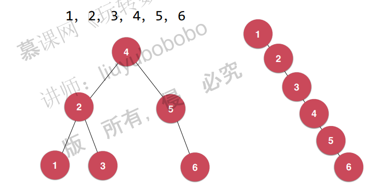

这是我们不愿意看到的。因此要想办法解决这个问题。即通过平衡二叉树来解决。

之前讲的二分搜索树不是平衡二叉树。

满二叉树，完全二叉树和线段树是平衡二叉树：

满二叉树：

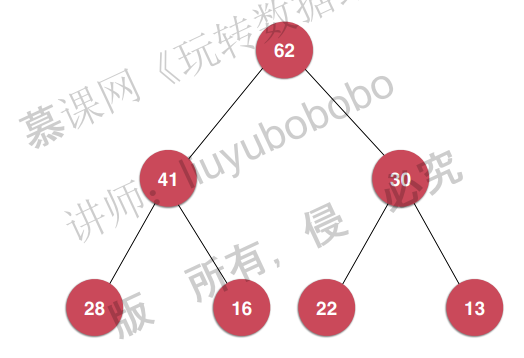

完全二叉树：

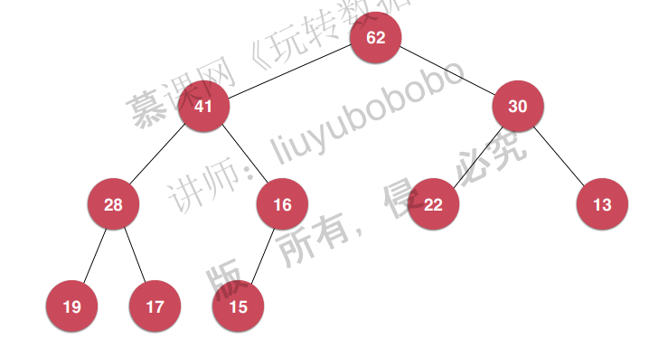

线段树：

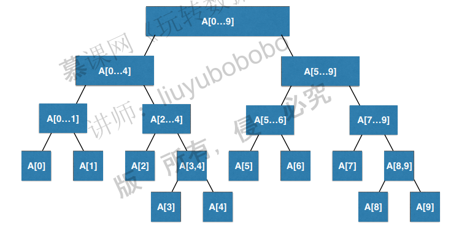

### 平衡二叉树

定义：对于任意一个节点，左子树和右子树的高度差不能超过1。比如：

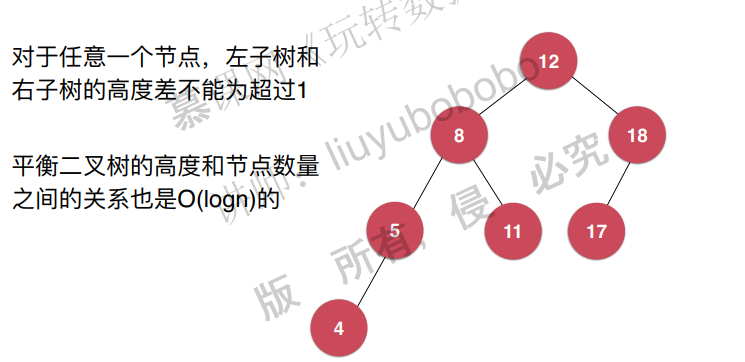

但是，下面这个就不是平衡二叉树了：

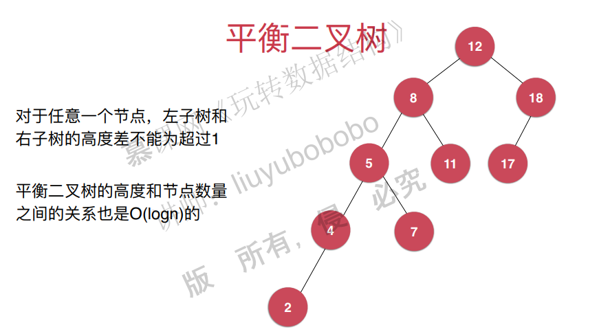

怎么判断一个树是不是平衡二叉树：

可以通过标注节点的高度和计算平衡因子得到。

标注节点的高度：

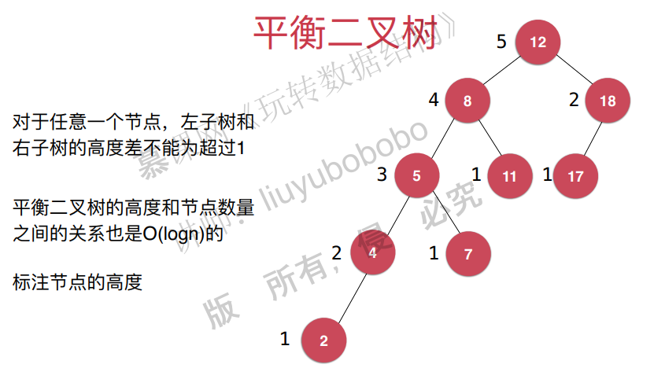

计算平衡因子

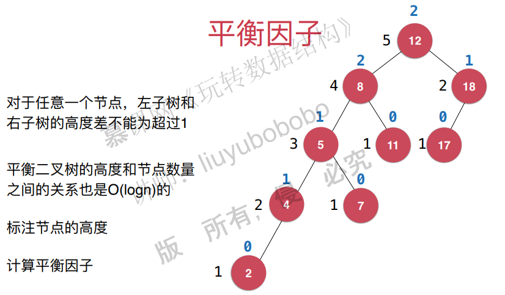

## 2. 计算节点的高度和平衡因子

直接看java代码

~~~java
import java.util.ArrayList;

public class AVLTree<K extends Comparable<K>, V> {

    private class Node{
        public K key;
        public V value;
        public Node left, right;
        public int height;

        public Node(K key, V value){
            this.key = key;
            this.value = value;
            left = null;
            right = null;
            height = 1;
        }
    }

    private Node root;
    private int size;

    public AVLTree(){
        root = null;
        size = 0;
    }

    public int getSize(){
        return size;
    }

    public boolean isEmpty(){
        return size == 0;
    }

    // 获得节点node的高度
    private int getHeight(Node node){
        if(node == null)
            return 0;
        return node.height;
    }

    // 获得节点node的平衡因子
    private int getBalanceFactor(Node node){
        if(node == null)
            return 0;
        return getHeight(node.left) - getHeight(node.right);
    }

    // 向二分搜索树中添加新的元素(key, value)
    public void add(K key, V value){
        root = add(root, key, value);
    }

    // 向以node为根的二分搜索树中插入元素(key, value)，递归算法
    // 返回插入新节点后二分搜索树的根
    private Node add(Node node, K key, V value){

        if(node == null){
            size ++;
            return new Node(key, value);
        }

        if(key.compareTo(node.key) < 0)
            node.left = add(node.left, key, value);
        else if(key.compareTo(node.key) > 0)
            node.right = add(node.right, key, value);
        else // key.compareTo(node.key) == 0
            node.value = value;

        // 更新height
        node.height = 1 + Math.max(getHeight(node.left), getHeight(node.right));

        // 计算平衡因子
        int balanceFactor = getBalanceFactor(node);
        if(Math.abs(balanceFactor) > 1)
            System.out.println("unbalanced : " + balanceFactor);

        return node;
    }

    // 返回以node为根节点的二分搜索树中，key所在的节点
    private Node getNode(Node node, K key){

        if(node == null)
            return null;

        if(key.equals(node.key))
            return node;
        else if(key.compareTo(node.key) < 0)
            return getNode(node.left, key);
        else // if(key.compareTo(node.key) > 0)
            return getNode(node.right, key);
    }

    public boolean contains(K key){
        return getNode(root, key) != null;
    }

    public V get(K key){

        Node node = getNode(root, key);
        return node == null ? null : node.value;
    }

    public void set(K key, V newValue){
        Node node = getNode(root, key);
        if(node == null)
            throw new IllegalArgumentException(key + " doesn't exist!");

        node.value = newValue;
    }

    // 返回以node为根的二分搜索树的最小值所在的节点
    private Node minimum(Node node){
        if(node.left == null)
            return node;
        return minimum(node.left);
    }

    // 删除掉以node为根的二分搜索树中的最小节点
    // 返回删除节点后新的二分搜索树的根
    private Node removeMin(Node node){

        if(node.left == null){
            Node rightNode = node.right;
            node.right = null;
            size --;
            return rightNode;
        }

        node.left = removeMin(node.left);
        return node;
    }

    // 从二分搜索树中删除键为key的节点
    public V remove(K key){

        Node node = getNode(root, key);
        if(node != null){
            root = remove(root, key);
            return node.value;
        }
        return null;
    }

    private Node remove(Node node, K key){

        if( node == null )
            return null;

        if( key.compareTo(node.key) < 0 ){
            node.left = remove(node.left , key);
            return node;
        }
        else if(key.compareTo(node.key) > 0 ){
            node.right = remove(node.right, key);
            return node;
        }
        else{   // key.compareTo(node.key) == 0

            // 待删除节点左子树为空的情况
            if(node.left == null){
                Node rightNode = node.right;
                node.right = null;
                size --;
                return rightNode;
            }

            // 待删除节点右子树为空的情况
            if(node.right == null){
                Node leftNode = node.left;
                node.left = null;
                size --;
                return leftNode;
            }

            // 待删除节点左右子树均不为空的情况

            // 找到比待删除节点大的最小节点, 即待删除节点右子树的最小节点
            // 用这个节点顶替待删除节点的位置
            Node successor = minimum(node.right);
            successor.right = removeMin(node.right);
            successor.left = node.left;

            node.left = node.right = null;

            return successor;
        }
    }

    public static void main(String[] args){

        System.out.println("Pride and Prejudice");

        ArrayList<String> words = new ArrayList<>();
        if(FileOperation.readFile("pride-and-prejudice.txt", words)) {
            System.out.println("Total words: " + words.size());

            AVLTree<String, Integer> map = new AVLTree<>();
            for (String word : words) {
                if (map.contains(word))
                    map.set(word, map.get(word) + 1);
                else
                    map.add(word, 1);
            }

            System.out.println("Total different words: " + map.getSize());
            System.out.println("Frequency of PRIDE: " + map.get("pride"));
            System.out.println("Frequency of PREJUDICE: " + map.get("prejudice"));
        }

        System.out.println();
    }
}

~~~

## 3. 检测二分搜索树的性质和平衡性

直接看java代码：

~~~java
// 判断该二叉树是否是一棵二分搜索树
    public boolean isBST(){

        ArrayList<K> keys = new ArrayList<>();
        inOrder(root, keys);
        for(int i = 1 ; i < keys.size() ; i ++)
            if(keys.get(i - 1).compareTo(keys.get(i)) > 0)
                return false;
        return true;
    }

    private void inOrder(Node node, ArrayList<K> keys){

        if(node == null)
            return;

        inOrder(node.left, keys);
        keys.add(node.key);
        inOrder(node.right, keys);
    }

    // 判断该二叉树是否是一棵平衡二叉树
    public boolean isBalanced(){
        return isBalanced(root);
    }

    // 判断以Node为根的二叉树是否是一棵平衡二叉树，递归算法
    private boolean isBalanced(Node node){

        if(node == null)
            return true;

        int balanceFactor = getBalanceFactor(node);
        if(Math.abs(balanceFactor) > 1)
            return false;
        return isBalanced(node.left) && isBalanced(node.right);
    }
~~~

## 4. 旋转操作的基本原理

为了保持平衡性，需要添加右旋转操作（插入左的时候）：

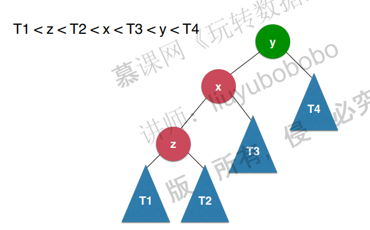

右旋转：

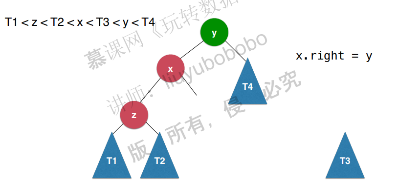

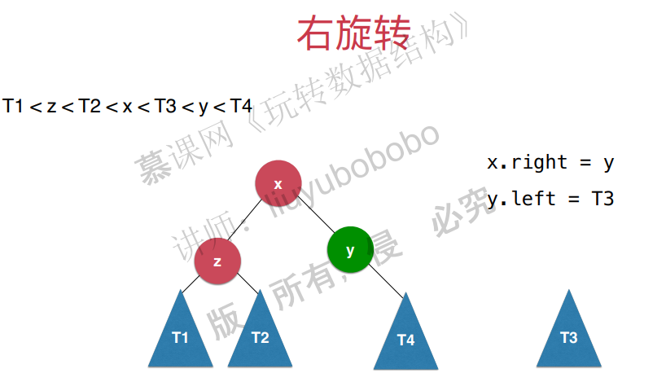

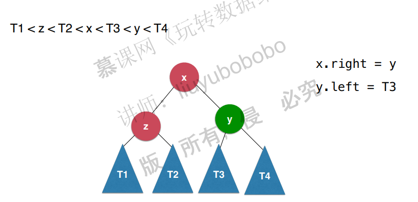

经过右旋转之后，可以保持二分搜索性和平衡性，证明需要再看视频。

左旋转同理。

## 5. 左旋转和右旋转的实现

pass

## 6. LR和RL

pass

## 7. 从AVL树中删除元素

pass

## 8. 基于AVL树的集合和映射

### 基于AVL树的set和map

### AVL树的优化

### AVL树的局限性

