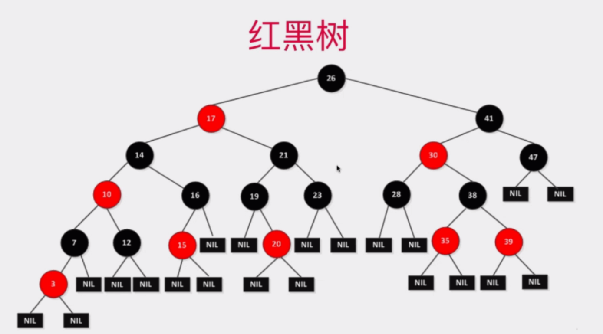

# 红黑树

## 1. 红黑树与2-3树

什么是红黑树？

长这样：

先不管为什么这样。

首先要看什么是2-3树。

比如：

以上这颗2-3树满足二分搜索树的性质。

2-3树是一颗绝对平衡的树。所有节点的左右子树的高度都相等！

## 2. 2-3树的绝对平衡性

理解树的绝对平衡性。

主要注意一个原则：在2-3树中添加元素的时候，永远保持绝对平衡性。

接上面一张图：

接上图：

## 3. 红黑树与2-3树的等价性

将2-3树画成红黑树：

将红色边横过来画：

## 4. 红黑树的基本性质和复杂度分析

红黑树满足如下性质：

红黑树的基本能性质：

只对黑色的绝对平衡。

时间复杂度（暂时没搞懂）：

## 5. 保持根节点为黑色和左旋转

面试基本上知道以上4部分就可以了。

## 6. 颜色翻转和右旋转

## 7. 红黑树中添加新元素

## 8. 红黑树的性能测试

相对二分搜索树和AVL，红黑树的查询操作有可能是O(2logn)，因此没有优势。但是添加和删除操作比较有优势。

## 9. 更多红黑树相关的话题

## 10. 对于红黑树，任何不平衡问题都会在三次旋转内解决
