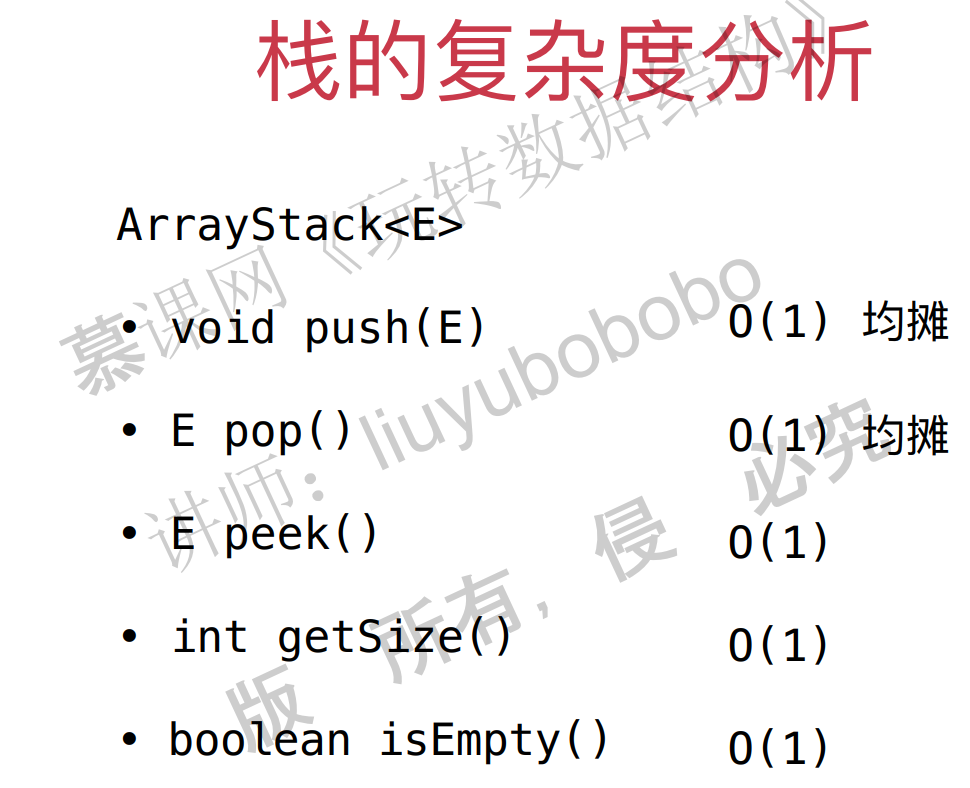

## 三、栈和队列

### 栈

#### 1. 栈的特点

1. 线性结构
2. 数组的子集
3. 先进后出或者说后进先出

#### 2. 栈的应用

undo操作，即撤销操作

程序调用的系统栈

#### 3. 功能

添加一个元素

取出一个元素

栈顶元素是什么

栈的大小

栈是否空

#### 4. 栈的实现

有两种不同的底层实现。

基于前一章的Array创建StackArray类。

通过接口来定义。

java StackArray的实现：

```java
public class ArrayStack<E> implements Stack<E> {

    private Array<E> array;

    public ArrayStack(int capacity){
        array = new Array<>(capacity);
    }

    public ArrayStack(){
        array = new Array<>();
    }

    @Override
    public int getSize(){
        return array.getSize();
    }

    @Override
    public boolean isEmpty(){
        return array.isEmpty();
    }

    public int getCapacity(){
        return array.getCapacity();
    }

    @Override
    public void push(E e){
        array.addLast(e);
    }

    @Override
    public E pop(){
        return array.removeLast();
    }

    @Override
    public E peek(){
        return array.getLast();
    }

    @Override
    public String toString(){
        StringBuilder res = new StringBuilder();
        res.append("Stack: ");
        res.append('[');
        for(int i = 0 ; i < array.getSize() ; i ++){
            res.append(array.get(i));
            if(i != array.getSize() - 1)
                res.append(", ");
        }
        res.append("] top");
        return res.toString();
    }
}
```

c++实现：

```c++
#include "array.h"
#include<iostream>
template<typename T>
class ArrayStack{
private:
	Array<T> *array;
public:
	ArrayStack(int capacity) {
		array = new Array<T>(capacity);
	}

	ArrayStack() {
		array = new Array<T>();
	}

	int getSize() {
		return array->getSize();
	}

	bool isEmpty() {
		return array->isEmpty();
	}

	int getCapacity() {
		return array->getCapacity();
	}

	void push(T e) {
		array->addLast(e);
	}

	T pop() {
		return array->removeLast();
	}

	T peek() {
		return array->getLast();
	}

	friend std::ostream & operator<<(std::ostream & out, ArrayStack & arrayStack) {
		for (int i = 0; i < arrayStack.array->getSize(); i++) {
			out << arrayStack.array->get(i) << " ";
		}
		out << std::endl;
		return out;
	}
};
```

#### 5. 栈的复杂度分析



#### 6. 括号匹配应用

leetcode题目：


思路：是左括号，就压入栈，如果是右括号，看与前一个是否匹配，如果是，则出栈，否则，不匹配。

```java
import java.util.Stack;
class Solution {

    public boolean isValid(String s) {

        ArrayStack<Character> stack = new ArrayStack<>();
        for(int i = 0 ; i < s.length() ; i ++){
            char c = s.charAt(i);
            if(c == '(' || c == '[' || c == '{')
                stack.push(c);
            else{
                if(stack.isEmpty())
                    return false;

                char topChar = stack.pop();
                if(c == ')' && topChar != '(')
                    return false;
                if(c == ']' && topChar != '[')
                    return false;
                if(c == '}' && topChar != '{')
                    return false;
            }
        }
        return stack.isEmpty();
    }

    public static void main(String[] args) {

        System.out.println((new Solution()).isValid("()[]{}"));
        System.out.println((new Solution()).isValid("([)]"));
    }
}
```

注意点：

> leecode的方法必须是public。
>
> 可以写内部类。

c++实现：

```c++
#include<stack>
#include<iostream>
using std::string;
using std::stack;
class Solution {
public:
	bool isValid(string s) {
		stack<char> stack;
		for (int i = 0; i <s.length(); i++) {
			char c = s[i];
			if (c == '(' || c == '[' || c == '{') {
				stack.push(c);
			}
			else {
				if (stack.empty()) {
					return false;
				}
				// 注意这里栈中的top()操作只是返回栈顶元素，不删除。pop()操作则相反。
				char topChar = stack.top();
				stack.pop();
				if (c==')'&& topChar != '(') {
					return false;
				}
				if (c == ']'&& topChar != '[') {
					return false;
				}
				if (c == '}'&& topChar != '{') {
					return false;
				}
			}
		}
		return stack.empty();
	}
};

// ===========================================================================
#include "dataStructure.h"
int main() {
	Solution solution;
	string s1 = "()[]{}";
	string s2 = "([)]";
	std::cout << solution.isValid(s1) << std::endl;
	std::cout << solution.isValid(s2) << std::endl;

}
```


### 队列

队列是一种线性结构。

队列从一端添加元素，一端取出元素。

#### 1. 数组队列

数组队列的设计很简单，不需要tail，front等成员变量，直接进队列，出队列就可以了。

功能设计：


注意：

1. 出队列的时候要数据要整体前移。
2. 不需要处理队列空或者满的问题？

```java
public class ArrayQueue<E> implements Queue<E> {

    private Array<E> array;

    public ArrayQueue(int capacity){
        array = new Array<>(capacity);
    }

    public ArrayQueue(){
        array = new Array<>();
    }

    @Override
    public int getSize(){
        return array.getSize();
    }

    @Override
    public boolean isEmpty(){
        return array.isEmpty();
    }

    public int getCapacity(){
        return array.getCapacity();
    }

    @Override
    public void enqueue(E e){
        array.addLast(e);
    }

    @Override
    public E dequeue(){
        return array.removeFirst();
    }

    @Override
    public E getFront(){
        return array.getFirst();
    }

    @Override
    public String toString(){
        StringBuilder res = new StringBuilder();
        res.append("Queue: ");
        res.append("front [");
        for(int i = 0 ; i < array.getSize() ; i ++){
            res.append(array.get(i));
            if(i != array.getSize() - 1)
                res.append(", ");
        }
        res.append("] tail");
        return res.toString();
    }

    public static void main(String[] args) {

        ArrayQueue<Integer> queue = new ArrayQueue<>();
        for(int i = 0 ; i < 10 ; i ++){
            queue.enqueue(i);
            System.out.println(queue);
            if(i % 3 == 2){
                queue.dequeue();
                System.out.println(queue);
            }
        }
    }
}
```

c++版本：

```c++
#include<vector>
#include<iostream>
using std::vector;
template<typename T>
class ArrayQueue{
private:
	vector<T> *array;
public:
	ArrayQueue() {
		array = new vector<T>;
	}
	~ArrayQueue() {
		delete array;
	}

	int getSize() {
		return array->size();
	}

	bool isEmpty() {
		return array->empty();
	}

	int getCapacity() {
		return array->capacity();
	}

	void enqueue(T e) {
		array->push_back(e);
	}

	T dequeue() {
		// vector删除第一个元素需要通过迭代器，具体参考：https://zhidao.baidu.com/question/1174443676189215499.html
		// T e = array[0];这样是不行的，暂时没找到原因。
 		T e = array->front();
		array->erase(this->array->begin());
		return e;
	}

	T getFront() {
		return array->front();
	}

	//friend std::ostream & operator<<(std::ostream & out, ArrayQueue & arrayQueue) {
	//	//c++使用 vector指针访问vector元素时，不能简单的类似于c中数组和指针的方式。需要使用迭代器。
	//	//参考：https://blog.csdn.net/fao9001/article/details/75006369
	//	for (vector<T>::iterator it = arrayQueue.array->begin(); it != arrayQueue.array->end(); it++) {
	//		out << *it << " ";
	//	}
	//	out << std::endl;
	//	return out;
	//}
	void print() {
		//以下方法是不行的。不支持泛型，暂时不知道为什么。
		/*for (vector<T>::iterator it = array->begin(); it != array->end(); it++) {
			std::cout << *it << " ";
		}
		std::cout << std::endl;*/
		for (int i = 0; i < array->size(); i++) {
			//注意这里需要用解引用
			std::cout << (*array)[i]<<" ";
		}
		std::cout << std::endl;
	}
};

//===============================================================================
#include"dataStructure.h"
#include<iostream>
#include<vector>
int main() {
	ArrayQueue<int> *queue = new ArrayQueue<int>;
	for (int i = 0; i < 10; i++) {
		queue->enqueue(i);
		queue->print();
		if (i % 3 == 2) {
			queue->dequeue();
			queue->print();
		}
	}
}
```

#### 2.数组队列的复杂度分析


#### 3. 数组队列的问题

出队列的时候，所有元素都要向前移动移动一位，这样导致出队列的时间复杂度是O(n)。

#### 4. 循环队列的思想

出队列的时候，保留数据位置不动，只是重新定义front和tail。

#### 5. 设计思想

1. 当没有元素的时候，设置$head=tail$，这时候用$head==tail$这个条件来判断队列是否为空，满足则空。
2. 出队列的时候，通过front = (front + 1) % data.length来设置tail的值。注意：front指向第一个元素。
3. 入队列的时候，通过tail = (tail + 1) % data.length来设置tail的值，注意这个时候，tail并没有指向任何元素。
4. 判断数组满的方法：$(tail + 1) \% data.length == front$，注意这里要加1。注意：我们已经用front==tail表示数组为空的情况，因此，不能用front==tail判断满，而是通过tail+1==front判断满。

java版本实现：

```java
public class LoopQueue<E> implements Queue<E> {

    private E[] data;
    private int front, tail;
    private int size;  // 有兴趣的同学，在完成这一章后，可以思考一下：
                       // LoopQueue中不声明size，如何完成所有的逻辑？
                       // 这个问题可能会比大家想象的要难一点点：）

    public LoopQueue(int capacity){
        data = (E[])new Object[capacity + 1];
        front = 0;
        tail = 0;
        size = 0;
    }

    public LoopQueue(){
        this(10);
    }

    public int getCapacity(){
        return data.length - 1;
    }

    @Override
    public boolean isEmpty(){
        return front == tail;
    }

    @Override
    public int getSize(){
        return size;
    }

    @Override
    public void enqueue(E e){
		// 判断队列是否满，满的话就进行扩容。
        if((tail + 1) % data.length == front)
            resize(getCapacity() * 2);

        data[tail] = e;
        //添加一个元素之后，通过这种方式来讲tail移位。注意不能直接使用tail++，会出现移到数组前面去的情况。
        tail = (tail + 1) % data.length;
        size ++;
    }

    @Override
    public E dequeue(){
		// 首先判断是否为空，空的话就不能出队列。
        if(isEmpty())
            throw new IllegalArgumentException("Cannot dequeue from an empty queue.");

        E ret = data[front];
        data[front] = null;
        // 通过这种方式对front进行重新幅值。注意：不能直接用front++，因为会出现跑到数组前面去的情况。
        front = (front + 1) % data.length;
        size --;
        if(size == getCapacity() / 4 && getCapacity() / 2 != 0)
            resize(getCapacity() / 2);
        return ret;
    }

    @Override
    public E getFront(){
        if(isEmpty())
            throw new IllegalArgumentException("Queue is empty.");
        return data[front];
    }

    private void resize(int newCapacity){

        E[] newData = (E[])new Object[newCapacity + 1];
        for(int i = 0 ; i < size ; i ++)
            newData[i] = data[(i + front) % data.length];

        data = newData;
        front = 0;
        tail = size;
    }

    @Override
    public String toString(){

        StringBuilder res = new StringBuilder();
        res.append(String.format("Queue: size = %d , capacity = %d\n", size, getCapacity()));
        res.append("front [");
        for(int i = front ; i != tail ; i = (i + 1) % data.length){
            res.append(data[i]);
            if((i + 1) % data.length != tail)
                res.append(", ");
        }
        res.append("] tail");
        return res.toString();
    }

    public static void main(String[] args){

        LoopQueue<Integer> queue = new LoopQueue<>();
        for(int i = 0 ; i < 10 ; i ++){
            queue.enqueue(i);
            System.out.println(queue);

            if(i % 3 == 2){
                queue.dequeue();
                System.out.println(queue);
            }
        }
    }
}
```

c++版本实现：

pass