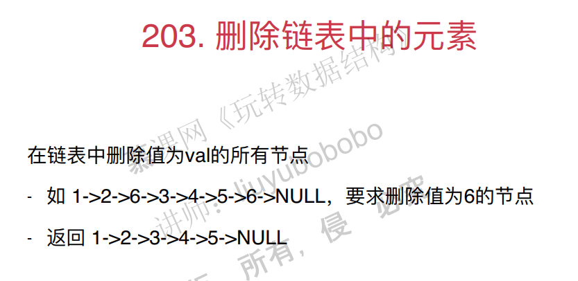

## 五、链表和递归

递归经常用在树中。但是递归也可以在链表中使用。为了更好地理解递归，这里讨论链表和递归的话题。

### 1. 从leetcode开始

题目如下：



leetcode已经定义好了链表节点的结构：

```java
//Definition for singly-linked list.
public class ListNode {
    public int val;
    public ListNode next;
    public ListNode(int x) {
        val = x;
    }
}
```

之前删除链表中元素的方法：

1. 找到要删除的节点之前的节点，然后删除这个节点。但是这样有一个问题，就是头结点没有之前的节点，为了解决这个问题，头结点需要单独进行处理。
2. 为了不单独进行处理，有一种办法，就是建立虚拟节点进行处理。
3. 尝试不涉及头结点来处理这个问题。

首先讲直接处理头结点的解决方法1：

java代码：

```java
/// Leetcode 203. Remove Linked List Elements
/// https://leetcode.com/problems/remove-linked-list-elements/description/
class Solution {
    public ListNode removeElements(ListNode head, int val) {
		//首先判断是不是要删除头节点。注意：头结点删除完之后，新的头结点也可能需要删除，所以需要while。
        while(head != null && head.val == val){
            ListNode delNode = head;
            head = head.next;
            delNode.next = null;//将删除的节点的next赋值null，java回进行垃圾回收。
        }

        if(head == null)
            return head;//返回null会满足类型？

        ListNode prev = head;//此时的头结点的值一定不等于val。
        while(prev.next != null){
            if(prev.next.val == val) {
                ListNode delNode = prev.next;
                prev.next = delNode.next;
                delNode.next = null;
            }
            else
                prev = prev.next;
        }
	    //将该删除的节点都删除之后，就可以直接返回头结点就行了。
        return head;
    }
}
```

c++代码：

```c++
class ListNode {
public:
	int val;
	ListNode *next;
	ListNode(int x) {
		val = x;
	}
};
class Solution {
public:
	ListNode* removeElement(ListNode *head, int val) {
		while (head != nullptr&&head->val == val) {
			ListNode* delNode = head;
			head = head->next;
			delete delNode;
		}
		if (head = nullptr) {
			return head;
		}
		ListNode* prev = head;
		while (prev->next != nullptr) {
			if (prev->val == val) {
				ListNode *delNode = prev->next;
				prev->next = delNode->next;
				delete delNode;
			}
			else {
				prev = prev->next;
			}
		}
		return head;
	}
};
```

注意：这里的代码用到了循环到最后一个元素来删除多个元素，之前删除一个元素并不需要循环到最后一个元素。

在leetcode上提交的版本，这是一个简化过的版本：

```java
/// Leetcode 203. Remove Linked List Elements
/// https://leetcode.com/problems/remove-linked-list-elements/description/

class Solution2 {

    public ListNode removeElements(ListNode head, int val) {

        while(head != null && head.val == val)
            head = head.next;

        if(head == null)
            return head;

        ListNode prev = head;
        while(prev.next != null){
            if(prev.next.val == val)
                prev.next = prev.next.next;
            else
                prev = prev.next;
        }

        return head;
    }
}
```

解决方法3：使用虚拟头结点

```java
/// Leetcode 203. Remove Linked List Elements
/// https://leetcode.com/problems/remove-linked-list-elements/description/

class Solution3 {

    public ListNode removeElements(ListNode head, int val) {
		// 虚拟头结点创建的时候可以随便赋值，这里赋值为-1.
        ListNode dummyHead = new ListNode(-1);
        dummyHead.next = head;
		
        ListNode prev = dummyHead;
        while(prev.next != null){
            if(prev.next.val == val)
                prev.next = prev.next.next;
            else
                prev = prev.next;
        }
		// 返回头结点
        return dummyHead.next;
    }
}
```

c++代码：

```c++
class ListNode {
public:
	int val;
	ListNode *next;
	ListNode(int x) {
		val = x;
         next = nullptr;
	}
};
class Solution {
public:
	ListNode* removeElement(ListNode *head, int val) {
		ListNode* dummy_head = new ListNode(-1);
		dummy_head->next = head;
		ListNode* prev = dummy_head;
		while (prev->next != nullptr) {
			if (prev->next->val == val) {
				ListNode *delNode = prev->next;
				prev->next = delNode->next;
				delete delNode;
			}
			else {
				prev = prev->next;
			}
		}
		return dummy_head->next;
	}
};
```

### 2. 测试leetcode的代码

pass

### 3. 递归和链表

递归：将原来的问题，转化为更小的同一问题。

比如数组求和问题。

求解最基本的问题。

将原问题转为更小的问题。

函数里面调用自己，完全可以想象成它是在调用另外一个函数，而不是调用自己，这样会比较不晕。


### 4. 链表的天然递归性

链表具有天然的递归属性，考虑删除元素的问题，删除一个节点之后，剩下的仍然是一个链表。对于剩下的链表删除元素和原链表删除元素是同一个问题。

### 5. 链表调用的微观解读

实际上就是函数调用栈。

使用递归删除链表中元素java代码：

```java
/// Leetcode 203. Remove Linked List Elements
/// https://leetcode.com/problems/remove-linked-list-elements/description/

class Solution4 {

    public ListNode removeElements(ListNode head, int val) {

        if(head == null)
            return head;

        ListNode res = removeElements(head.next, val);
        if(head.val == val)
            return res;
        else{
            head.next = res;
            return head;
        }
    }

    public static void main(String[] args) {

        int[] nums = {1, 2, 6, 3, 4, 5, 6};
        ListNode head = new ListNode(nums);
        System.out.println(head);

        ListNode res = (new Solution4()).removeElements(head, 6);
        System.out.println(res);
    }
}
```

c++代码：

```c++
class ListNode {
public:
	int val;
	ListNode *next;
	ListNode(int x) {
		val = x;
		next = nullptr;
	}
};
class Solution {
public:
	ListNode * removeElements(ListNode *head, int val) {
		if (head == nullptr) {
			return head;
		}
		ListNode* res = removeElements(head->next, val);
		if (head->val == val) {
			return res;
		}
		else {
			head->next = res;
			return head;
		}
		return head;
	}
};
```

### 6. 递归程序的调试

利用IDE跟踪调试。