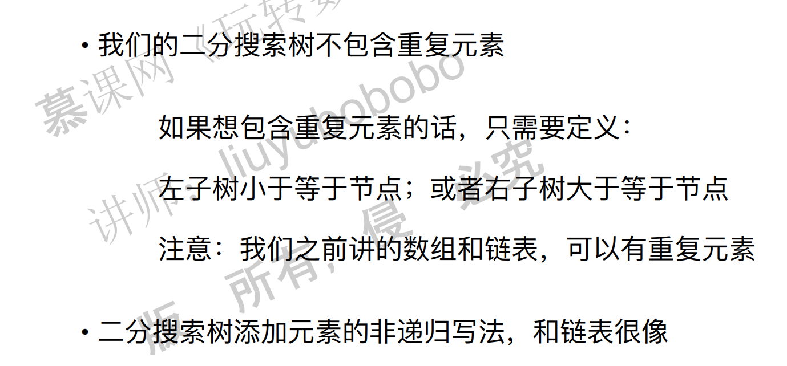

## 六、二分搜索树

### 1. 为什么要研究树结构

#### 树结构的优点

非常**高效**。按照某个分支寻找下去就可以了，节省了不必要的搜索，因此很高效。

#### 要讲的树结构


### 2. 二分搜索树基础

#### 2.1 二叉树

二叉树的概念略。

二叉树的特性：具有天然的递归特性。

#### 2.2 什么是二分搜索树


包含重复元素和不包含重复元素的二分搜索树：


#### 2.3 二分搜索树的优点

因为左子树小于根，右子树大于根，因为这种结构，使得查找非常快。

节点是要可比较的。

#### 2.4 二分搜索树的基础实现

```java
public class BST<E extends Comparable<E>> {

    private class Node {
        public E e;
        public Node left, right;

        public Node(E e) {
            this.e = e;
            left = null;
            right = null;
        }
    }
    private Node root;
    private int size;

    public BST(){
        root = null;
        size = 0;
    }

    public int size(){
        return size;
    }

    public boolean isEmpty(){
        return size == 0;
    }
}
```

**递归的要点**

递归实现的要点：1. 写终止条件。2. 转化为规模更小的问题。

另外，需要注意的是：1. 递归函数本身的意义是什么。2. 递归函数的调用，看作是调用了一个新的函数就好了。3. 用IDE进行递归的DEBUG。

### 3. 向二分搜索树中添加元素

添加元素操作：

如果根节点为空，直接添加。

如果不为空，看看比根节点大还是小，小的话添加到左子树，大的话添加到右子树。完毕。

如果插入元素如果和树中存在元素相同的话，则覆盖。不过我们这里讲的二分搜索树不包含重复元素。



二分搜索树可能退化成为一个链表！因此递归的方法可能导致栈溢出。


java代码：

```java
// 向二分搜索树中添加新的元素e
    public void add(E e){

        if(root == null){
            root = new Node(e);
            size ++;
        }
        else
            add(root, e);
    }

    // 向以node为根的二分搜索树中插入元素e，递归算法
    private void add(Node node, E e){
        if(e.equals(node.e))
            return;
        else if(e.compareTo(node.e) < 0 && node.left == null){
            node.left = new Node(e);
            size ++;
            return;
        }
        else if(e.compareTo(node.e) > 0 && node.right == null){
            node.right = new Node(e);
            size ++;
            return;
        }

        if(e.compareTo(node.e) < 0)
            add(node.left, e);
        else //e.compareTo(node.e) > 0
            add(node.right, e);
    }
```

### 4. 改进添加操作：深入理解递归终止条件

将3中的递归进行优化：

修改点：返回根节点！

```java
// 向二分搜索树中添加新的元素e
    public void add(E e){
        root = add(root, e);
    }

    // 向以node为根的二分搜索树中插入元素e，递归算法
    // 返回插入新节点后二分搜索树的根
    private Node add(Node node, E e){
        if(node == null){
            size ++;
            return new Node(e);
        }

        if(e.compareTo(node.e) < 0)
            node.left = add(node.left, e);
        else if(e.compareTo(node.e) > 0)
            node.right = add(node.right, e);

        return node;
    }
```

### 5. 二分搜索树的查询操作

查询元素

思想：传入一个节点，如果为空，就返回false。如果不为空，看看这个节点是否是待查询的节点，如果是就返回true，否则根据待查询的节点的值的大小选择到左或者右子树进行查找。

```java
 // 看二分搜索树中是否包含元素e
    public boolean contains(E e){
        return contains(root, e);
    }

    // 看以node为根的二分搜索树中是否包含元素e, 递归算法
    private boolean contains(Node node, E e){

        if(node == null)
            return false;

        if(e.compareTo(node.e) == 0)
            return true;
        else if(e.compareTo(node.e) < 0)
            return contains(node.left, e);
        else // e.compareTo(node.e) > 0
            return contains(node.right, e);
    }
```

### 6. 二分搜索树的前序遍历

前序遍历的意思：就是先访问根，然后左，然后右。

```java
// 二分搜索树的前序遍历
    public void preOrder(){
        preOrder(root);
    }

    // 前序遍历以node为根的二分搜索树, 递归算法
    private void preOrder(Node node){
        if(node == null)
            return;

        System.out.println(node.e);
        preOrder(node.left);
        preOrder(node.right);
    }
```

### 7. 二分搜索树的中序遍历和后序遍历

中序遍历：左，中，右。

后序遍历：左，右，中。

中序遍历：

```java
 // 二分搜索树的中序遍历
    public void inOrder(){
        inOrder(root);
    }

    // 中序遍历以node为根的二分搜索树, 递归算法
    private void inOrder(Node node){
        if(node == null)
            return;

        inOrder(node.left);
        System.out.println(node.e);
        inOrder(node.right);
    }
```

后序遍历：

```java
 // 二分搜索树的后序遍历
    public void postOrder(){
        postOrder(root);
    }

    // 后序遍历以node为根的二分搜索树, 递归算法
    private void postOrder(Node node){
        if(node == null)
            return;

        postOrder(node.left);
        postOrder(node.right);
        System.out.println(node.e);
    }
```

### 8. 深入理解二分搜索树的前中后序遍历

我们要怎么不看程序也能得到前中后序遍历的结果呢？有一种办法就是3点法。


前序遍历：


中序遍历：


后序遍历：


### 9. 二分搜索树的前序遍历的非递归写法

需要模拟系统栈，暂时忽略。

### 10. 二分搜索树的层序遍历

二分搜索树的遍历分为两种，一种是深度优先遍历，包括之前讲的前序遍历，中序遍历和后续遍历。另外一种是广度优先遍历，也就是接下来要讲的层序遍历。


层序遍历的实现，不能使用递归，需要使用栈来进行遍历。具体思想：

> 首先，将头结点放到队列中。然后出队列，出队列的时候将左节点和右节点分别压入队列中。
>
> 将左节点出栈，同时将左节点和右节点压入到栈中…
>
> 如此不断循环。
>
> 总之一句话，就是在节点出队列的时候要把左右节点都给压入到队列中。


**广度优先遍历的意义**

深度优先遍历是一路走到底，但是问题的解不一定在底部，而是在顶部，这个时候使用广度优先遍历可能就可以更快地找到问题的解。


java代码：

```java
    // 二分搜索树的层序遍历
    public void levelOrder(){

        if(root == null)
            return;

        Queue<Node> q = new LinkedList<>();
        q.add(root);
        while(!q.isEmpty()){
            Node cur = q.remove();
            System.out.println(cur.e);

            if(cur.left != null)
                q.add(cur.left);
            if(cur.right != null)
                q.add(cur.right);
        }
    }
```

### 11. 删除二分搜索树的最大元素和最小元素

由于二分搜索树的删除操作比较麻烦，这里先讲简单的：删除二分搜索树的最小值和最大值。

二分搜索树的最小值：从头结点开始往左走，直到走不动为止，删除。

二分搜索树的最大值：从头结点开始往右走，直到走不动为止，删除。

注意，最小值和最大值不一定是叶子节点。比如以下这种情况。


首先知道怎么寻找最小值和最大值。

寻找最小值和最大值的代码：

```java
// 寻找二分搜索树的最小元素
    public E minimum(){
        if(size == 0)
            throw new IllegalArgumentException("BST is empty");

        Node minNode = minimum(root);
        return minNode.e;
    }

    // 返回以node为根的二分搜索树的最小值所在的节点
    private Node minimum(Node node){
        if( node.left == null )
            return node;

        return minimum(node.left);
    }

    // 寻找二分搜索树的最大元素
    public E maximum(){
        if(size == 0)
            throw new IllegalArgumentException("BST is empty");

        return maximum(root).e;
    }

    // 返回以node为根的二分搜索树的最大值所在的节点
    private Node maximum(Node node){
        if( node.right == null )
            return node;

        return maximum(node.right);
    }
```

**删除二分搜索树的最小值**

如果最小值是叶子节点，那么删除起来很简单。实际上就是链表的节点删除，可以用递归实现，也可以不用。


如果最小值不是叶子节点，那么删除起来就有点麻烦，需要将当前节点的右子树赋值给当前节点的父节点的左子树。


删除最大值的方法同理。

删除最小值和最大值的java代码：

java代码：

```java
    // 删除掉以node为根的二分搜索树中值为e的节点, 递归算法
    // 返回删除节点后新的二分搜索树的根
    private Node remove(Node node, E e){

        if( node == null )
            return null;

        if( e.compareTo(node.e) < 0 ){
            node.left = remove(node.left , e);
            return node;
        }
        else if(e.compareTo(node.e) > 0 ){
            node.right = remove(node.right, e);
            return node;
        }
        else{   // e.compareTo(node.e) == 0

            // 待删除节点左子树为空的情况
            if(node.left == null){
                Node rightNode = node.right;
                node.right = null;
                size --;
                return rightNode;
            }

            // 待删除节点右子树为空的情况
            if(node.right == null){
                Node leftNode = node.left;
                node.left = null;
                size --;
                return leftNode;
            }

            // 待删除节点左右子树均不为空的情况

            // 找到比待删除节点大的最小节点, 即待删除节点右子树的最小节点
            // 用这个节点顶替待删除节点的位置
            Node successor = minimum(node.right);
            successor.right = removeMin(node.right);
            successor.left = node.left;

            node.left = node.right = null;

            return successor;
        }
```

c++代码：

```c++
	// 删除掉以node为根的二分搜索树中值为e的节点, 递归算法
	// 返回删除节点后新的二分搜索树的根
	Node<T>* remove(Node<T>* node, T e) {
		if (node == nullptr) {
			return nullptr;
		}
		if (e< node->e) {
			node->left = this->remove(node->left, e);
			return node;
		}
		else if (e> node->e) {
			node->right = this->remove(node->right, e);
			return node;
		}
		else {   // e.compareTo(node.e) == 0

				 // 待删除节点左子树为空的情况
			if (node->left == nullptr) {
				Node<T>* rightNode = node->right;
				delete node;
				this->size--;
				return rightNode;
			}

			// 待删除节点右子树为空的情况
			if (node->right == nullptr) {
				Node<T>* leftNode = node->left;
				delete node;
				this->size--;
				return leftNode;
			}

			// 待删除节点左右子树均不为空的情况

			// 找到比待删除节点大的最小节点, 即待删除节点右子树的最小节点
			// 用这个节点顶替待删除节点的位置
			Node<T>* successor = this->minimum(node->right);
			//删除右子树的最小节点，返回根。
			successor->right =this-> removeMin(node->right);
			successor->left = node->left;
			delete node;
			return successor;
		}
	}
```

思路：递归问题的三步骤：

1. 明白递归函数的任务：给一个根节点，删除掉树的最小值节点，返回新的根。
2. 最基本问题：判断根的左节点是不是空，空的话删掉这个根节点同时返回右节点作为新的根。
3. 相似子问题：如果左节点不是空的话，剩下的问题就是子问题，将根节点的左节点=新产生的根就可以了。

注意：如果左右子树都不为空的情况下删除节点的做法。删除右子树中最小的值：


当然，也可以删除左子树中最小的值：


至于为什么要这么做，暂时不知道。

```java
//......
    // 寻找二分搜索树的最小元素
    public E minimum(){
        if(size == 0)
            throw new IllegalArgumentException("BST is empty");

        Node minNode = minimum(root);
        return minNode.e;
    }

    // 返回以node为根的二分搜索树的最小值所在的节点
    private Node minimum(Node node){
        if( node.left == null )
            return node;

        return minimum(node.left);
    }

    // 寻找二分搜索树的最大元素
    public E maximum(){
        if(size == 0)
            throw new IllegalArgumentException("BST is empty");

        return maximum(root).e;
    }

    // 返回以node为根的二分搜索树的最大值所在的节点
    private Node maximum(Node node){
        if( node.right == null )
            return node;

        return maximum(node.right);
    }

    // 从二分搜索树中删除最小值所在节点, 返回最小值
    public E removeMin(){
        E ret = minimum();
        root = removeMin(root);
        return ret;
    }

    // 删除掉以node为根的二分搜索树中的最小节点
    // 返回删除节点后新的二分搜索树的根
    private Node removeMin(Node node){

        if(node.left == null){
            Node rightNode = node.right;
            node.right = null;
            size --;
            return rightNode;
        }

        node.left = removeMin(node.left);   
        return node;
    }

    // 从二分搜索树中删除最大值所在节点
    public E removeMax(){
        E ret = maximum();
        root = removeMax(root);
        return ret;
    }

    // 删除掉以node为根的二分搜索树中的最大节点
    // 返回删除节点后新的二分搜索树的根
    private Node removeMax(Node node){

        if(node.right == null){
            Node leftNode = node.left;
            node.left = null;
            size --;
            return leftNode;
        }

        node.right = removeMax(node.right);
        return node;
    }
//......
```

删除最小值和最大值的c++代码：

```c++
	// 寻找二分搜索树的最小元素
	T minimum() {
		assert(this->size > 0);
		Node<T> *minNode = minimum(this->root);
		return minNode->e;
	}

	// 返回以node为根的二分搜索树的最小值所在的节点
	Node<T>* minimum(Node<T>* node) {
		if (node->left == nullptr) {
			return node;
		}
		return minimum(node->left);
	}

	// 寻找二分搜索树的最大元素
	T maximum() {
		assert(this->size > 0);
		Node<T> *maxNode = maximum(this->root);
		return maxNode->e;
	}

	// 返回以node为根的二分搜索树的最大值所在的节点
	Node<T>* maximum(Node<T> *node) {
		if (node->right == nullptr) {
			return node;
		}
		return maximum(node->right);
	}
    // 从二分搜索树中删除最小值所在节点, 返回最小值
	T removeMin() {
		T ret = this->minimum();
		this->root = this->removeMin(this->root);
		return ret;
	}

	// 删除掉以node为根的二分搜索树中的最小节点
	// 返回删除节点后新的二分搜索树的根
	Node<T>* removeMin(Node<T>* node) {

		if (node->left == nullptr) {
			Node<T>* rightNode = node->right;
			delete node;
			this->size--;
			return rightNode;
		}

		node->left = this->removeMin(node->left);
		return node;
	}

	// 从二分搜索树中删除最大值所在节点
	T removeMax() {
		T ret = this->maximum();
		this->root = this->removeMax(this->root);
		return ret;
	}

	// 删除掉以node为根的二分搜索树中的最大节点
	// 返回删除节点后新的二分搜索树的根
	Node<T>* removeMax(Node<T> *node) {

		if (node->right == nullptr) {
			Node<T>* leftNode = node->left;
			delete node;
			this->size--;
			return leftNode;
		}
		node->right =this-> removeMax(node->right);
		return node;
	}
	// 从二分搜索树中删除元素为e的节点
	void remove(T e) {
		this->root = remove(this->root, e);
	}
```

**二分搜索树删除节点**


### 12. 删除二分搜索树的任意元素

### 13. 更多关于二分搜索树的相关话题

 二分搜索树前序遍历的非递归写法

二分搜索树的前序遍历的非递归写法需要用到栈的数据结构。二分搜索树遍历的非递归实现，比递归实现复杂得多，中序遍历和后序遍历的非递归实现更复杂。中序遍历和后序遍历的非递归实现，实际应用得很少。

### 总代码

java代码：

```java
public class BST<E extends Comparable<E>> {

    private class Node {
        public E e;
        public Node left, right;

        public Node(E e) {
            this.e = e;
            left = null;
            right = null;
        }
    }

    private Node root;
    private int size;

    public BST(){
        root = null;
        size = 0;
    }

    public int size(){
        return size;
    }

    public boolean isEmpty(){
        return size == 0;
    }

    // 向二分搜索树中添加新的元素e
    public void add(E e){
        root = add(root, e);
    }

    // 向以node为根的二分搜索树中插入元素e，递归算法
    // 返回插入新节点后二分搜索树的根
    private Node add(Node node, E e){
        if(node == null){
            size ++;
            return new Node(e);
        }

        if(e.compareTo(node.e) < 0)
            node.left = add(node.left, e);
        else if(e.compareTo(node.e) > 0)
            node.right = add(node.right, e);

        return node;
    }

    // 看二分搜索树中是否包含元素e
    public boolean contains(E e){
        return contains(root, e);
    }

    // 看以node为根的二分搜索树中是否包含元素e, 递归算法
    private boolean contains(Node node, E e){

        if(node == null)
            return false;

        if(e.compareTo(node.e) == 0)
            return true;
        else if(e.compareTo(node.e) < 0)
            return contains(node.left, e);
        else // e.compareTo(node.e) > 0
            return contains(node.right, e);
    }

    // 二分搜索树的前序遍历
    public void preOrder(){
        preOrder(root);
    }

    // 前序遍历以node为根的二分搜索树, 递归算法
    private void preOrder(Node node){
        if(node == null)
            return;

        System.out.println(node.e);
        preOrder(node.left);
        preOrder(node.right);
    }

    @Override
    public String toString(){
        StringBuilder res = new StringBuilder();
        generateBSTString(root, 0, res);
        return res.toString();
    }

    // 生成以node为根节点，深度为depth的描述二叉树的字符串
    private void generateBSTString(Node node, int depth, StringBuilder res){

        if(node == null){
            res.append(generateDepthString(depth) + "null\n");
            return;
        }

        res.append(generateDepthString(depth) + node.e + "\n");
        generateBSTString(node.left, depth + 1, res);
        generateBSTString(node.right, depth + 1, res);
    }

    private String generateDepthString(int depth){
        StringBuilder res = new StringBuilder();
        for(int i = 0 ; i < depth ; i ++)
            res.append("--");
        return res.toString();
    }
}
```

c++代码：

```c++
#pragma once
#include<iostream>
template<typename T>
class Node {
public:
	T e;
	Node *left;
	Node *right;

public:
	Node(T e) {
		this->e = e;
		left = nullptr;
		right = nullptr;
	}

};

template<typename T>
class BST {
private:
	Node<T> *root;
	int size;
public:
	BST(){
		this->root = nullptr;
		this->size = 0;
	}
	~BST() {
		this->delTree(this->root);
	}
	void delTree(Node<T> *node) {
		if (node = nullptr) {
			return;
		}
		delTree(node->left);
		delTree(node->right);
		std::cout << "delete node " << node->e;
		delete node;
		node = nullptr;
	}

	int getSize() {
		return this->size;
	}
	bool isEmpty() {
		return this->size == 0;
	}

	void add(T e) {
		this->root = this->add(this->root, e);
	}
	// 看二分搜索树中是否包含元素e，这里假设没有重复元素。
	bool contain(T e) {
		return this->contain(this->root, e);
	}
	// 二分搜索树的前序遍历
	void preOrder() {
		this->preOrder(this->root);
	}
	// 二分搜索树的中序遍历
	void inOrder() {
		this->inOrder(this->root);
	}
	// 二分搜索树的后序遍历
	void postOrder() {
		this->postOrder(this->root);
	}


private:
	// 向以node为根的二分搜索树中插入元素e，递归算法
	// 返回插入新节点后二分搜索树的根
	
	Node<T>* add(Node<T> *node, T e) {
		if (node == nullptr) {	
			this->size++;
			return new Node<T>(e);
		}
		if (e<node->e){
			node->left= add(node->left, e);
		}
		else if (e > node->e) {
			node->right=add(node->right,e);
		}
		return node;
	}
	// 看以node为根的二分搜索树中是否包含元素e, 递归算法
	bool contain(Node<T> *node, T e) {
		if (node == nullptr) {
			return false;
		}
		if (node->e == e) {
			return true;
		}
		else if (e<node->e) {
			return contain(node->left,e);
		}
		else {
			return contain(node->right, e);
		}
	
	}
	// 前序遍历以node为根的二分搜索树, 递归算法
	void preOrder(Node<T> *node) {
		if (node == nullptr) {
			return;
		}
		std::cout << node->e << std::endl;
		preOrder(node->left);
		preOrder(node->right);
	}
	// 中序遍历以node为根的二分搜索树, 递归算法
	void inOrder(Node<T> *node) {
		if (node == nullptr) {
			return;
		}	
		inOrder(node->left);
		std::cout << node->e << std::endl;
		inOrder(node->right);
	}
	// 后序遍历以node为根的二分搜索树, 递归算法
	void postOrder(Node<T> *node) {
		if (node == nullptr) {
			return;
		}
		postOrder(node->left);
		postOrder(node->right);
		std::cout << node->e << std::endl;
	}
};

//======================================================
#include"dataStructure.h"
#include<iostream>
#include<vector>
int main() {

	BST<int> bst;
	int nums[]= { 5, 3, 6, 8, 4, 2 };
	for (int i = 0; i < 6; i++) {
		bst.add(nums[i]);
	}
  	/////////////////
  //      5      //
  //    /   \    //
  //   3    6    //
  //  / \    \   //
  // 2  4     8  //
  /////////////////
	bst.preOrder();
	std::cout << std::endl;
	bst.inOrder();
	std::cout << std::endl;
	bst.postOrder();
	std::cout << std::endl;
}
```

