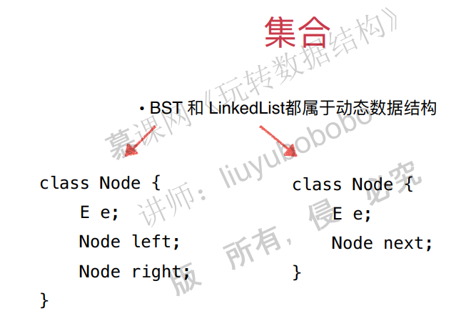
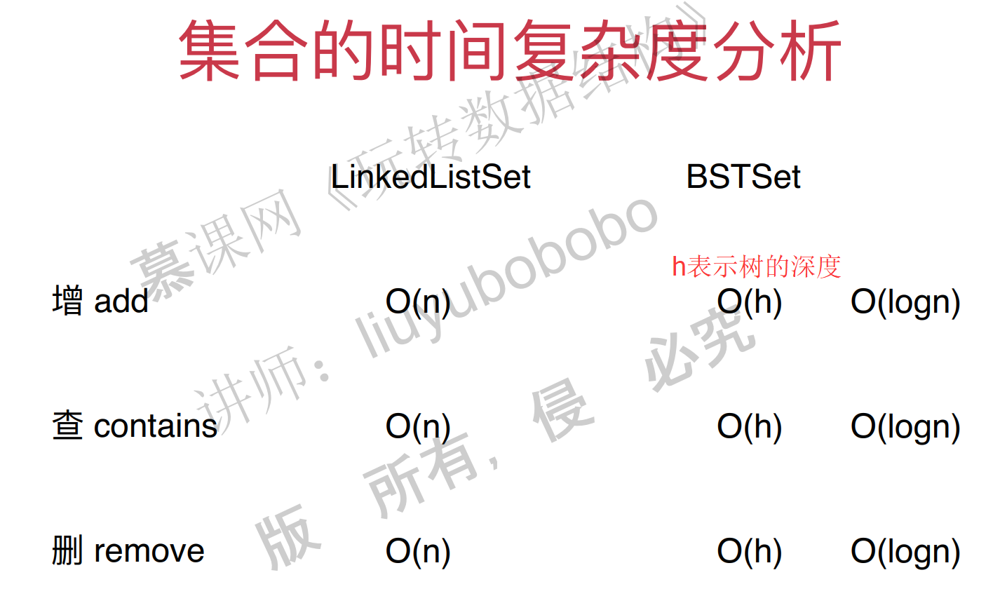
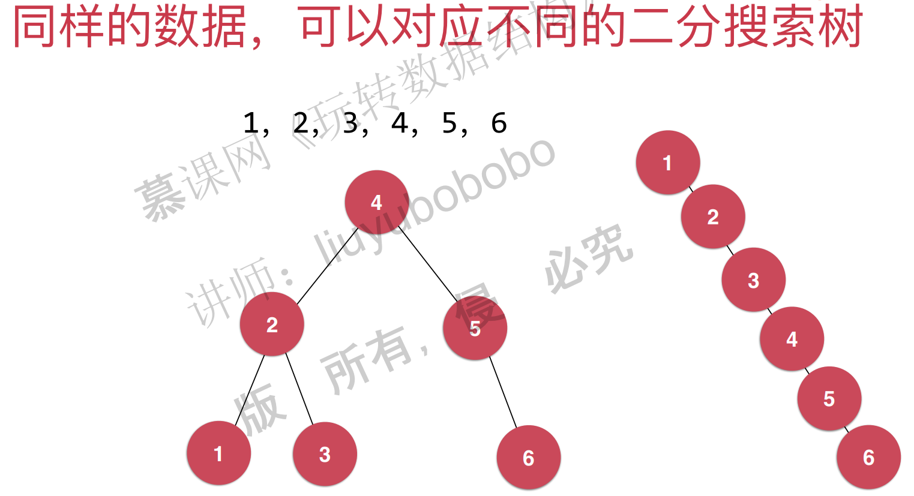
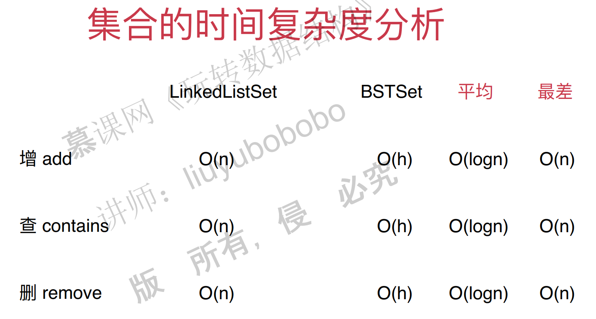
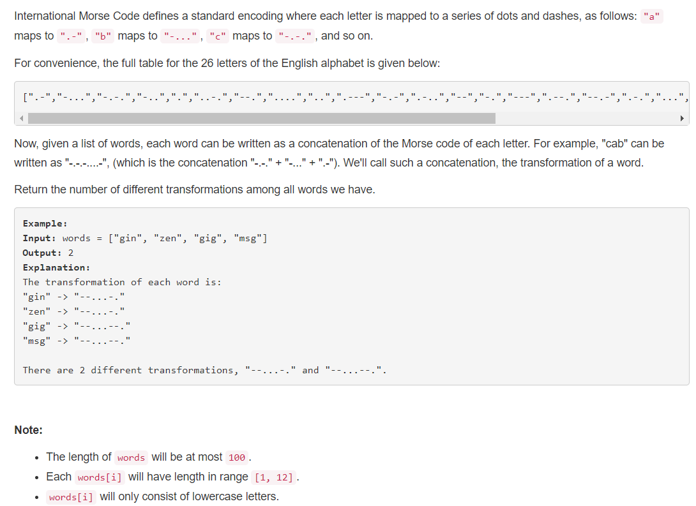
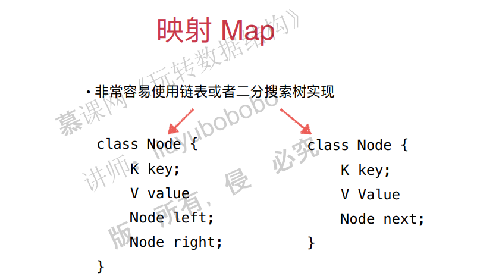
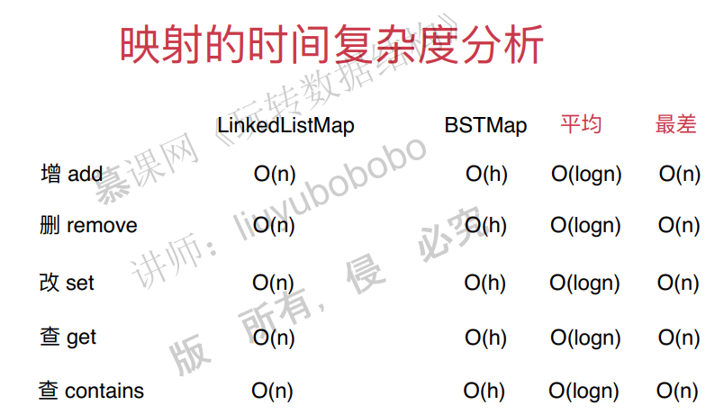
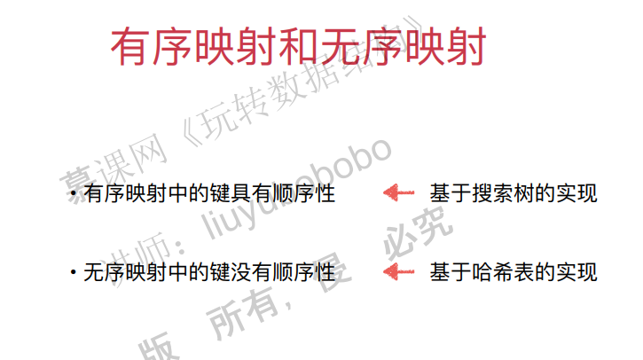
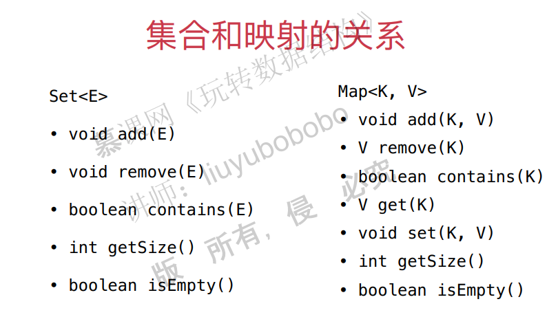

## 七、集合和映射

### 1. 集合基础和基于二分搜索树的集合实现

集合是一种不能存放重复元素的数据结构。回顾之前我们讲的二分搜索树，它就是不能存放重复元素的，因此用二分搜索树来实现集合是一种很好的选择。

功能设计

> void add()：不能添加重复元素
>
> void remove()
>
> bool contains()
>
> int getSize()
>
> bool isEmpty()

集合的实现


**基于二分搜索树的实现集合**

java代码

```java
public class BSTSet<E extends Comparable<E>> implements Set<E> {

    private BST<E> bst;

    public BSTSet(){
        bst = new BST<>();
    }

    @Override
    public int getSize(){
        return bst.size();
    }

    @Override
    public boolean isEmpty(){
        return bst.isEmpty();
    }

    @Override
    public void add(E e){
        bst.add(e);
    }

    @Override
    public boolean contains(E e){
        return bst.contains(e);
    }

    @Override
    public void remove(E e){
        bst.remove(e);
    }
}
```

c++代码：

```c++
#include"BST.h"
template<typename T>
class BSTSet {
private:
	BST<T> *bst;
public:
	int getSize() {
		this->bst->getSize();
	}
	bool isEmpty() {
		this->bst->isEmpty();
	}
	void add(T e) {
		this->bst->add(e);
	}
	bool contains() {
		this->bst->contains();
	}

	void remove(T e) {
		this->bst->re
	}
};
```

### 2. 基于链表的实现集合

基于链表的实现(注意这时候链表也是不能添加重复元素的，具体来说，在向链表添加元素的时候可以通过contains来判断是否包含这个元素，如果包含，那么就不往链表中添加这个元素)。



java代码：

```java
import java.util.ArrayList;

public class BSTSet<E extends Comparable<E>> implements Set<E> {

    private BST<E> bst;

    public BSTSet(){
        bst = new BST<>();
    }

    @Override
    public int getSize(){
        return bst.size();
    }

    @Override
    public boolean isEmpty(){
        return bst.isEmpty();
    }

    @Override
    public void add(E e){
        bst.add(e);
    }

    @Override
    public boolean contains(E e){
        return bst.contains(e);
    }

    @Override
    public void remove(E e){
        bst.remove(e);
    }
}
```

基于c++的实现，略。

### 3. 集合的复杂度分析

基于链表实现的集合和基于BST实现的集合时间复杂度是有很大差距的。




注意：链表添加元素的时间复杂度是O(1)，但是因为set中元素不能重复，所以在add的时候会调用contains函数。contains的时间复杂度是O(n)。

但是注意一个问题，**就是对于同一组数据，二分搜索树不是唯一的**。最差的情况，二分搜索树会退化成链表，比如数组有序的时候，二分搜索树进行添加元素之后就成了链表。




这样，复杂度进行重新分析：



注意，这里的平均并不是平均，而是最好的情况，最好的情况就是二叉树是满二叉树的情况。

### 4. Leetcode中的集合问题和更多集合相关问题

804号问题。https://leetcode.com/problems/unique-morse-code-words/description/



java代码：

```java
// Leetcode 804. Unique Morse Code Words
// https://leetcode.com/problems/unique-morse-code-words/description/

import java.util.TreeSet;

public class Solution {

    public int uniqueMorseRepresentations(String[] words) {

        String[] codes = {".-","-...","-.-.","-..",".","..-.","--.","....","..",".---","-.-",".-..","--","-.","---",".--.","--.-",".-.","...","-","..-","...-",".--","-..-","-.--","--.."};
        TreeSet<String> set = new TreeSet<>();
        for(String word: words){
            StringBuilder res = new StringBuilder();
            for(int i = 0 ; i < word.length() ; i ++)
                res.append(codes[word.charAt(i) - 'a']);

            set.add(res.toString());
        }

        return set.size();
    }
}
```

c++代码：

```c++
//
// Created by hpf on 18-5-14.
//

#include <set>
#include <iostream>
#include <string>
#include <vector>

class Solution {
public:
    int uniqueMorseRepresentations(std::vector<std::string> &words) {
        std::vector<std::string> morse = {".-", "-...", "-.-.", "-..", ".", "..-.", "--.", "....", "..", ".---", "-.-",
                                          ".-..", "--", "-.", "---", ".--.", "--.-", ".-.", "...", "-", "..-", "...-",
                                          ".--", "-..-", "-.--", "--.."};
        std::set<std::string> Set;
        for (const std::string &word : words) {
            std::cout << '"' << word << '"' << " -> ";
            std::string code = "";
            for (char c : word) {
                code += morse[c - 'a'];
            }
            std::cout << '"' << code << '"' << std::endl;
            Set.insert(code);
        }
        return Set.size();
    }
};
```

**有序集合和无序集合**

集合按照有序无序可以分为有序集合和无序集合。

有序集合通常都是基于树来实现的，这个树除了是二分搜索树之外还可以是其他的。

通过链表实现的集合是无序的，不过基于链表实现的集合性能比较差，之后会讲基于哈希表实现的集合，性能好很多，它也是一种无序结合。

除此之外，还有一种集合叫做多重集合，它里边的元素是可以重复的，这里暂时不讲。

### 5. 映射基础

映射的概念很简单，实际上就是函数中的映射的意思，可以多对一，不能一对多。实际上，python中的字典就是映射，key是不能重复的，但是value是可以重复的。

映射可以通过链表和二分搜索树来实现，多增加一个value就行了：



### 6. 基于链表的映射实现

映射可以有两种实现方式，一种是基于链表，一种是基于二分搜索树。

####  

### 7. 基于二分搜索树的映射实现


### 8. 映射的复杂度分析和更多映射相关问题

本节主要考察使用链表和二分搜索树为底层的映射的性能。



有序映射和无序映射



有序映射一般是基于搜索树实现的，无序映射可以基于链表实现，但是实在太慢了，因此可以考虑哈希表实现，后面会讲。

**多重映射**

有些情况键可以重复。不做要求。

**集合和映射的区别**

集合和映射实际上是差不多，只不过映射多了一个value。



### 9. Leetcode上更多集合和映射的问题

求数组的交集。

这个在算法课中有，略。

