## 八、堆和优先队列

### 1. 什么是优先队列

普通队列：先进先出，后进后出。

优先队列：出队顺序和入队顺序无关，和优先级有关。

优先队列的例子

1. 医院中的排队的例子。排队进队列的时候和普通队列是一样的，但是出队就不一样了。出队按照病人的病情严重程度来优先出队。
2. 操作系统调度。操作系统需要优先选择优先级高的任务出队。

这两个例子中都有一个很关键的就是，队列是动态的，数据是会不断入队的，如果不是动态的，就不需要考虑优先队列这种数据结构了。

**优先队列功能**

```c++
class PriorityQueue
void enqueue();
T dequeue();
T getFront();
int getsize();
bool isEmpty();
```

其中和普通队列差别最大的就是出队操作。出队操作需要选择优先级最大的元素出队。

**使用不同底层数据结构的复杂度分析**

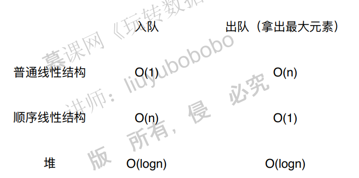

如果使用普通的线性结构，入队时间复杂度O(1)，但是出队的时候，要选择最大元素，这个时候的时间复杂度是O（n）。

如果使用顺序线性结构，那么入队的时候需要进行排序，因此时间复杂度是O(n)，因为已经排好了顺序，因此出队就是O(1)。

如果使用堆这种数据结构，那么入队和出队的时间复杂度都是O(log(n))，因此是一个很优秀的数据结构。

注：这里的普通线性结构指的是链表，顺序线性结构指的是有顺序的链表。

### 2. 堆的基础表示

堆的基本结构

堆实际上就是用树表示的，二叉堆就是满足某种特性的二叉树。二叉堆是一个完全二叉树。

**满二叉树**：每一层的节点都是满的。

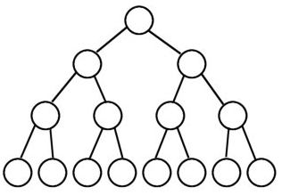

**完全二叉树**：从根结点到倒数第二层满足满二叉树，最后一层可以不完全填充，其叶子结点都靠左对齐。

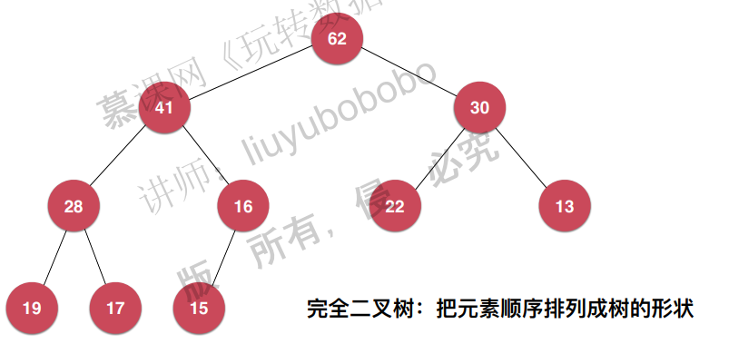

二叉堆可以分为最大堆和最小堆，定义分别为：

**最大堆**：如果一个二叉堆满足，所有的子节点都不比父节点大，那么称为最大堆。**左节点不一定**

**大于右节点！**

**最小堆**：如果一个二叉堆所有子节点都不比父节点小，那么其为最小堆。

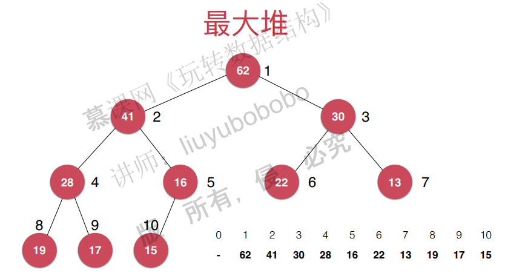


**用数组储存二叉堆**

我们知道，由于其独特结构，完全二叉树可以用数组很好地进行储存，那么很自然地可以用数组来表示二叉堆。用数组储存最大堆的时候，通常将数组的首元素空出来，因为这样可以让父节点和子节点的索引变得更简单。

> 父亲节点的索引是$i$ ，则子节点的索引分别是$2*i, 2*i+1$ 。
>
> 左子子节点的索引是$i$ ，则父亲节点的索引是$i/2$ 。
>
> 右子节点的索引是$i$ ，则父亲节点的索引是$(i-1)/2$ 。

当然，如果数组首元素不空出来也是可以的，只是相应的索引要发生改变。

### 3. 向堆中添加元素和sift up

这里以最大堆为例。

向堆中添加元素和sift up：一路和父亲节点进行比较。

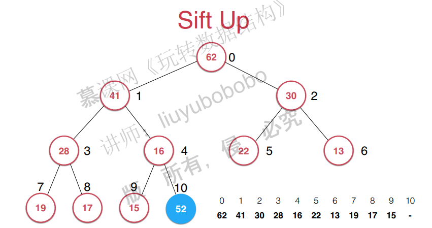

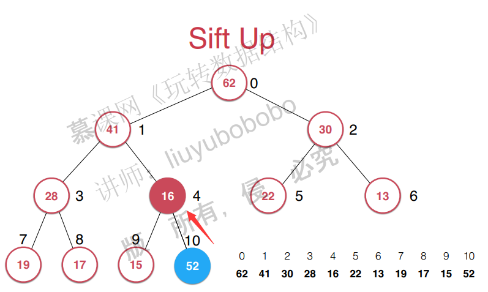

### 4. 从堆中取出元素Sift down

取出堆中的最大元素和sift Down：

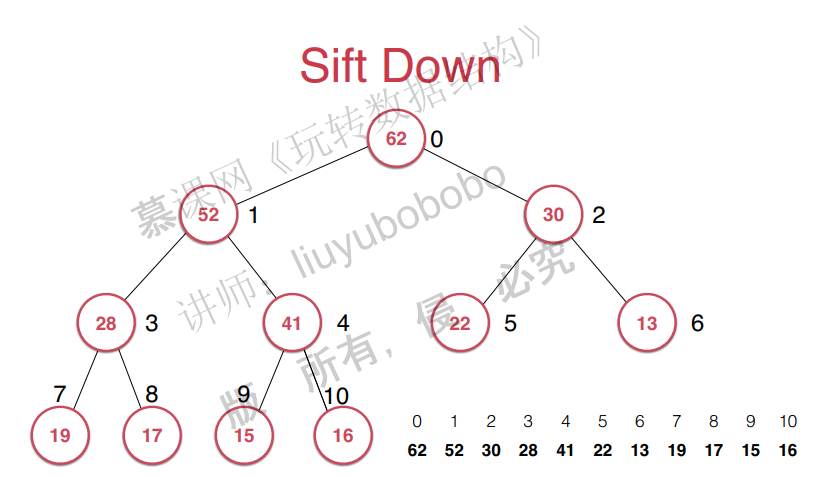

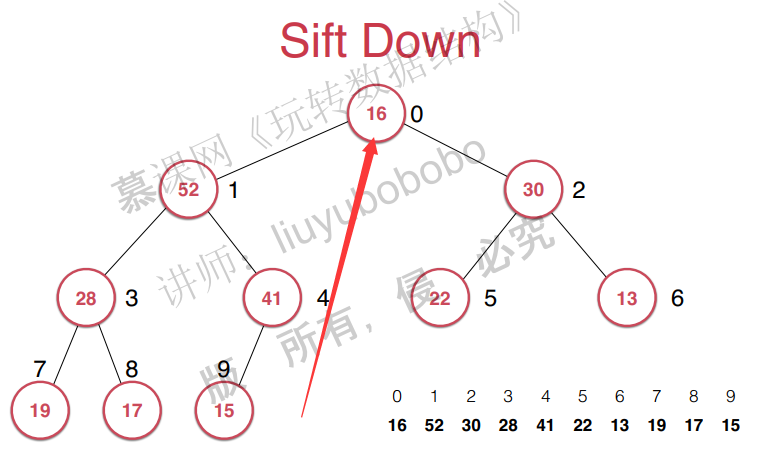


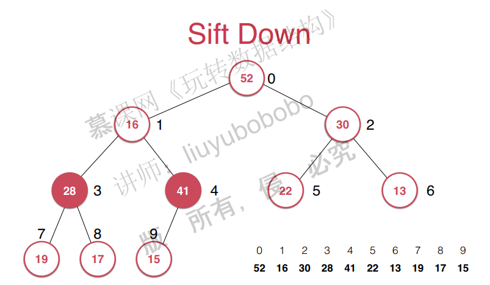

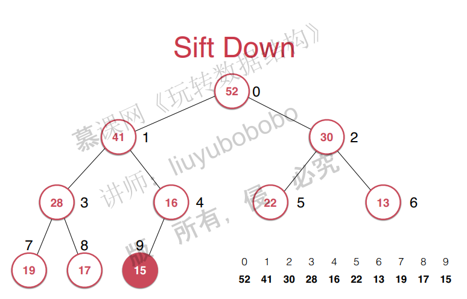

堆的复杂度分析

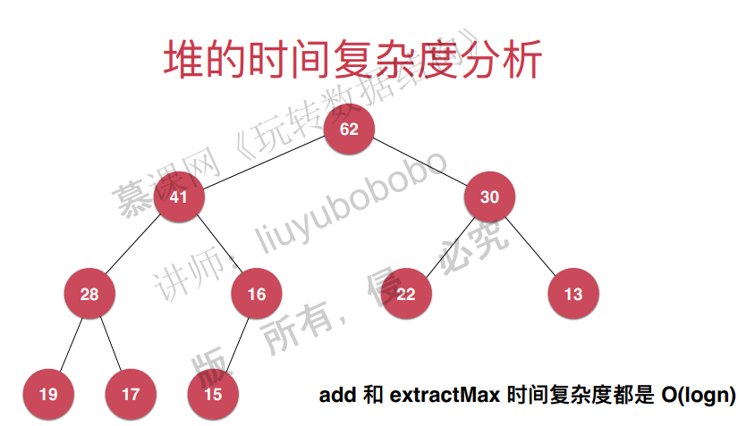


java代码：

```java
public class MaxHeap<E extends Comparable<E>> {

    private Array<E> data;

    public MaxHeap(int capacity){
        data = new Array<>(capacity);
    }

    public MaxHeap(){
        data = new Array<>();
    }

    // 返回堆中的元素个数
    public int size(){
        return data.getSize();
    }

    // 返回一个布尔值, 表示堆中是否为空
    public boolean isEmpty(){
        return data.isEmpty();
    }

    // 返回完全二叉树的数组表示中，一个索引所表示的元素的父亲节点的索引
    private int parent(int index){
        if(index == 0)
            throw new IllegalArgumentException("index-0 doesn't have parent.");
        return (index - 1) / 2;
    }

    // 返回完全二叉树的数组表示中，一个索引所表示的元素的左孩子节点的索引
    private int leftChild(int index){
        return index * 2 + 1;
    }

    // 返回完全二叉树的数组表示中，一个索引所表示的元素的右孩子节点的索引
    private int rightChild(int index){
        return index * 2 + 2;
    }

    // 向堆中添加元素
    public void add(E e){
        data.addLast(e);
        siftUp(data.getSize() - 1);
    }

    private void siftUp(int k){

        while(k > 0 && data.get(parent(k)).compareTo(data.get(k)) < 0 ){
            data.swap(k, parent(k));
            k = parent(k);
        }
    }

    // 看堆中的最大元素
    public E findMax(){
        if(data.getSize() == 0)
            throw new IllegalArgumentException("Can not findMax when heap is empty.");
        return data.get(0);
    }

    // 取出堆中最大元素
    public E extractMax(){

        E ret = findMax();

        data.swap(0, data.getSize() - 1);
        data.removeLast();
        siftDown(0);

        return ret;
    }

    private void siftDown(int k){

        while(leftChild(k) < data.getSize()){
            int j = leftChild(k); // 在此轮循环中,data[k]和data[j]交换位置
            if( j + 1 < data.getSize() &&
                    data.get(j + 1).compareTo(data.get(j)) > 0 )
                j ++;
            // data[j] 是 leftChild 和 rightChild 中的最大值

            if(data.get(k).compareTo(data.get(j)) >= 0 )
                break;

            data.swap(k, j);
            k = j;
        }
    }
}
```

c++代码实现：

```c++
#include<vector>
#include<algorithm>
#include<iostream>
#include<assert.h>
using std::vector;
template<typename T>
//这里使用vector作为动态数组使用
class MaxHeap{
private:
	vector<T> data;

public:
	MaxHeap(int capacity) {
		this->data = vector<T>(capacity);
	}

	MaxHeap() {
		this->data = vector<T>();
	}

	// 返回堆中的元素个数
	int size() {
		return this->data.size();
	}

	// 返回一个布尔值, 表示堆中是否为空
	bool sEmpty() {
		return this->data.empty();
	}

	// 返回完全二叉树的数组表示中，一个索引所表示的元素的父亲节点的索引
	// 这里的索引是从0开始的
	int parent(int index) {
		assert(index > 0);
		return (index - 1) / 2;
	}

	// 返回完全二叉树的数组表示中，一个索引所表示的元素的左孩子节点的索引
	int leftChild(int index) {
		return index * 2 + 1;
	}

	// 返回完全二叉树的数组表示中，一个索引所表示的元素的右孩子节点的索引
	int rightChild(int index) {
		return index * 2 + 2;
	}

	// 向堆中添加元素
	void add(T e) {
		this->data.push_back(e);
		this->siftUp(this->data.size() - 1);
	}

	void siftUp(int k) {
		//索引大于0，父亲节点比它大，则交换。
		while (k > 0 && this->data[this->parent(k)]<this->data[k] ) {
			std::swap(this->data[k], this->data[this->parent(k)]);
			k = parent(k);
		}
	}

	// 找堆中的最大元素
	T findMax() {
		assert(this->data.size() > 0);
		return this->data[0];
	}

	// 取出堆中最大元素
	T extractMax() {

		T ret =this-> findMax();
		std::swap(this->data[0], this->data[this->data.size() - 1]);
		this->data.pop_back();
		this->siftDown(0);
		return ret;
	}

	void siftDown(int k) {

		while (this->leftChild(k) < this->data.size()) {
			int j = this->leftChild(k); // 在此轮循环中,data[k]和data[j]交换位置
			if (j + 1 <this-> data.size() && this->data[j + 1]>this->data[j]) {
				j++;
				// data[j] 是 leftChild 和 rightChild 中的最大值
			}
			if (this->data[k]>=this->data[j])
				break;

			std::swap(this->data[k], this->data[j]);
			k = j;
		}
	}
	void print() {
		int size = this->data.size();
		for (int i = 0; i<size; i++) {
			std::cout << this->data[i] << " ";
		}
		std::cout << std::endl;
	}
};
//=======================================================
#include<vector>
#include<iostream>
#include"dataStructure.h"
using namespace std;
int main() {
	MaxHeap<int> *maxHeap = new MaxHeap<int>();
	std::vector<int> nums = { 5,3,8,9,2,7,4,2,7,8,3,10 };
	for (int i = 0; i < 12; i++) {
		maxHeap->add(nums[i]);
	}
	maxHeap->print();
	for (int i = 0; i < 12; i++) {
		int max = maxHeap->extractMax();
		std::cout << max << " ";
	}
	maxHeap->print();
}
```


### 5. Heapify和replace

视频缺失。。。

replace：

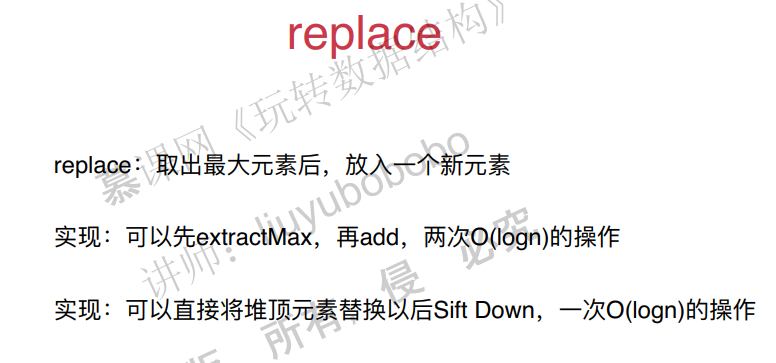

Heapify：

将任意元素整理成堆的形状

原始数组：

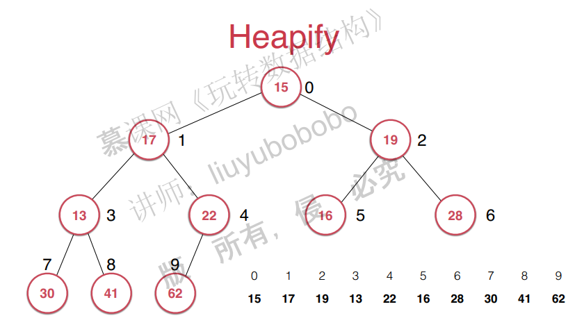

整理后的数组：

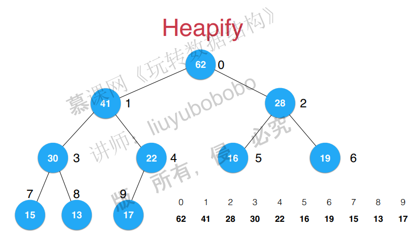

复杂度分析：

​	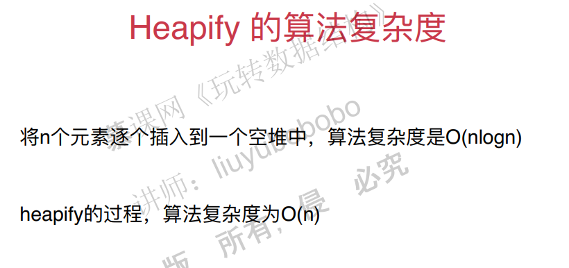

### 6. 基于堆的优先队列的实现

java代码

```java
public class PriorityQueue<E extends Comparable<E>> implements Queue<E> {

    private MaxHeap<E> maxHeap;

    public PriorityQueue(){
        maxHeap = new MaxHeap<>();
    }

    @Override
    public int getSize(){
        return maxHeap.size();
    }

    @Override
    public boolean isEmpty(){
        return maxHeap.isEmpty();
    }

    @Override
    public E getFront(){
        return maxHeap.findMax();
    }

    @Override
    public void enqueue(E e){
        maxHeap.add(e);
    }

    @Override
    public E dequeue(){
        return maxHeap.extractMax();
    }
}
```

c++代码

```c++
#include"MaxHeap.h"
template<typename T>
class PriorityQueue {
private:
	MaxHeap<T> maxHeap;
public:
	PriorityQueue() {
		this->maxHeap =  MaxHeap<T>();
	}

	int getSize() {
		return maxHeap.size();
	}

	bool isEmpty() {
		return maxHeap.isEmpty();
	}

	T getFront() {
		return maxHeap.findMax();
	}

	void enqueue(T e) {
		maxHeap.add(e);
	}

	T dequeue() {
		return maxHeap.extractMax();
	}
};
```

### 7. Leetcode关于优先队列的题目

先来看一个面试题：


首先能想到的想法就是：将数组排序，这样的时间复杂度是O(nlogn)，然后选出前100个，时间复杂度还行。

但是能不能做得更好，答案就是使用优先队列。首先将100个元素加入到队列中，然后遍历数组，看是否比队列中的最小值大，大的话就加进队列。这样时间复杂度就变成了O(nlogM)。

看leetcode上的一道题：

求出一个数组的前k个高频数字。

### 8. 使用java标准库中的优先队列

pass

### 9. 和堆相关的更多话题和广义队列

这一章讲的是二叉堆，实际上还有：

d叉堆

索引堆（在图论中会用到）

二项堆

斐波那契堆

但这些不做要求，因此不要管。


广义队列：

只要出队入队就是队列，这样很多数据结构都可以看成队列，称为广义队列。

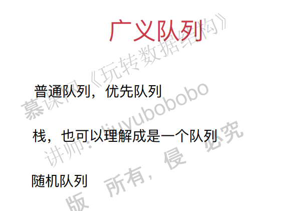