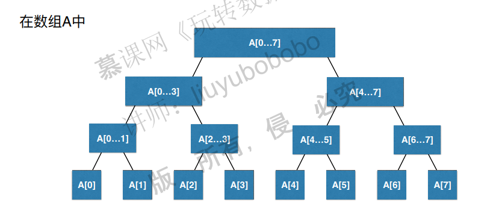

# 线段树

注意，线段树属于比较高级的数据结构，一般在面试中不会考察，因此只要懂这个数据结构就好了，不需要做leetcode上相关的题目。

## 1. 什么是线段树

### 为什么要用线段树？

有一些问题，我们关心的是线段，或者说区间，比如：

或者，更复杂一点：

很容易想到可以基于数组进行解决，但是时间复杂度会比较高：

除此之外，还有另外一种问题，叫做区间查询：

这一类问题的实质就是基于区间的统计查询，但是注意，区间会不断更新！

如果使用线段树来实现，时间复杂度会变为O(logn):

### 什么是线段树

实际上，就是将区间用数组来表示了：

## 2. 线段树的基础表示

实际上就是将数组区间不断地二分：

以长度8为例：

以长度10为例：

特别注意：

线段树不是完全二叉树。

线段树是平衡二叉树。平衡二叉树指的是树的最大深度和最低深度不超过1。

尽管线段树不是完全二叉树，但是仍然可以用数组来表示，因为可以将线段树看作满二叉树：

如果区间有n个元素，那么数组表示需要的节点数目为4n，这里记住就好，不需要管怎么来的。

## 3. 创建线段树

以求和为例，创建线段树：

## 4. 线段树中的区间查询

查询过程如下：

代码总结如下（待看）：

~~~c++
//
// Created by hpf on 18-5-18.
//

#ifndef SEGMENT_TREE_SEGMENTTREE_H
#define SEGMENT_TREE_SEGMENTTREE_H

#include <cassert>
#include <functional>

template<class T>
class SegmentTree {
private:
    T *tree;
    T *data;
    int size;
	std::function<T(T, T)> function;
	
    int leftChild(int index) {
        return index * 2 + 1;
    }

    int rightChild(int index) {
        return index * 2 + 2;
    }
    // 在treeIndex的位置创建表示区间[l...r]的线段树
    void buildSegmentTree(int treeIndex, int l, int r) {
        if (l == r) {
            tree[treeIndex] = data[l];
            return;
        }
        int leftTreeIndex = leftChild(treeIndex);
        int rightTreeIndex = rightChild(treeIndex);
        int mid = l + (r - l) / 2;

        buildSegmentTree(leftTreeIndex,   l, mid);
        buildSegmentTree(rightTreeIndex, mid + 1, r);
        tree[treeIndex] = function(tree[leftTreeIndex], tree[rightTreeIndex]);
    }
    
    T query(int treeIndex, int l, int r, int queryL, int queryR) {
        if (l == queryL && r == queryR) {
            return tree[treeIndex];
        }

        int mid = l + (r - l) / 2;
        int leftTreeIndex = leftChild(treeIndex);
        int rightTreeIndex = rightChild(treeIndex);

        if (queryL >= mid + 1) {
            return query(rightTreeIndex, mid + 1, r, queryL, queryR);
        } else if (queryR <= mid) {
            return query(leftTreeIndex, l, mid, queryL, queryR);
        }

        T leftResult = query(leftTreeIndex, l, mid, queryL, mid);
        T rightResult = query(rightTreeIndex, mid + 1, r, mid + 1, queryR);
        return function(leftResult, rightResult);
    }

public:
    SegmentTree(T arr[], int n, std::function<T(T, T)> function) {
        this->function = function;
        data = new T[n];
        for (int i = 0; i < n; ++i) {
            data[i] = arr[i];
        }
        tree = new T[n * 4];
        size = n;
        buildSegmentTree(0, 0, size - 1);
    }

    int getSize() {
        return size;
    }

    T get(int index) {
        assert(index >= 0 && index < size);
        return data[index];
    }
    
    T query(int queryL, int queryR) {
        assert(queryL >= 0 && queryL < size && queryR >= 0 && queryR < size && queryL <= queryR);
        return query(0, 0, size - 1, queryL, queryR);
    }

	void print() {
        std::cout << "[";
        for (int i = 0; i < size * 4; ++i) {
            if (tree[i] != NULL) {
                std::cout << tree[i];
            } else {
                std::cout << "0";
            }
            if (i != size * 4 - 1) {
                std::cout << ", ";
            }
        }
        std::cout << "]" << std::endl;
    }
};

#endif //SEGMENT_TREE_SEGMENTTREE_H

~~~

## 5. leetcode上关于线段树的相关问题

## 6. 线段树的更新操作

## 7.  更多线段树相关的话题

