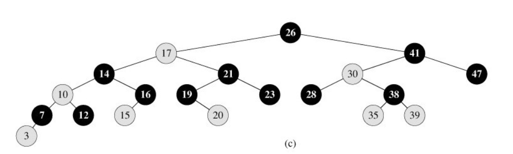

# 总结

## BST树

即二叉搜索树：

​       1.所有非叶子结点至多拥有两个儿子（Left和Right）；

​       2.所有结点存储一个关键字；

​       3.非叶子结点的左指针指向小于其关键字的子树，右指针指向大于其关键字的子树；

​       如：

BST树的搜索，从根结点开始，如果查询的关键字与结点的关键字相等，那么就命中；

否则，如果查询关键字比结点关键字小，就进入左儿子；如果比结点关键字大，就进入

右儿子；如果左儿子或右儿子的指针为空，则报告找不到相应的关键字；

​       如果BST树的所有非叶子结点的左右子树的结点数目均保持差不多（平衡），那么B树

的搜索性能逼近二分查找；但它比连续内存空间的二分查找的优点是，改变BST树结构

（插入与删除结点）不需要移动大段的内存数据，甚至通常是常数开销；

​       如：

 但BST树在经过多次插入与删除后，有可能导致不同的结构：

右边也是一个BST树，但它的搜索性能已经是线性的了；同样的关键字集合有可能导致不同的

树结构索引；所以，使用BST树还要考虑尽可能让BST树保持左图的结构，和避免右图的结构，也就

是所谓的“平衡”问题；

**时间复杂度**

因为一棵由n个结点随机构造的二叉查找树的高度为logn，所以顺理成章，二叉查找树的一般操作的执行时间为O(lgn)。但二叉查找树若退化成了一棵具有n个结点的线性链后，则这些操作最坏情况运行时间为O(n)。

## AVL平衡二叉搜索树

定义：平衡二叉树或为空树,或为如下性质的二叉排序树:
  （1）左右子树深度之差的绝对值不超过1;
  （2）左右子树仍然为平衡二叉树.
平衡因子BF=左子树深度－右子树深度.
平衡二叉树每个结点的平衡因子只能是1，0，-1。若其绝对值超过1，则该二叉排序树就是不平衡的。
如图所示为平衡树和非平衡树示意图：

AVL是严格平衡树，因此在增加或者删除节点的时候，根据不同情况，旋转的次数比红黑树要多；
红黑是弱平衡的，用非严格的平衡来换取增删节点时候旋转次数的降低；
**所以简单说，搜索的次数（红黑树中是2logn）远远大于插入和删除，那么选择AVL树，如果搜索，插入删除次数几乎差不多，应该选择RB树。**

## 红黑树

红黑树上每个结点内含五个域，color，key，left，right，p。如果相应的指针域没有，则设为NIL。
一般的，红黑树，满足以下性质，即只有满足以下全部性质的树，我们才称之为红黑树：
1）每个结点要么是红的，要么是黑的。
2）根结点是黑的。
3）每个叶结点，即空结点（NIL）是黑的。
4）如果一个结点是红的，那么它的俩个儿子都是黑的。
5）对每个结点，从该结点到其子孙结点的所有路径上包含相同数目的黑结点。
下图所示，即是一颗红黑树：

