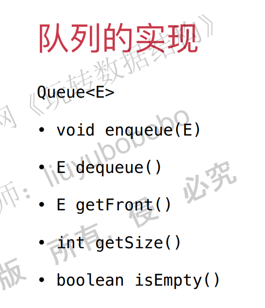

# 数据结构笔记

## 一、数组

### 1. 一些注意点：

1. 数组索引可以有语义信息，比如学号，但是并不是有语义信息的索引都适用于数组，比如身份证号。
2. 数组有点：根据索引快速查询。

### 2. 重新封装数组

#### 功能

- 增加元素（数组末，数组开头，任意指定位置）
- 查询元素
- 修改元素
- 是否包含元素
- 搜索元素
- 删除元素


### 3. 使用泛型

java中使用泛型不能直接使用基本数据类型，只能是类对象。因此要讲基本数据类型搞成包装类，这个在java中已经做好了，不需要我们再去做。

### 4. 综合代码

java代码：

~~~java
// E表示泛型
public class Array<E> {
    //java中定义数组的方法E[]
    //成员函数中没有容量capacity这一项。而是通过直接求data的长度得到。
    private E[] data;
    private int size;

    // 构造函数，传入数组的容量capacity构造Array
    public Array(int capacity){
        //注意，在java中不能通过new E(capacity)这种方法进行建立数组，只能通过所有类的父类Object来建立数组，然后再通过（E[]）进行强制类型转换。
        data = (E[])new Object[capacity];
        size = 0;
    }

    // 无参数的构造函数，默认数组的容量capacity=10
    public Array(){
        //这里应该是使用到了成员函数重载的功能，this（10）因为有一个参数传进去，所以会默认调用上面那个构造函数。
        this(10);
    }

    // 获取数组的容量
    public int getCapacity(){
        return data.length;
    }

    // 获取数组中的元素个数
    public int getSize(){
        return size;
    }

    // 返回数组是否为空
    public boolean isEmpty(){
        return size == 0;
    }

    // 在index索引的位置插入一个新元素e
    // 注意index的值是0-based.index=size,那么就在最后一个元素之后插入。
    public void add(int index, E e){

        if(size == data.length)
            throw new IllegalArgumentException("Add failed. Array is full.");

        if(index < 0 || index > size)
            throw new IllegalArgumentException("Add failed. Require index >= 0 and index <= size.");

        for(int i = size - 1; i >= index ; i --)
            data[i + 1] = data[i];

        data[index] = e;

        size ++;
    }

    // 向所有元素后添加一个新元素
    public void addLast(E e){
        add(size, e);
    }

    // 在所有元素前添加一个新元素
    public void addFirst(E e){
        add(0, e);
    }

    // 获取index索引位置的元素
    public E get(int index){
        if(index < 0 || index >= size)
            throw new IllegalArgumentException("Get failed. Index is illegal.");
        return data[index];
    }

    // 修改index索引位置的元素为e
    public void set(int index, E e){
        if(index < 0 || index >= size)
            throw new IllegalArgumentException("Set failed. Index is illegal.");
        data[index] = e;
    }

    // 查找数组中是否有元素e
    public boolean contains(E e){
        for(int i = 0 ; i < size ; i ++){
            if(data[i].equals(e))
                return true;
        }
        return false;
    }

    // 查找数组中元素e所在的索引，如果不存在元素e，则返回-1
    public int find(E e){
        for(int i = 0 ; i < size ; i ++){
            if(data[i].equals(e))
                return i;
        }
        return -1;
    }

    // 从数组中删除index位置的元素, 返回删除的元素
    public E remove(int index){
        if(index < 0 || index >= size)
            throw new IllegalArgumentException("Remove failed. Index is illegal.");

        E ret = data[index];
        for(int i = index + 1 ; i < size ; i ++)
            data[i - 1] = data[i];
        size --;
        // 涉及到java的垃圾回收机制，这里暂时不用管这个。这句可以直接注释掉也没关系。
        data[size] = null; // loitering objects != memory leak
        return ret;
    }

    // 从数组中删除第一个元素, 返回删除的元素
    public E removeFirst(){
        return remove(0);
    }

    // 从数组中删除最后一个元素, 返回删除的元素
    public E removeLast(){
        return remove(size - 1);
    }

    // 从数组中删除元素e
    public void removeElement(E e){
        int index = find(e);
        if(index != -1)
            remove(index);
    }

    @Override
    public String toString(){

        StringBuilder res = new StringBuilder();
        res.append(String.format("Array: size = %d , capacity = %d\n", size, data.length));
        res.append('[');
        for(int i = 0 ; i < size ; i ++){
            res.append(data[i]);
            if(i != size - 1)
                res.append(", ");
        }
        res.append(']');
        return res.toString();
    }
}

~~~

c++代码

~~~c++
#include<assert.h>
#include <iostream>
template<typename T>
class Array{
private:
	T *data;
	int capacity;
	int size;
	
public:
	// 构造函数，传入数组的容量capacity构造Array
	Array(int capacity) {
		this->capacity = capacity;
		this->data = new T[capacity];
		this->size = 0;
	}

	// 无参数的构造函数，默认数组的容量capacity=10
	Array() {
		this->Array(10);
	}

	~Array() {
		delete[]this->data;
	}

	// 获取数组的容量
	int getCapacity() {
		return this->capacity;
	}

	// 获取数组中的元素个数
	int getSize() {
		return this->size;
	}

	// 返回数组是否为空
	bool isEmpty() {
		return this->size == 0;
	}

	// 在index索引的位置插入一个新元素e
	void add(int index,T e) { 

		assert(this->size < capacity);
		assert(index >= 0 && index <= this->size);
		for (int i = this->size ; i > index; i--) {
			this->data[i] = this->data[i - 1];
		}
		/*for (int i = this->size - 1; i >= index; i--)
			this->data[i + 1] = this->data[i];*/

		this->data[index] = e;
		this->size++;
	}

	// 向所有元素后添加一个新元素
	void addLast(T e) {
		this->add(this->size, e);
	}

	// 在所有元素前添加一个新元素
	void addFirst(T e) {
		this->add(0, e);
	}

	// 获取index索引位置的元素
	T get(int index) {
		assert(index >= 0 && index < size);
		return this->data[index];
	}

	// 修改index索引位置的元素为e
	void set(int index, T e) {
		assert(index >= 0 && index < size);
		this->data[index] = e;
	}

	// 查找数组中是否有元素e
	bool contains(T e) {
		for (int i = 0; i < size; i++) {
			if (this->data[i] == e) {
				return true;
			}	
		}
		return false;
	}

	// 查找数组中元素e所在的索引，如果不存在元素e，则返回-1
	int find(T e) {
		for (int i = 0; i < size; i++) {
			if (data[i]==e)
				return i;
		}
		return -1;
	}

	// 从数组中删除index位置的元素, 返回删除的元素
	T remove(int index) {
		assert(index >= 0 && index < size);
		T ret = this->data[index];
		for (int i = index; i < size-1; i++)
			data[i] = data[i+1];
		/*for (int i = index + 1; i < size; i++)
			data[i - 1] = data[i];*/
		this->size--;
		return ret;
	}

	// 从数组中删除第一个元素, 返回删除的元素
	T removeFirst() {
		return this->remove(0);
	}

	// 从数组中删除最后一个元素, 返回删除的元素
	T removeLast() {
		return this->remove(this->size - 1);
	}

	// 从数组中删除元素e
	void removeElement(T e) {
		int index = this->find(e);
		if (index != -1)
			this->remove(index);
	}
	friend std::ostream & operator<<(std::ostream & out, Array & array) {
		for (int i = 0; i < array.size; i++) {
			out << array.data[i] << " ";
		}
		out << std::endl;
		return out;
	}
};
~~~


### 5. 动态数组

我们目前的数组的容量都是固定的，没有办法动态扩展，因此可以考虑将数组增加动态扩展的功能。

动态数组的功能：

1. 动态扩增数据容量
2. 动态缩减数据容量

java代码：

~~~java

public class Array<E> {

    private E[] data;
    private int size;

    // 构造函数，传入数组的容量capacity构造Array
    public Array(int capacity){
        data = (E[])new Object[capacity];
        size = 0;
    }

    // 无参数的构造函数，默认数组的容量capacity=10
    public Array(){
        this(10);
    }

    // 获取数组的容量
    public int getCapacity(){
        return data.length;
    }

    // 获取数组中的元素个数
    public int getSize(){
        return size;
    }

    // 返回数组是否为空
    public boolean isEmpty(){
        return size == 0;
    }

    // 在index索引的位置插入一个新元素e
    public void add(int index, E e){

        if(index < 0 || index > size)
            throw new IllegalArgumentException("Add failed. Require index >= 0 and index <= size.");
//========================================================================================
        if(size == data.length)
            resize(2 * data.length);
//========================================================================================
        for(int i = size - 1; i >= index ; i --)
            data[i + 1] = data[i];

        data[index] = e;

        size ++;
    }

    // 向所有元素后添加一个新元素
    public void addLast(E e){
        add(size, e);
    }

    // 在所有元素前添加一个新元素
    public void addFirst(E e){
        add(0, e);
    }

    // 获取index索引位置的元素
    public E get(int index){
        if(index < 0 || index >= size)
            throw new IllegalArgumentException("Get failed. Index is illegal.");
        return data[index];
    }

    // 修改index索引位置的元素为e
    public void set(int index, E e){
        if(index < 0 || index >= size)
            throw new IllegalArgumentException("Set failed. Index is illegal.");
        data[index] = e;
    }

    // 查找数组中是否有元素e
    public boolean contains(E e){
        for(int i = 0 ; i < size ; i ++){
            if(data[i].equals(e))
                return true;
        }
        return false;
    }

    // 查找数组中元素e所在的索引，如果不存在元素e，则返回-1
    public int find(E e){
        for(int i = 0 ; i < size ; i ++){
            if(data[i].equals(e))
                return i;
        }
        return -1;
    }

    // 从数组中删除index位置的元素, 返回删除的元素
    public E remove(int index){
        if(index < 0 || index >= size)
            throw new IllegalArgumentException("Remove failed. Index is illegal.");

        E ret = data[index];
        for(int i = index + 1 ; i < size ; i ++)
            data[i - 1] = data[i];
        size --;
        data[size] = null; // loitering objects != memory leak
//===========================删除元素需要减少容量===========================================
        if(size == data.length / 2)
            resize(data.length / 2);
//========================================================================================
        return ret;
    }

    // 从数组中删除第一个元素, 返回删除的元素
    public E removeFirst(){
        return remove(0);
    }

    // 从数组中删除最后一个元素, 返回删除的元素
    public E removeLast(){
        return remove(size - 1);
    }

    // 从数组中删除元素e
    public void removeElement(E e){
        int index = find(e);
        if(index != -1)
            remove(index);
    }

    @Override
    public String toString(){

        StringBuilder res = new StringBuilder();
        res.append(String.format("Array: size = %d , capacity = %d\n", size, data.length));
        res.append('[');
        for(int i = 0 ; i < size ; i ++){
            res.append(data[i]);
            if(i != size - 1)
                res.append(", ");
        }
        res.append(']');
        return res.toString();
    }
//========================================================================================
    // 将数组空间的容量变成newCapacity大小
    private void resize(int newCapacity){

        E[] newData = (E[])new Object[newCapacity];
        for(int i = 0 ; i < size ; i ++)
            newData[i] = data[i];
        data = newData;
    }
}
//========================================================================================
~~~

c++代码：

~~~c++
#include<assert.h>
#include <iostream>
template<typename T>
class Array{
private:
	T *data;
	int capacity;
	int size;

private:
	// 将数组空间的容量变成newCapacity大小
	void resize(int newCapacity) {

		T *newData = new T[newCapacity];
		for (int i = 0; i < this->size; i++)
			newData[i] =this-> data[i];
		delete[]this->data;
		this->data = newData;
	}
public:
	// 构造函数，传入数组的容量capacity构造Array
	Array(int capacity) {
		this->capacity = capacity;
		this->data = new T[capacity];
		this->size = 0;
	}

	// 无参数的构造函数，默认数组的容量capacity=10
	Array() {
		this->capacity = 10;
		this->data = new T[10];
		this->size = 0;
	}

	~Array() {
		delete[]this->data;
		this->data = nullptr;
	}

	// 获取数组的容量
	int getCapacity() {
		return this->capacity;
	}

	// 获取数组中的元素个数
	int getSize() {
		return this->size;
	}

	// 返回数组是否为空
	bool isEmpty() {
		return this->size == 0;
	}

	// 在index索引的位置插入一个新元素e
	void add(int index,T e) { 

		assert(index >= 0 && index <= this->size);
		if (this->size == this->capacity) {
			this->resize(2 * this->capacity);
			this->capacity = 2 * this->capacity;
		}

		for (int i = this->size ; i > index; i--) {
			this->data[i] = this->data[i - 1];
		}
		/*for (int i = this->size - 1; i >= index; i--)
			this->data[i + 1] = this->data[i];*/

		this->data[index] = e;
		this->size++;
	}

	// 向所有元素后添加一个新元素
	void addLast(T e) {
		this->add(this->size, e);
	}

	// 在所有元素前添加一个新元素
	void addFirst(T e) {
		this->add(0, e);
	}

	// 获取index索引位置的元素
	T get(int index) {
		assert(index >= 0 && index < size);
		return this->data[index];
	}

	// 修改index索引位置的元素为e
	void set(int index, T e) {
		assert(index >= 0 && index < size);
		this->data[index] = e;
	}

	// 查找数组中是否有元素e
	bool contains(T e) {
		for (int i = 0; i < size; i++) {
			if (this->data[i] == e) {
				return true;
			}	
		}
		return false;
	}

	// 查找数组中元素e所在的索引，如果不存在元素e，则返回-1
	int find(T e) {
		for (int i = 0; i < size; i++) {
			if (data[i]==e)
				return i;
		}
		return -1;
	}

	// 从数组中删除index位置的元素, 返回删除的元素
	T remove(int index) {
		assert(index >= 0 && index < size);
		T ret = this->data[index];
		for (int i = index; i < size-1; i++)
			data[i] = data[i+1];
		/*for (int i = index + 1; i < size; i++)
			data[i - 1] = data[i];*/
		this->size--;
		if (this->size == this->capacity / 2) {
			this->resize(this->capacity / 2);
		}
		return ret;
	}

	// 从数组中删除第一个元素, 返回删除的元素
	T removeFirst() {
		return this->remove(0);
	}

	// 从数组中删除最后一个元素, 返回删除的元素
	T removeLast() {
		return this->remove(this->size - 1);
	}

	// 从数组中删除元素e
	void removeElement(T e) {
		int index = this->find(e);
		if (index != -1)
			this->remove(index);
	}
	friend std::ostream & operator<<(std::ostream & out, Array & array) {
		for (int i = 0; i < array.size; i++) {
			out << array.data[i] << " ";
		}
		out << std::endl;
		return out;
	}
};
~~~


### 6. 复杂度分析

**时间复杂度概念**

$T(n)=2n^2+3n+c​$：算法的总操作数目，

如果 $n->{∞}，lim (T(n)/n^2)=常数$ ，

$O(n^2)$则是时间复杂度。

**注意点**

$O(n^2)$的时间复杂度不一定小于$O(n)$。时间复杂度主要关注$n$很大的情况下来说。

复杂度分析要考虑最坏的情况。

对于动态数组而言，并不是每次都是调用resize函数，因此要进行均摊计算。

## 三、栈和队列

### 栈

#### 1. 栈的特点

1. 线性结构
2. 数组的子集
3. 先进后出或者说后进先出

#### 2. 栈的应用

undo操作，即撤销操作

程序调用的系统栈

#### 3. 功能

添加一个元素

取出一个元素

栈顶元素是什么

栈的大小

栈是否空

#### 4. 栈的实现

有两种不同的底层实现。

基于前一章的Array创建StackArray类。

通过接口来定义。

java StackArray的实现：

~~~java
public class ArrayStack<E> implements Stack<E> {

    private Array<E> array;

    public ArrayStack(int capacity){
        array = new Array<>(capacity);
    }

    public ArrayStack(){
        array = new Array<>();
    }

    @Override
    public int getSize(){
        return array.getSize();
    }

    @Override
    public boolean isEmpty(){
        return array.isEmpty();
    }

    public int getCapacity(){
        return array.getCapacity();
    }

    @Override
    public void push(E e){
        array.addLast(e);
    }

    @Override
    public E pop(){
        return array.removeLast();
    }

    @Override
    public E peek(){
        return array.getLast();
    }

    @Override
    public String toString(){
        StringBuilder res = new StringBuilder();
        res.append("Stack: ");
        res.append('[');
        for(int i = 0 ; i < array.getSize() ; i ++){
            res.append(array.get(i));
            if(i != array.getSize() - 1)
                res.append(", ");
        }
        res.append("] top");
        return res.toString();
    }
}

~~~

c++实现：

~~~c++
#include "array.h"
#include<iostream>
template<typename T>
class ArrayStack{
private:
	Array<T> *array;
public:
	ArrayStack(int capacity) {
		array = new Array<T>(capacity);
	}

	ArrayStack() {
		array = new Array<T>();
	}

	int getSize() {
		return array->getSize();
	}

	bool isEmpty() {
		return array->isEmpty();
	}

	int getCapacity() {
		return array->getCapacity();
	}

	void push(T e) {
		array->addLast(e);
	}

	T pop() {
		return array->removeLast();
	}

	T peek() {
		return array->getLast();
	}

	friend std::ostream & operator<<(std::ostream & out, ArrayStack & arrayStack) {
		for (int i = 0; i < arrayStack.array->getSize(); i++) {
			out << arrayStack.array->get(i) << " ";
		}
		out << std::endl;
		return out;
	}
};
~~~

#### 5. 栈的复杂度分析


#### 6. 括号匹配应用

leetcode题目：


思路：是左括号，就压入栈，如果是右括号，看与前一个是否匹配，如果是，则出栈，否则，不匹配。

~~~java
import java.util.Stack;
class Solution {

    public boolean isValid(String s) {

        ArrayStack<Character> stack = new ArrayStack<>();
        for(int i = 0 ; i < s.length() ; i ++){
            char c = s.charAt(i);
            if(c == '(' || c == '[' || c == '{')
                stack.push(c);
            else{
                if(stack.isEmpty())
                    return false;

                char topChar = stack.pop();
                if(c == ')' && topChar != '(')
                    return false;
                if(c == ']' && topChar != '[')
                    return false;
                if(c == '}' && topChar != '{')
                    return false;
            }
        }
        return stack.isEmpty();
    }

    public static void main(String[] args) {

        System.out.println((new Solution()).isValid("()[]{}"));
        System.out.println((new Solution()).isValid("([)]"));
    }
}
~~~

注意点：

> leecode的方法必须是public。
>
> 可以写内部类。
>

c++实现：

~~~c++
#include<stack>
#include<iostream>
using std::string;
using std::stack;
class Solution {
public:
	bool isValid(string s) {
		stack<char> stack;
		for (int i = 0; i <s.length(); i++) {
			char c = s[i];
			if (c == '(' || c == '[' || c == '{') {
				stack.push(c);
			}
			else {
				if (stack.empty()) {
					return false;
				}
				// 注意这里栈中的top()操作只是返回栈顶元素，不删除。pop()操作则相反。
				char topChar = stack.top();
				stack.pop();
				if (c==')'&& topChar != '(') {
					return false;
				}
				if (c == ']'&& topChar != '[') {
					return false;
				}
				if (c == '}'&& topChar != '{') {
					return false;
				}
			}
		}
		return stack.empty();
	}
};

// ===========================================================================
#include "dataStructure.h"
int main() {
	Solution solution;
	string s1 = "()[]{}";
	string s2 = "([)]";
	std::cout << solution.isValid(s1) << std::endl;
	std::cout << solution.isValid(s2) << std::endl;

}
~~~


### 队列

队列是一种线性结构。

队列从一端添加元素，一端取出元素。

#### 1. 数组队列

数组队列的设计很简单，不需要tail，front等成员变量，直接进队列，出队列就可以了。

功能设计：



注意：

1. 出队列的时候要数据要整体前移。
2. 不需要处理队列空或者满的问题？


~~~java
public class ArrayQueue<E> implements Queue<E> {

    private Array<E> array;

    public ArrayQueue(int capacity){
        array = new Array<>(capacity);
    }

    public ArrayQueue(){
        array = new Array<>();
    }

    @Override
    public int getSize(){
        return array.getSize();
    }

    @Override
    public boolean isEmpty(){
        return array.isEmpty();
    }

    public int getCapacity(){
        return array.getCapacity();
    }

    @Override
    public void enqueue(E e){
        array.addLast(e);
    }

    @Override
    public E dequeue(){
        return array.removeFirst();
    }

    @Override
    public E getFront(){
        return array.getFirst();
    }

    @Override
    public String toString(){
        StringBuilder res = new StringBuilder();
        res.append("Queue: ");
        res.append("front [");
        for(int i = 0 ; i < array.getSize() ; i ++){
            res.append(array.get(i));
            if(i != array.getSize() - 1)
                res.append(", ");
        }
        res.append("] tail");
        return res.toString();
    }

    public static void main(String[] args) {

        ArrayQueue<Integer> queue = new ArrayQueue<>();
        for(int i = 0 ; i < 10 ; i ++){
            queue.enqueue(i);
            System.out.println(queue);
            if(i % 3 == 2){
                queue.dequeue();
                System.out.println(queue);
            }
        }
    }
}
~~~

c++版本：

~~~c++
#include<vector>
#include<iostream>
using std::vector;
template<typename T>
class ArrayQueue{
private:
	vector<T> *array;
public:
	ArrayQueue() {
		array = new vector<T>;
	}
	~ArrayQueue() {
		delete array;
	}

	int getSize() {
		return array->size();
	}

	bool isEmpty() {
		return array->empty();
	}

	int getCapacity() {
		return array->capacity();
	}

	void enqueue(T e) {
		array->push_back(e);
	}

	T dequeue() {
		// vector删除第一个元素需要通过迭代器，具体参考：https://zhidao.baidu.com/question/1174443676189215499.html
		// T e = array[0];这样是不行的，暂时没找到原因。
 		T e = array->front();
		array->erase(this->array->begin());
		return e;
	}

	T getFront() {
		return array->front();
	}

	//friend std::ostream & operator<<(std::ostream & out, ArrayQueue & arrayQueue) {
	//	//c++使用 vector指针访问vector元素时，不能简单的类似于c中数组和指针的方式。需要使用迭代器。
	//	//参考：https://blog.csdn.net/fao9001/article/details/75006369
	//	for (vector<T>::iterator it = arrayQueue.array->begin(); it != arrayQueue.array->end(); it++) {
	//		out << *it << " ";
	//	}
	//	out << std::endl;
	//	return out;
	//}
	void print() {
		//以下方法是不行的。不支持泛型，暂时不知道为什么。
		/*for (vector<T>::iterator it = array->begin(); it != array->end(); it++) {
			std::cout << *it << " ";
		}
		std::cout << std::endl;*/
		for (int i = 0; i < array->size(); i++) {
			//注意这里需要用解引用
			std::cout << (*array)[i]<<" ";
		}
		std::cout << std::endl;
	}
};

//===============================================================================
#include"dataStructure.h"
#include<iostream>
#include<vector>
int main() {
	ArrayQueue<int> *queue = new ArrayQueue<int>;
	for (int i = 0; i < 10; i++) {
		queue->enqueue(i);
		queue->print();
		if (i % 3 == 2) {
			queue->dequeue();
			queue->print();
		}
	}
}
~~~

#### 2.数组队列的复杂度分析


#### 3. 数组队列的问题

出队列的时候，所有元素都要向前移动移动一位，这样导致出队列的时间复杂度是O(n)。

#### 4. 循环队列的思想

出队列的时候，保留数据位置不动，只是重新定义front和tail。

#### 5. 设计思想

1. 当没有元素的时候，设置$head=tail$，这时候用$head==tail$这个条件来判断队列是否为空，满足则空。
2. 出队列的时候，通过front = (front + 1) % data.length来设置tail的值。注意：front指向第一个元素。
3. 入队列的时候，通过tail = (tail + 1) % data.length来设置tail的值，注意这个时候，tail并没有指向任何元素。
4. 判断数组满的方法：$(tail + 1) \% data.length == front$，注意这里要加1。注意：我们已经用front==tail表示数组为空的情况，因此，不能用front==tail判断满，而是通过tail+1==front判断满。

java版本实现：

~~~java
public class LoopQueue<E> implements Queue<E> {

    private E[] data;
    private int front, tail;
    private int size;  // 有兴趣的同学，在完成这一章后，可以思考一下：
                       // LoopQueue中不声明size，如何完成所有的逻辑？
                       // 这个问题可能会比大家想象的要难一点点：）

    public LoopQueue(int capacity){
        data = (E[])new Object[capacity + 1];
        front = 0;
        tail = 0;
        size = 0;
    }

    public LoopQueue(){
        this(10);
    }

    public int getCapacity(){
        return data.length - 1;
    }

    @Override
    public boolean isEmpty(){
        return front == tail;
    }

    @Override
    public int getSize(){
        return size;
    }

    @Override
    public void enqueue(E e){
		// 判断队列是否满，满的话就进行扩容。
        if((tail + 1) % data.length == front)
            resize(getCapacity() * 2);

        data[tail] = e;
        //添加一个元素之后，通过这种方式来讲tail移位。注意不能直接使用tail++，会出现移到数组前面去的情况。
        tail = (tail + 1) % data.length;
        size ++;
    }

    @Override
    public E dequeue(){
		// 首先判断是否为空，空的话就不能出队列。
        if(isEmpty())
            throw new IllegalArgumentException("Cannot dequeue from an empty queue.");

        E ret = data[front];
        data[front] = null;
        // 通过这种方式对front进行重新幅值。注意：不能直接用front++，因为会出现跑到数组前面去的情况。
        front = (front + 1) % data.length;
        size --;
        if(size == getCapacity() / 4 && getCapacity() / 2 != 0)
            resize(getCapacity() / 2);
        return ret;
    }

    @Override
    public E getFront(){
        if(isEmpty())
            throw new IllegalArgumentException("Queue is empty.");
        return data[front];
    }

    private void resize(int newCapacity){

        E[] newData = (E[])new Object[newCapacity + 1];
        for(int i = 0 ; i < size ; i ++)
            newData[i] = data[(i + front) % data.length];

        data = newData;
        front = 0;
        tail = size;
    }

    @Override
    public String toString(){

        StringBuilder res = new StringBuilder();
        res.append(String.format("Queue: size = %d , capacity = %d\n", size, getCapacity()));
        res.append("front [");
        for(int i = front ; i != tail ; i = (i + 1) % data.length){
            res.append(data[i]);
            if((i + 1) % data.length != tail)
                res.append(", ");
        }
        res.append("] tail");
        return res.toString();
    }

    public static void main(String[] args){

        LoopQueue<Integer> queue = new LoopQueue<>();
        for(int i = 0 ; i < 10 ; i ++){
            queue.enqueue(i);
            System.out.println(queue);

            if(i % 3 == 2){
                queue.dequeue();
                System.out.println(queue);
            }
        }
    }
}
~~~

c++版本实现：

pass


## 三、链表

### 1. 链表的特性

真正的动态数据结构（可以动态地增加元素，容量不是一开始就指定了），插入数据不需要像数组一样移动数据，因此时间复杂度低。但是访问数据则不能直接通过索引来访问，实际上也没有索引，因此访问的话时间复杂度就高了起来。

java代码：

~~~java
public class LinkedList<E> {
	//节点作为内部类。
    private class Node{
        public E e;
        public Node next;

        public Node(E e, Node next){
            this.e = e;
            this.next = next;
        }

        public Node(E e){
            this(e, null);
        }

        public Node(){
            this(null, null);
        }

        @Override
        public String toString(){
            return e.toString();
        }
    }

    private Node head;
    private int size;

    public LinkedList(){
        head = null;
        size = 0;
    }

    // 获取链表中的元素个数
    public int getSize(){
        return size;
    }

    // 返回链表是否为空
    public boolean isEmpty(){
        return size == 0;
    }

    // 在链表头添加新的元素e
    public void addFirst(E e){
//        Node node = new Node(e);
//        node.next = head;
//        head = node;

        head = new Node(e, head);
        size ++;
    }

    // 在链表的index(0-based)位置添加新的元素e
    // 在链表中不是一个常用的操作，练习用：）
    public void add(int index, E e){

        if(index < 0 || index > size)
            throw new IllegalArgumentException("Add failed. Illegal index.");

        if(index == 0)
            addFirst(e);
        else{
            Node prev = head;
            for(int i = 0 ; i < index - 1 ; i ++)
                prev = prev.next;

//            Node node = new Node(e);
//            node.next = prev.next;
//            prev.next = node;

            prev.next = new Node(e, prev.next);
            size ++;
        }
    }

    // 在链表末尾添加新的元素e
    public void addLast(E e){
        add(size, e);
    }
}

~~~

c++代码：

~~~c++
#include<assert.h>
template<typename T>
class Node {
public:	
	T e;
	T* next;
public:
	Node() {
		this->next = nullptr;
	}
	Node(T e) {
		this->e = e;
		this->next = nullptr;
	}
	Node(T e, Node<T> *node) {
		this->e = e;
		this->next = node;
	}
};

template<typename T>
class LinkedList {
private:
	Node<T> head;
	int size;
public:
	LinkedList() {
		this->head = nullptr;
		this->size = 0;
	}

	int getSize() {
		return this->size;
	}
	bool isEmpty() {
		return this->size == 0;
	}

	void addFist(T e) {
		/*Node<T> *node = new Node<T>(e);
		node->next = this->head;
		this->head = node;*/

		this->head = new Node<T>(e, this->head);
		this->size++;
	}

	// 在链表的index(0-based)位置添加新的元素e
	// 在链表中不是一个常用的操作，练习用：）
	void add(int index, T e) {
		assert(index >= 0 && index <= size);
		if (index == 0) {
			this->addFist(e);
		}
		else {
			Node<T> *prev = this->head;
			for (int i = 0; i < index - 1; i++) {
				prev = prev->next;
			}
			Node<T> *node=new Node<T>(e);
			node->next = prev->next;
			prev->next = node;
			this->size++;
		}
	}

	// 在链表末尾添加新的元素e
	void addLast(T e) {
		this->add(this->size, e);
	}
};
~~~

### 2. 虚拟节点

以上的这种情况需要特殊考虑头节点，这是因为头结点没有前节点，因此需要特殊操作。如果考虑在头节点之前建立一个虚拟节点，那么就可以不需要对头结点进行特殊处理了。

特别注意：使用了dummyHead之后，就不使用head了。而且，往链表中添加元素等操作的逻辑也发生了改变。

### 3. 链表元素的遍历，查询，修改和删除。

注意一点：所有prev和cur代表的意思就是我想要进行某种操作的元素的**前一个**或者**当前这个**。

java代码：

~~~java
public class LinkedList<E> {

    private class Node{
        public E e;
        public Node next;

        public Node(E e, Node next){
            this.e = e;
            this.next = next;
        }

        public Node(E e){
            this(e, null);
        }

        public Node(){
            this(null, null);
        }

        @Override
        public String toString(){
            return e.toString();
        }
    }

    private Node dummyHead;
    private int size;

    public LinkedList(){
        //初始化是不是有错？为什么不需要传入头结点的指针？
        dummyHead = new Node();
        size = 0;
    }

    // 获取链表中的元素个数
    public int getSize(){
        return size;
    }

    // 返回链表是否为空
    public boolean isEmpty(){
        return size == 0;
    }

    // 在链表的index(0-based)位置添加新的元素e
    // 在链表中不是一个常用的操作，练习用：）
    public void add(int index, E e){

        if(index < 0 || index > size)
            throw new IllegalArgumentException("Add failed. Illegal index.");

        Node prev = dummyHead;
        for(int i = 0 ; i < index ; i ++)
            prev = prev.next;

        prev.next = new Node(e, prev.next);
        size ++;
    }

    // 在链表头添加新的元素e
    public void addFirst(E e){
        add(0, e);
    }

    // 在链表末尾添加新的元素e
    public void addLast(E e){
        add(size, e);
    }

    // 获得链表的第index(0-based)个位置的元素
    // 在链表中不是一个常用的操作，练习用：）
    public E get(int index){

        if(index < 0 || index >= size)
            throw new IllegalArgumentException("Get failed. Illegal index.");

        Node cur = dummyHead.next;//注意这里指向的是虚拟节点的next。
        for(int i = 0 ; i < index ; i ++)
            cur = cur.next;
        return cur.e;
    }

    // 获得链表的第一个元素
    public E getFirst(){
        return get(0);
    }

    // 获得链表的最后一个元素
    public E getLast(){
        return get(size - 1);
    }

    // 修改链表的第index(0-based)个位置的元素为e
    // 在链表中不是一个常用的操作，练习用：）
    public void set(int index, E e){
        if(index < 0 || index >= size)
            throw new IllegalArgumentException("Set failed. Illegal index.");

        Node cur = dummyHead.next;
        for(int i = 0 ; i < index ; i ++)
            cur = cur.next;
        cur.e = e;
    }

    // 查找链表中是否有元素e
    public boolean contains(E e){
        Node cur = dummyHead.next;
        while(cur != null){
            if(cur.e.equals(e))
                return true;
            cur = cur.next;
        }
        return false;
    }

    // 从链表中删除index(0-based)位置的元素, 返回删除的元素
    // 在链表中不是一个常用的操作，练习用：）
    public E remove(int index){
        if(index < 0 || index >= size)
            throw new IllegalArgumentException("Remove failed. Index is illegal.");

        Node prev = dummyHead;
        for(int i = 0 ; i < index ; i ++)
            prev = prev.next;

        Node retNode = prev.next;
        prev.next = retNode.next;
        retNode.next = null;
        size --;

        return retNode.e;
    }

    // 从链表中删除第一个元素, 返回删除的元素
    public E removeFirst(){
        return remove(0);
    }

    // 从链表中删除最后一个元素, 返回删除的元素
    public E removeLast(){
        return remove(size - 1);
    }

    // 从链表中删除元素e
    public void removeElement(E e){

        Node prev = dummyHead;
        while(prev.next != null){
            if(prev.next.e.equals(e))
                break;
            prev = prev.next;
        }

        if(prev.next != null){
            Node delNode = prev.next;
            prev.next = delNode.next;
            delNode.next = null;
            size --;
        }
    }

    @Override
    public String toString(){
        StringBuilder res = new StringBuilder();

        Node cur = dummyHead.next;
        while(cur != null){
            res.append(cur + "->");
            cur = cur.next;
        }
        res.append("NULL");

        return res.toString();
    }
}
~~~

c++代码：

~~~c++
#include<assert.h>
#include <iostream>
template<typename T>
class Node {
public:
	T e;
	Node<T>* next;
public:
	Node() {
		this->next = nullptr;
	}
	Node(T e) {
		this->e = e;
		this->next = nullptr;
	}
	Node(T e, Node<T> *node) {
		this->e = e;
		this->next = node;
	}

};

template<typename T>
class LinkedList {
private:
	Node<T> *dummyHead;
	int size;
public:
	LinkedList() {
		this->dummyHead = new Node<T>();
		this->size = 0;
	}
	~LinkedList() {
		int size = this->size;
		for (int i = 0; i < size; i++) {
			this->removeFirst();
		}
	}

	int getSize() {
		return this->size;
	}
	bool isEmpty() {
		return this->size == 0;
	}


	// 在链表的index(0-based)位置添加新的元素e
	// 在链表中不是一个常用的操作，练习用：）
	void add(int index, T e) {
		assert(index >= 0 && index <= size);
		if (index == 0) {
			this->dummyHead->next=new Node<T>(e,this->dummyHead->next);
			this->size++;
		}
		else {
			Node<T> *prev = this->dummyHead;
			for (int i = 0; i < index ; i++) {
				prev = prev->next;
			}
			/*Node<T> *node=new Node<T>(e);
			node->next = prev->next;
			prev->next = node;*/
			prev->next = new Node<T>(e, prev->next);
			this->size++;
		}
	}
	void addFirst(T e) {
		this->add(0, e);
	}

	// 在链表末尾添加新的元素e
	void addLast(T e) {
		this->add(this->size, e);
	}

	// 获得链表的第index(0-based)个位置的元素
	// 在链表中不是一个常用的操作，练习用：）
	T get(int index) {

		assert(index >= 0 && index < size);

		Node<T> *cur = this->dummyHead->next;
		for (int i = 0; i < index; i++)
			cur = cur->next;
		return cur->e;
	}

	// 获得链表的第一个元素
	T getFirst() {
		return this->get(0);
	}

	// 获得链表的最后一个元素
	T getLast() {
		return this->get(size - 1);
	}

	// 修改链表的第index(0-based)个位置的元素为e
	// 在链表中不是一个常用的操作，练习用：）
	void set(int index, T e) {
		assert(index >= 0 && index < size);
		Node<T> *cur = dummyHead->next;
		for (int i = 0; i < index; i++)
			cur = cur->next;
		cur->e = e;
	}

	// 查找链表中是否有元素e
	bool contains(T e) {
		Node<T> *cur = this->dummyHead->next;
		while (cur != nullptr) {
			if (cur->e == e) {
				return true;
			}
			cur = cur->next;
		}
		return false;
	}
	// 从链表中删除index(0-based)位置的元素, 返回删除的元素
	// 在链表中不是一个常用的操作，练习用：）
	T remove(int index) {
		assert(index >= 0 && index < size);
		Node<T> *prev = this->dummyHead;
		for (int i = 0; i < index; i++) {
			prev = prev->next;
		}
		Node<T> *retNode = prev->next;
		T e = retNode->e;
		prev->next = retNode->next;
		delete retNode;
		this->size--;

		return e;
	}

	// 从链表中删除第一个元素, 返回删除的元素
	T removeFirst() {
		return remove(0);
	}

	// 从链表中删除最后一个元素, 返回删除的元素
	T removeLast() {
		return remove(size - 1);
	}

	// 从链表中删除元素e，此时假定链表中
	void removeElement(T e) {

		Node<T> *prev = this->dummyHead;
		while (prev->next != nullptr) {
			if (prev->next->e == e) {
				break;
			}
			prev = prev->next;
		}

		if (prev.next != null) {
			Node<T> *delNode = prev->next;
			prev->next = delNode->next;
			delete delNode;
			this->size--;
		}
	}
	friend std::ostream & operator<<(std::ostream & out, LinkedList & linkedList) {
		Node<T> *cur = linkedList.dummyHead->next;
		while (cur != nullptr) {
			out << cur->e<<" ";
			cur = cur->next;
		}
		out << std::endl;
		return out;
	}
};
//==================================================================
# include "linkedList.h"
int main() {
	LinkedList<int> linkedList;
	for (int i = 0; i < 5; i++) {
		linkedList.addFirst(i);
		std::cout << linkedList;
	}
	linkedList.add( 2, 666);
	std::cout << linkedList;

	linkedList.remove(2);
	std::cout << linkedList;
	linkedList.removeFirst();
	std::cout << linkedList;
	linkedList.removeLast();
	std::cout << linkedList;
}
~~~


### 4. 链表时间复杂度分析

pass

### 5. 用链表来写stack

java代码：

~~~java
public class LinkedListStack<E> implements Stack<E> {

    private LinkedList<E> list;

    public LinkedListStack(){
        list = new LinkedList<>();
    }

    @Override
    public int getSize(){
        return list.getSize();
    }

    @Override
    public boolean isEmpty(){
        return list.isEmpty();
    }

    @Override
    public void push(E e){
        list.addFirst(e);
    }

    @Override
    public E pop(){
        return list.removeFirst();
    }

    @Override
    public E peek(){
        return list.getFirst();
    }

    @Override
    public String toString(){
        StringBuilder res = new StringBuilder();
        res.append("Stack: top ");
        res.append(list);
        return res.toString();
    }

    public static void main(String[] args) {

        LinkedListStack<Integer> stack = new LinkedListStack<>();

        for(int i = 0 ; i < 5 ; i ++){
            stack.push(i);
            System.out.println(stack);
        }

        stack.pop();
        System.out.println(stack);
    }
}
~~~

c++代码：

~~~c++
#include<iostream>
#include"linkedList.h"
template<typename T>
class LinkedListStack {
private:
	LinkedList<T> *list;
public:
	LinkedListStack() {
		this->list = new LinkedList<T>();
	}
	int getSize() {
		return list->getSize();
	}

	bool isEmpty() {
		return list->isEmpty();
	}

	void push(T e) {
		list->addFirst(e);
	}

	T pop() {
		return list->removeFirst();
	}

	T peek() {
		return list->getFirst();
	}

	void print() {
		std::cout << this->list;
	}
};
~~~

### 6. 用链表来写队列

java代码实现：

~~~java
public class LinkedListQueue<E> implements Queue<E> {

    private class Node{
        public E e;
        public Node next;

        public Node(E e, Node next){
            this.e = e;
            this.next = next;
        }

        public Node(E e){
            this(e, null);
        }

        public Node(){
            this(null, null);
        }

        @Override
        public String toString(){
            return e.toString();
        }
    }

    private Node head, tail;
    private int size;

    public LinkedListQueue(){
        head = null;
        tail = null;
        size = 0;
    }

    @Override
    public int getSize(){
        return size;
    }

    @Override
    public boolean isEmpty(){
        return size == 0;
    }

    @Override
    public void enqueue(E e){
        if(tail == null){
            tail = new Node(e);
            head = tail;
        }
        else{
            tail.next = new Node(e);
            tail = tail.next;
        }
        size ++;
    }

    @Override
    public E dequeue(){
        if(isEmpty())
            throw new IllegalArgumentException("Cannot dequeue from an empty queue.");

        Node retNode = head;
        head = head.next;
        retNode.next = null;
        if(head == null)
            tail = null;
        size --;
        return retNode.e;
    }

    @Override
    public E getFront(){
        if(isEmpty())
            throw new IllegalArgumentException("Queue is empty.");
        return head.e;
    }

    @Override
    public String toString(){
        StringBuilder res = new StringBuilder();
        res.append("Queue: front ");

        Node cur = head;
        while(cur != null) {
            res.append(cur + "->");
            cur = cur.next;
        }
        res.append("NULL tail");
        return res.toString();
    }

    public static void main(String[] args){

        LinkedListQueue<Integer> queue = new LinkedListQueue<>();
        for(int i = 0 ; i < 10 ; i ++){
            queue.enqueue(i);
            System.out.println(queue);

            if(i % 3 == 2){
                queue.dequeue();
                System.out.println(queue);
            }
        }
    }
}

~~~

c++代码实现:

~~~c++
#include<iostream>
#include"linkedList.h"
template<typename T>
class LinkedListStack {
private:
	LinkedList<T> *list;
public:
	LinkedListStack() {
		this->list = new LinkedList<T>();
	}
	int getSize() {
		return list->getSize();
	}

	bool isEmpty() {
		return list->isEmpty();
	}

	void push(T e) {
		list->addFirst(e);
	}

	T pop() {
		return list->removeFirst();
	}

	T peek() {
		return list->getFirst();
	}

	void print() {
		std::cout << this->list;
	}
};
//=======================================
# include "linkedListStack.h"

int main() {
	int opCount = 100000;
	LinkedListStack<int> *linkedListStack = new LinkedListStack<int>();
	for (int i = 0; i < opCount; i++) {
		linkedListStack->push(i);
	}
	for (int i = 0; i < opCount; i++) {
		linkedListStack->pop();
	}
	std::cout << "Done!" << std::endl;
	// 其实这个时间比较很复杂，因为LinkedListStack中包含更多的new操作

}
~~~


## 五、链表和递归

递归经常用在树中。但是递归也可以在链表中使用。为了更好地理解递归，这里讨论链表和递归的话题。

### 1. 从leetcode开始

题目如下：


leetcode已经定义好了链表节点的结构：

~~~java
//Definition for singly-linked list.
public class ListNode {
    public int val;
    public ListNode next;
    public ListNode(int x) {
        val = x;
    }
}
~~~

之前删除链表中元素的方法：

1. 找到要删除的节点之前的节点，然后删除这个节点。但是这样有一个问题，就是头结点没有之前的节点，为了解决这个问题，头结点需要单独进行处理。
2. 为了不单独进行处理，有一种办法，就是建立虚拟节点进行处理。
3. 尝试不涉及头结点来处理这个问题。

首先讲直接处理头结点的解决方法1：

java代码：

~~~java
/// Leetcode 203. Remove Linked List Elements
/// https://leetcode.com/problems/remove-linked-list-elements/description/
class Solution {
    public ListNode removeElements(ListNode head, int val) {
		//首先判断是不是要删除头节点。注意：头结点删除完之后，新的头结点也可能需要删除，所以需要while。
        while(head != null && head.val == val){
            ListNode delNode = head;
            head = head.next;
            delNode.next = null;//将删除的节点的next赋值null，java回进行垃圾回收。
        }

        if(head == null)
            return head;//返回null会满足类型？

        ListNode prev = head;//此时的头结点的值一定不等于val。
        while(prev.next != null){
            if(prev.next.val == val) {
                ListNode delNode = prev.next;
                prev.next = delNode.next;
                delNode.next = null;
            }
            else
                prev = prev.next;
        }
	    //将该删除的节点都删除之后，就可以直接返回头结点就行了。
        return head;
    }
}
~~~

c++代码：

~~~c++
class ListNode {
public:
	int val;
	ListNode *next;
	ListNode(int x) {
		val = x;
	}
};
class Solution {
public:
	ListNode* removeElement(ListNode *head, int val) {
		while (head != nullptr&&head->val == val) {
			ListNode* delNode = head;
			head = head->next;
			delete delNode;
		}
		if (head = nullptr) {
			return head;
		}
		ListNode* prev = head;
		while (prev->next != nullptr) {
			if (prev->val == val) {
				ListNode *delNode = prev->next;
				prev->next = delNode->next;
				delete delNode;
			}
			else {
				prev = prev->next;
			}
		}
		return head;
	}
};
~~~

注意：这里的代码用到了循环到最后一个元素来删除多个元素，之前删除一个元素并不需要循环到最后一个元素。

在leetcode上提交的版本，这是一个简化过的版本：

```java
/// Leetcode 203. Remove Linked List Elements
/// https://leetcode.com/problems/remove-linked-list-elements/description/

class Solution2 {

    public ListNode removeElements(ListNode head, int val) {

        while(head != null && head.val == val)
            head = head.next;

        if(head == null)
            return head;

        ListNode prev = head;
        while(prev.next != null){
            if(prev.next.val == val)
                prev.next = prev.next.next;
            else
                prev = prev.next;
        }

        return head;
    }
}
```

解决方法3：使用虚拟头结点

~~~java
/// Leetcode 203. Remove Linked List Elements
/// https://leetcode.com/problems/remove-linked-list-elements/description/

class Solution3 {

    public ListNode removeElements(ListNode head, int val) {
		// 虚拟头结点创建的时候可以随便赋值，这里赋值为-1.
        ListNode dummyHead = new ListNode(-1);
        dummyHead.next = head;
		
        ListNode prev = dummyHead;
        while(prev.next != null){
            if(prev.next.val == val)
                prev.next = prev.next.next;
            else
                prev = prev.next;
        }
		// 返回头结点
        return dummyHead.next;
    }
}
~~~

c++代码：

~~~c++
class ListNode {
public:
	int val;
	ListNode *next;
	ListNode(int x) {
		val = x;
         next = nullptr;
	}
};
class Solution {
public:
	ListNode* removeElement(ListNode *head, int val) {
		ListNode* dummy_head = new ListNode(-1);
		dummy_head->next = head;
		ListNode* prev = dummy_head;
		while (prev->next != nullptr) {
			if (prev->next->val == val) {
				ListNode *delNode = prev->next;
				prev->next = delNode->next;
				delete delNode;
			}
			else {
				prev = prev->next;
			}
		}
		return dummy_head->next;
	}
};
~~~

### 2. 测试leetcode的代码

pass

### 3. 递归和链表

递归：将原来的问题，转化为更小的同一问题。

比如数组求和问题。

求解最基本的问题。

将原问题转为更小的问题。

函数里面调用自己，完全可以想象成它是在调用另外一个函数，而不是调用自己，这样会比较不晕。


### 4. 链表的天然递归性

链表具有天然的递归属性，考虑删除元素的问题，删除一个节点之后，剩下的仍然是一个链表。对于剩下的链表删除元素和原链表删除元素是同一个问题。

### 5. 链表调用的微观解读

实际上就是函数调用栈。

使用递归删除链表中元素java代码：

~~~java
/// Leetcode 203. Remove Linked List Elements
/// https://leetcode.com/problems/remove-linked-list-elements/description/

class Solution4 {

    public ListNode removeElements(ListNode head, int val) {

        if(head == null)
            return head;

        ListNode res = removeElements(head.next, val);
        if(head.val == val)
            return res;
        else{
            head.next = res;
            return head;
        }
    }

    public static void main(String[] args) {

        int[] nums = {1, 2, 6, 3, 4, 5, 6};
        ListNode head = new ListNode(nums);
        System.out.println(head);

        ListNode res = (new Solution4()).removeElements(head, 6);
        System.out.println(res);
    }
}
~~~

c++代码：

~~~c++
class ListNode {
public:
	int val;
	ListNode *next;
	ListNode(int x) {
		val = x;
		next = nullptr;
	}
};
class Solution {
public:
	ListNode * removeElements(ListNode *head, int val) {
		if (head == nullptr) {
			return head;
		}
		ListNode* res = removeElements(head->next, val);
		if (head->val == val) {
			return res;
		}
		else {
			head->next = res;
			return head;
		}
		return head;
	}
};
~~~

### 6. 递归程序的调试

利用IDE跟踪调试。


