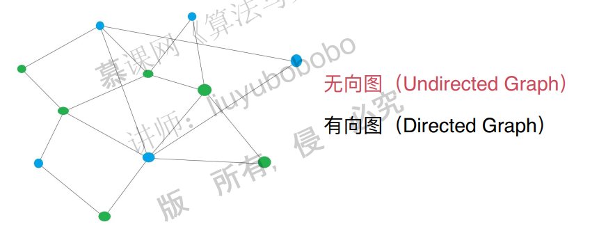
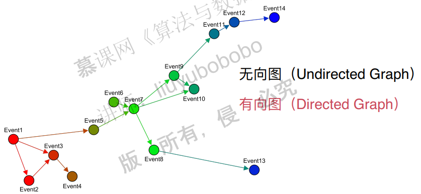
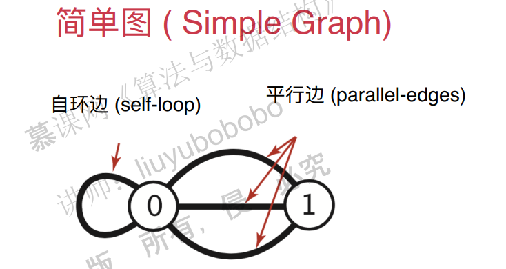
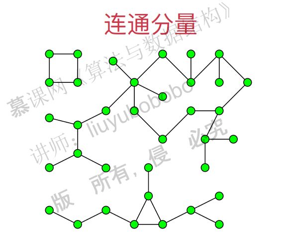
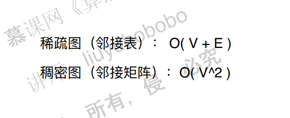

# 图的基础

## 1. 图论基础

图的分类：

图的连通性：

## 2. 图的表示

邻接矩阵：

邻接表：

稠密图：

~~~c++
#include <iostream>
#include <vector>
#include <cassert>

using namespace std;

// 稠密图 - 邻接矩阵
class DenseGraph{

private:
    int n, m;       // 节点数和边数
    bool directed;  // 是否为有向图
    vector<vector<bool>> g; // 图的具体数据

public:
    // 构造函数
    DenseGraph( int n , bool directed ){
        assert( n >= 0 );
        this->n = n;
        this->m = 0;    // 初始化没有任何边
        this->directed = directed;
        // g初始化为n*n的布尔矩阵, 每一个g[i][j]均为false, 表示没有任和边
        g = vector<vector<bool>>(n, vector<bool>(n, false));
    }

    ~DenseGraph(){ }

    int V(){ return n;} // 返回节点个数
    int E(){ return m;} // 返回边的个数

    // 向图中添加一个边
    void addEdge( int v , int w ){

        assert( v >= 0 && v < n );
        assert( w >= 0 && w < n );

        if( hasEdge( v , w ) )
            return;

        g[v][w] = true;
        if( !directed )
            g[w][v] = true;

        m ++;
    }

    // 验证图中是否有从v到w的边
    bool hasEdge( int v , int w ){
        assert( v >= 0 && v < n );
        assert( w >= 0 && w < n );
        return g[v][w];
    }
};

~~~

稀疏图：

~~~c++
#include <iostream>
#include <vector>
#include <cassert>

using namespace std;

// 稀疏图 - 邻接表
class SparseGraph{

private:
    int n, m;       // 节点数和边数
    bool directed;  // 是否为有向图
    vector<vector<int>> g;  // 图的具体数据

public:
    // 构造函数
    SparseGraph( int n , bool directed ){
        assert( n >= 0 );
        this->n = n;
        this->m = 0;    // 初始化没有任何边
        this->directed = directed;
        // g初始化为n个空的vector, 表示每一个g[i]都为空, 即没有任和边
        g = vector<vector<int>>(n, vector<int>());
    }

    ~SparseGraph(){ }

    int V(){ return n;} // 返回节点个数
    int E(){ return m;} // 返回边的个数

    // 向图中添加一个边
    void addEdge( int v, int w ){

        assert( v >= 0 && v < n );
        assert( w >= 0 && w < n );

        g[v].push_back(w);
        if( v != w && !directed )
            g[w].push_back(v);

        m ++;
    }

    // 验证图中是否有从v到w的边
    bool hasEdge( int v , int w ){

        assert( v >= 0 && v < n );
        assert( w >= 0 && w < n );

        for( int i = 0 ; i < g[v].size() ; i ++ )
            if( g[v][i] == w )
                return true;
        return false;
    }
};
~~~

## 3. 相邻节点迭代器

稠密图：

~~~c++
#include <iostream>
#include <vector>
#include <cassert>

using namespace std;

// 稠密图 - 邻接矩阵
class DenseGraph{

private:
    int n, m;       // 节点数和边数
    bool directed;  // 是否为有向图
    vector<vector<bool>> g; // 图的具体数据

public:
    // 构造函数
    DenseGraph( int n , bool directed ){
        assert( n >= 0 );
        this->n = n;
        this->m = 0;    // 初始化没有任何边
        this->directed = directed;
        // g初始化为n*n的布尔矩阵, 每一个g[i][j]均为false, 表示没有任和边
        g = vector<vector<bool>>(n, vector<bool>(n, false));
    }

    ~DenseGraph(){ }

    int V(){ return n;} // 返回节点个数
    int E(){ return m;} // 返回边的个数

    // 向图中添加一个边
    void addEdge( int v , int w ){

        assert( v >= 0 && v < n );
        assert( w >= 0 && w < n );

        if( hasEdge( v , w ) )
            return;

        g[v][w] = true;
        if( !directed )
            g[w][v] = true;

        m ++;
    }

    // 验证图中是否有从v到w的边
    bool hasEdge( int v , int w ){
        assert( v >= 0 && v < n );
        assert( w >= 0 && w < n );
        return g[v][w];
    }

    // 邻边迭代器, 传入一个图和一个顶点,
    // 迭代在这个图中和这个顶点向连的所有顶点
    class adjIterator{
    private:
        DenseGraph &G;  // 图G的引用
        int v;
        int index;

    public:
        // 构造函数
        adjIterator(DenseGraph &graph, int v): G(graph){
            assert( v >= 0 && v < G.n );
            this->v = v;
            this->index = -1;   // 索引从-1开始, 因为每次遍历都需要调用一次next()
        }

        ~adjIterator(){}

        // 返回图G中与顶点v相连接的第一个顶点
        int begin(){

            // 索引从-1开始, 因为每次遍历都需要调用一次next()
            index = -1;
            return next();
        }

        // 返回图G中与顶点v相连接的下一个顶点
        int next(){

            // 从当前index开始向后搜索, 直到找到一个g[v][index]为true
            for( index += 1 ; index < G.V() ; index ++ )
                if( G.g[v][index] )
                    return index;
            // 若没有顶点和v相连接, 则返回-1
            return -1;
        }

        // 查看是否已经迭代完了图G中与顶点v相连接的所有顶点
        bool end(){
            return index >= G.V();
        }
    };
};
~~~

稀疏图：

~~~c++
#include <iostream>
#include <vector>
#include <cassert>

using namespace std;

// 稀疏图 - 邻接表
class SparseGraph{

private:
    int n, m;       // 节点数和边数
    bool directed;  // 是否为有向图
    vector<vector<int>> g;  // 图的具体数据

public:
    // 构造函数
    SparseGraph( int n , bool directed ){
        assert( n >= 0 );
        this->n = n;
        this->m = 0;    // 初始化没有任何边
        this->directed = directed;
        // g初始化为n个空的vector, 表示每一个g[i]都为空, 即没有任和边
        g = vector<vector<int>>(n, vector<int>());
    }

    ~SparseGraph(){ }

    int V(){ return n;} // 返回节点个数
    int E(){ return m;} // 返回边的个数

    // 向图中添加一个边
    void addEdge( int v, int w ){

        assert( v >= 0 && v < n );
        assert( w >= 0 && w < n );

        g[v].push_back(w);
        if( v != w && !directed )
            g[w].push_back(v);

        m ++;
    }

    // 验证图中是否有从v到w的边
    bool hasEdge( int v , int w ){

        assert( v >= 0 && v < n );
        assert( w >= 0 && w < n );

        for( int i = 0 ; i < g[v].size() ; i ++ )
            if( g[v][i] == w )
                return true;
        return false;
    }

    // 邻边迭代器, 传入一个图和一个顶点,
    // 迭代在这个图中和这个顶点向连的所有顶点
    class adjIterator{
    private:
        SparseGraph &G; // 图G的引用
        int v;
        int index;

    public:
        // 构造函数
        adjIterator(SparseGraph &graph, int v): G(graph){
            this->v = v;
            this->index = 0;
        }

        ~adjIterator(){}

        // 返回图G中与顶点v相连接的第一个顶点
        int begin(){
            index = 0;
            if( G.g[v].size() )
                return G.g[v][index];
            // 若没有顶点和v相连接, 则返回-1
            return -1;
        }

        // 返回图G中与顶点v相连接的下一个顶点
        int next(){
            index ++;
            if( index < G.g[v].size() )
                return G.g[v][index];
            // 若没有顶点和v相连接, 则返回-1
            return -1;
        }

        // 查看是否已经迭代完了图G中与顶点v相连接的所有顶点
        bool end(){
            return index >= G.g[v].size();
        }
    };
};
~~~

c++中迭代器的实现：

STL中每个容器都有自己的迭代器，各种迭代器的接口相同，内部实现却不相同，这也直接体现了泛型编程的概念，下面在单链表类中内嵌入一个iterator的类来实现单链表的迭代

~~~c++
#include <iostream>

template<typename T>
struct ListNode {
    T value;
    ListNode* next;
    ListNode() {
        next = 0;
    }
    ListNode(T val, ListNode *p = nullptr) :
            value(val), next(p) {
    }
};

template<typename T>
class List {
private:
    ListNode<T> *m_pHead;
    ListNode<T> *m_pTail;
    int m_nSize;
public:
    List() {
        m_pHead = nullptr;
        m_pTail = nullptr;
        m_nSize = 0;
    }
    //从链表尾部插入元素
    void push_back(T value) {
        if (m_pHead == nullptr) {
            m_pHead = new ListNode<T>(value);
            m_pTail = m_pHead;
        } else {
            m_pTail->next = new ListNode<T>(value);
            m_pTail = m_pTail->next;
        }

    }

    //打印链表元素
    void print(std::ostream &os = std::cout) const {
        for (ListNode<T> *ptr = m_pHead; ptr != m_pTail->next ; ptr = ptr->next)
            std::cout << ptr->value << " ";
        os << std::endl;
    }

    //内置迭代器
    class iterator {
    private:
        ListNode<T> *m_ptr;
    public:
        iterator(ListNode<T>* p = nullptr) :
                m_ptr(p) {
        }

        T operator*() const {
            return m_ptr->value;
        }
        ListNode<T>* operator->() const {
            return m_ptr;
        }
        iterator& operator++() {
            m_ptr = m_ptr->next;
            return *this;
        }
        iterator operator++(int) {
            ListNode<T>* tmp = m_ptr;
            m_ptr = m_ptr->next;
            return iterator(tmp);
        }

        bool operator==(const iterator &arg) const {
            return arg.m_ptr == this->m_ptr;
        }

        bool operator!=(const iterator &arg) const {
            return arg.m_ptr != this->m_ptr;
        }

    };

    //返回链表头部指针
    iterator begin() const {
        return iterator(m_pHead);
    }

    //返回链表尾部指针
    iterator end() const {
        return iterator(m_pTail->next);
    }

    //其它成员函数

};

int main() {
    List<int> l;
    l.push_back(1);
    l.push_back(2);
    l.print();
    for (List<int>::iterator it = l.begin(); it != l.end(); ++it) {
        std::cout << *it << " ";
    }
    std::cout << std::endl;
    return 0;
}
~~~

## 4. 图的算法框架

文本文件：

~~~shell
13 13
0 5
4 3
0 1
9 12
6 4
5 4
0 2
11 12
9 10
0 6
7 8
9 11
5 3
~~~

图的读取：

~~~c++
#include <iostream>
#include <string>
#include <fstream>
#include <sstream>
#include <cassert>

using namespace std;

// 读取图算法
template <typename Graph>
class ReadGraph{

public:
    // 从文件filename中读取图的信息, 存储进图graph中
    ReadGraph(Graph &graph, const string &filename){

        ifstream file(filename);
        string line;
        int V, E;

        assert( file.is_open() );

        // 第一行读取图中的节点个数和边的个数
        assert( getline(file, line) );
        stringstream ss(line);
        ss>>V>>E;

        assert( V == graph.V() );

        // 读取每一条边的信息
        for( int i = 0 ; i < E ; i ++ ){

            assert( getline(file, line) );
            stringstream ss(line);

            int a,b;
            ss>>a>>b;
            assert( a >= 0 && a < V );
            assert( b >= 0 && b < V );
            graph.addEdge( a , b );
        }
    }
};
~~~

图的遍历

## 5. 深度优先遍历和联通分量

深度优先遍历：

联通分量：

c++代码：

~~~c++
#include <iostream>
#include <cassert>
using namespace std;
// 求无权图的联通分量
template <typename Graph>
class Component{

private:
    Graph &G;       // 图的引用
    bool *visited;  // 记录dfs的过程中节点是否被访问
    int ccount;     // 记录联通分量个数
    int *id;        // 每个节点所对应的联通分量标记

    // 图的深度优先遍历
    void dfs( int v ){

        visited[v] = true;
        id[v] = ccount;
        // Graph::adjIterator并不知道adjIterator是一种类型还是一种变量，因此需要加个typename说明是一个变量。
        typename Graph::adjIterator adj(G, v);
        for( int i = adj.begin() ; !adj.end() ; i = adj.next() ){
            if( !visited[i] )
                dfs(i);
        }
    }

public:
    // 构造函数, 求出无权图的联通分量
    Component(Graph &graph): G(graph){

        // 算法初始化
        visited = new bool[G.V()];
        id = new int[G.V()];
        ccount = 0;
        for( int i = 0 ; i < G.V() ; i ++ ){
            visited[i] = false;
            id[i] = -1;
        }

        // 求图的联通分量
        for( int i = 0 ; i < G.V() ; i ++ )
            if( !visited[i] ){
                dfs(i);
                ccount ++;
            }
    }

    // 析构函数
    ~Component(){
        delete[] visited;
        delete[] id;
    }

    // 返回图的联通分量个数
    int count(){
        return ccount;
    }

    // 查询点v和点w是否联通
    bool isConnected( int v , int w ){
        assert( v >= 0 && v < G.V() );
        assert( w >= 0 && w < G.V() );
        return id[v] == id[w];
    }
};
~~~

时间复杂度：

## 6. 寻路

## 7. 广度优先遍历和最短路径

## 8. 迷宫生成，PS抠图

# 最小生成树

## 1. 有权图

## 2. 最小生成树问题和切分定理

## 3. Prim算法的第一个实现

## 4. Prim算法的优化

##  5. 优化后的Prim算法的实现

## 6. Krush算法

## 7. 最小生成树算法的思考

# 最短路径

## 1. 最短路径问题和松弛操作

## 2. Dijkstra算法的思想

## 3. 实现Dijkstra算法

## 4. 负权边和Bellman-ford在                

