# 数据结构笔记第二部分

## 六、二分搜索树

### 1. 为什么要研究树结构

#### 树结构的优点

非常**高效**。按照某个分支寻找下去就可以了，节省了不必要的搜索，因此很高效。

#### 要讲的树结构

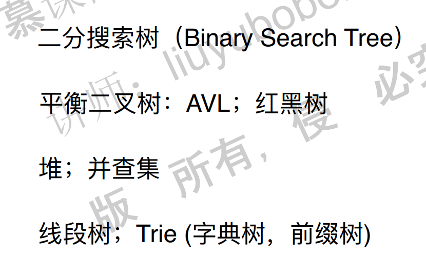

### 2. 二分搜索树基础

#### 2.1 二叉树

二叉树的概念略。

二叉树的特性：具有天然的递归特性。

#### 2.2 什么是二分搜索树


包含重复元素和不包含重复元素的二分搜索树：


#### 2.3 二分搜索树的优点

因为左子树小于根，右子树大于根，因为这种结构，使得查找非常快。

节点是要可比较的。

#### 2.4 二分搜索树的基础实现

~~~java
public class BST<E extends Comparable<E>> {

    private class Node {
        public E e;
        public Node left, right;

        public Node(E e) {
            this.e = e;
            left = null;
            right = null;
        }
    }
    private Node root;
    private int size;

    public BST(){
        root = null;
        size = 0;
    }

    public int size(){
        return size;
    }

    public boolean isEmpty(){
        return size == 0;
    }
}
~~~

**递归的要点**

递归实现的要点：1. 写终止条件。2. 转化为规模更小的问题。

另外，需要注意的是：1. 递归函数本身的意义是什么。2. 递归函数的调用，看作是调用了一个新的函数就好了。3. 用IDE进行递归的DEBUG。

### 3. 向二分搜索树中添加元素

添加元素操作：

如果根节点为空，直接添加。

如果不为空，看看比根节点大还是小，小的话添加到左子树，大的话添加到右子树。完毕。

如果插入元素如果和树中存在元素相同的话，则覆盖。不过我们这里讲的二分搜索树不包含重复元素。


二分搜索树可能退化成为一个链表！因此递归的方法可能导致栈溢出。


java代码：

~~~java
// 向二分搜索树中添加新的元素e
    public void add(E e){

        if(root == null){
            root = new Node(e);
            size ++;
        }
        else
            add(root, e);
    }

    // 向以node为根的二分搜索树中插入元素e，递归算法
    private void add(Node node, E e){
        if(e.equals(node.e))
            return;
        else if(e.compareTo(node.e) < 0 && node.left == null){
            node.left = new Node(e);
            size ++;
            return;
        }
        else if(e.compareTo(node.e) > 0 && node.right == null){
            node.right = new Node(e);
            size ++;
            return;
        }

        if(e.compareTo(node.e) < 0)
            add(node.left, e);
        else //e.compareTo(node.e) > 0
            add(node.right, e);
    }
~~~

### 4. 改进添加操作：深入理解递归终止条件

将3中的递归进行优化：

修改点：返回根节点！

~~~java
// 向二分搜索树中添加新的元素e
    public void add(E e){
        root = add(root, e);
    }

    // 向以node为根的二分搜索树中插入元素e，递归算法
    // 返回插入新节点后二分搜索树的根
    private Node add(Node node, E e){
        if(node == null){
            size ++;
            return new Node(e);
        }

        if(e.compareTo(node.e) < 0)
            node.left = add(node.left, e);
        else if(e.compareTo(node.e) > 0)
            node.right = add(node.right, e);

        return node;
    }
~~~

### 5. 二分搜索树的查询操作

查询元素

思想：传入一个节点，如果为空，就返回false。如果不为空，看看这个节点是否是待查询的节点，如果是就返回true，否则根据待查询的节点的值的大小选择到左或者右子树进行查找。

~~~java
 // 看二分搜索树中是否包含元素e
    public boolean contains(E e){
        return contains(root, e);
    }

    // 看以node为根的二分搜索树中是否包含元素e, 递归算法
    private boolean contains(Node node, E e){

        if(node == null)
            return false;

        if(e.compareTo(node.e) == 0)
            return true;
        else if(e.compareTo(node.e) < 0)
            return contains(node.left, e);
        else // e.compareTo(node.e) > 0
            return contains(node.right, e);
    }
~~~

### 6. 二分搜索树的前序遍历

前序遍历的意思：就是先访问根，然后左，然后右。

~~~java
// 二分搜索树的前序遍历
    public void preOrder(){
        preOrder(root);
    }

    // 前序遍历以node为根的二分搜索树, 递归算法
    private void preOrder(Node node){
        if(node == null)
            return;

        System.out.println(node.e);
        preOrder(node.left);
        preOrder(node.right);
    }
~~~

### 7. 二分搜索树的中序遍历和后序遍历

中序遍历：左，中，右。

后序遍历：左，右，中。

中序遍历：

~~~java
 // 二分搜索树的中序遍历
    public void inOrder(){
        inOrder(root);
    }

    // 中序遍历以node为根的二分搜索树, 递归算法
    private void inOrder(Node node){
        if(node == null)
            return;

        inOrder(node.left);
        System.out.println(node.e);
        inOrder(node.right);
    }
~~~

后序遍历：

~~~java
 // 二分搜索树的后序遍历
    public void postOrder(){
        postOrder(root);
    }

    // 后序遍历以node为根的二分搜索树, 递归算法
    private void postOrder(Node node){
        if(node == null)
            return;

        postOrder(node.left);
        postOrder(node.right);
        System.out.println(node.e);
    }
~~~

### 8. 深入理解二分搜索树的前中后序遍历

我们要怎么不看程序也能得到前中后序遍历的结果呢？有一种办法就是3点法。

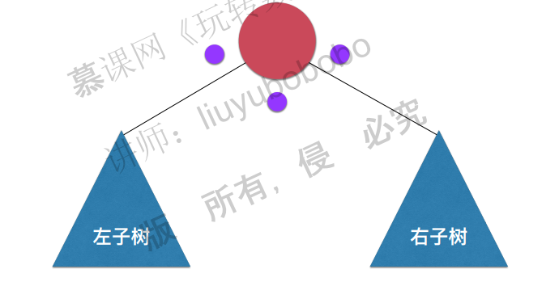

前序遍历：

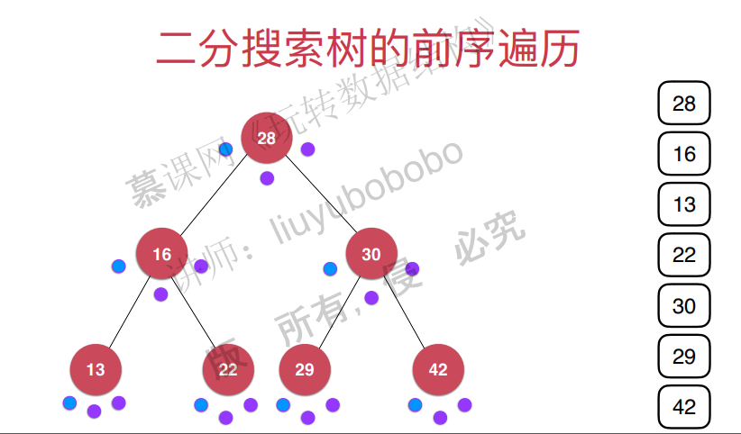

中序遍历：


后序遍历：


### 9. 二分搜索树的前序遍历的非递归写法

需要模拟系统栈，暂时忽略。

### 10. 二分搜索树的层序遍历

二分搜索树的遍历分为两种，一种是深度优先遍历，包括之前讲的前序遍历，中序遍历和后续遍历。另外一种是广度优先遍历，也就是接下来要讲的层序遍历。


层序遍历的实现，不能使用递归，需要使用栈来进行遍历。具体思想：

> 首先，将头结点放到队列中。然后出队列，出队列的时候将左节点和右节点分别压入队列中。
>
> 将左节点出栈，同时将左节点和右节点压入到栈中…
>
> 如此不断循环。
>
> 总之一句话，就是在节点出队列的时候要把左右节点都给压入到队列中。


**广度优先遍历的意义**

深度优先遍历是一路走到底，但是问题的解不一定在底部，而是在顶部，这个时候使用广度优先遍历可能就可以更快地找到问题的解。

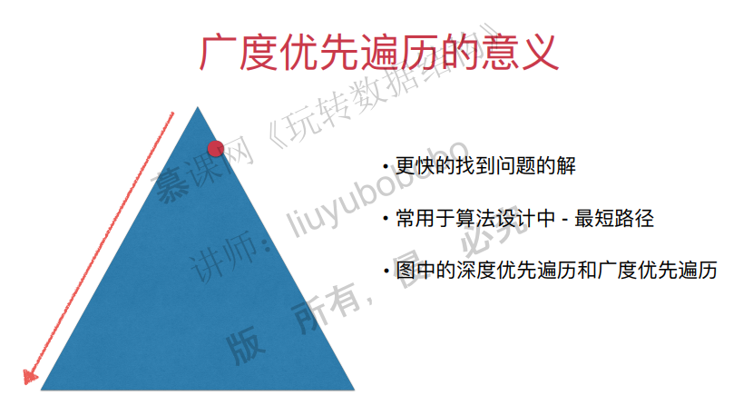

java代码：

~~~java
    // 二分搜索树的层序遍历
    public void levelOrder(){

        if(root == null)
            return;

        Queue<Node> q = new LinkedList<>();
        q.add(root);
        while(!q.isEmpty()){
            Node cur = q.remove();
            System.out.println(cur.e);

            if(cur.left != null)
                q.add(cur.left);
            if(cur.right != null)
                q.add(cur.right);
        }
    }
~~~

### 11. 删除二分搜索树的最大元素和最小元素

由于二分搜索树的删除操作比较麻烦，这里先讲简单的：删除二分搜索树的最小值和最大值。

二分搜索树的最小值：从头结点开始往左走，直到走不动为止，删除。

二分搜索树的最大值：从头结点开始往右走，直到走不动为止，删除。

注意，最小值和最大值不一定是叶子节点。比如以下这种情况。


首先知道怎么寻找最小值和最大值。

寻找最小值和最大值的代码：

~~~java
// 寻找二分搜索树的最小元素
    public E minimum(){
        if(size == 0)
            throw new IllegalArgumentException("BST is empty");

        Node minNode = minimum(root);
        return minNode.e;
    }

    // 返回以node为根的二分搜索树的最小值所在的节点
    private Node minimum(Node node){
        if( node.left == null )
            return node;

        return minimum(node.left);
    }

    // 寻找二分搜索树的最大元素
    public E maximum(){
        if(size == 0)
            throw new IllegalArgumentException("BST is empty");

        return maximum(root).e;
    }

    // 返回以node为根的二分搜索树的最大值所在的节点
    private Node maximum(Node node){
        if( node.right == null )
            return node;

        return maximum(node.right);
    }
~~~

**删除二分搜索树的最小值**

如果最小值是叶子节点，那么删除起来很简单。实际上就是链表的节点删除，可以用递归实现，也可以不用。


如果最小值不是叶子节点，那么删除起来就有点麻烦，需要将当前节点的右子树赋值给当前节点的父节点的左子树。


删除最大值的方法同理。

删除最小值和最大值的java代码：

java代码：

```java
    // 删除掉以node为根的二分搜索树中值为e的节点, 递归算法
    // 返回删除节点后新的二分搜索树的根
    private Node remove(Node node, E e){

        if( node == null )
            return null;

        if( e.compareTo(node.e) < 0 ){
            node.left = remove(node.left , e);
            return node;
        }
        else if(e.compareTo(node.e) > 0 ){
            node.right = remove(node.right, e);
            return node;
        }
        else{   // e.compareTo(node.e) == 0

            // 待删除节点左子树为空的情况
            if(node.left == null){
                Node rightNode = node.right;
                node.right = null;
                size --;
                return rightNode;
            }

            // 待删除节点右子树为空的情况
            if(node.right == null){
                Node leftNode = node.left;
                node.left = null;
                size --;
                return leftNode;
            }

            // 待删除节点左右子树均不为空的情况

            // 找到比待删除节点大的最小节点, 即待删除节点右子树的最小节点
            // 用这个节点顶替待删除节点的位置
            Node successor = minimum(node.right);
            successor.right = removeMin(node.right);
            successor.left = node.left;

            node.left = node.right = null;

            return successor;
        }
```

c++代码：

```c++
	// 删除掉以node为根的二分搜索树中值为e的节点, 递归算法
	// 返回删除节点后新的二分搜索树的根
	Node<T>* remove(Node<T>* node, T e) {
		if (node == nullptr) {
			return nullptr;
		}
		if (e< node->e) {
			node->left = this->remove(node->left, e);
			return node;
		}
		else if (e> node->e) {
			node->right = this->remove(node->right, e);
			return node;
		}
		else {   // e.compareTo(node.e) == 0

				 // 待删除节点左子树为空的情况
			if (node->left == nullptr) {
				Node<T>* rightNode = node->right;
				delete node;
				this->size--;
				return rightNode;
			}

			// 待删除节点右子树为空的情况
			if (node->right == nullptr) {
				Node<T>* leftNode = node->left;
				delete node;
				this->size--;
				return leftNode;
			}

			// 待删除节点左右子树均不为空的情况

			// 找到比待删除节点大的最小节点, 即待删除节点右子树的最小节点
			// 用这个节点顶替待删除节点的位置
			Node<T>* successor = this->minimum(node->right);
			//删除右子树的最小节点，返回根。
			successor->right =this-> removeMin(node->right);
			successor->left = node->left;
			delete node;
			return successor;
		}
	}
```

思路：递归问题的三步骤：

1. 明白递归函数的任务：给一个根节点，删除掉树的最小值节点，返回新的根。
2. 最基本问题：判断根的左节点是不是空，空的话删掉这个根节点同时返回右节点作为新的根。
3. 相似子问题：如果左节点不是空的话，剩下的问题就是子问题，将根节点的左节点=新产生的根就可以了。

注意：如果左右子树都不为空的情况下删除节点的做法。删除右子树中最小的值：

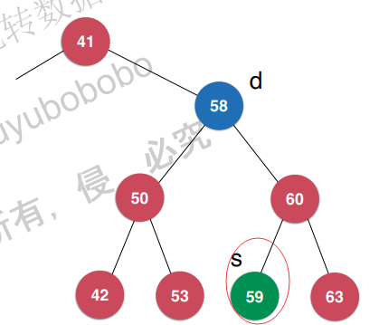

当然，也可以删除左子树中最小的值：


至于为什么要这么做，暂时不知道。

```java
//......
    // 寻找二分搜索树的最小元素
    public E minimum(){
        if(size == 0)
            throw new IllegalArgumentException("BST is empty");

        Node minNode = minimum(root);
        return minNode.e;
    }

    // 返回以node为根的二分搜索树的最小值所在的节点
    private Node minimum(Node node){
        if( node.left == null )
            return node;

        return minimum(node.left);
    }

    // 寻找二分搜索树的最大元素
    public E maximum(){
        if(size == 0)
            throw new IllegalArgumentException("BST is empty");

        return maximum(root).e;
    }

    // 返回以node为根的二分搜索树的最大值所在的节点
    private Node maximum(Node node){
        if( node.right == null )
            return node;

        return maximum(node.right);
    }

    // 从二分搜索树中删除最小值所在节点, 返回最小值
    public E removeMin(){
        E ret = minimum();
        root = removeMin(root);
        return ret;
    }

    // 删除掉以node为根的二分搜索树中的最小节点
    // 返回删除节点后新的二分搜索树的根
    private Node removeMin(Node node){

        if(node.left == null){
            Node rightNode = node.right;
            node.right = null;
            size --;
            return rightNode;
        }

        node.left = removeMin(node.left);   
        return node;
    }

    // 从二分搜索树中删除最大值所在节点
    public E removeMax(){
        E ret = maximum();
        root = removeMax(root);
        return ret;
    }

    // 删除掉以node为根的二分搜索树中的最大节点
    // 返回删除节点后新的二分搜索树的根
    private Node removeMax(Node node){

        if(node.right == null){
            Node leftNode = node.left;
            node.left = null;
            size --;
            return leftNode;
        }

        node.right = removeMax(node.right);
        return node;
    }
//......
```

删除最小值和最大值的c++代码：

```c++
	// 寻找二分搜索树的最小元素
	T minimum() {
		assert(this->size > 0);
		Node<T> *minNode = minimum(this->root);
		return minNode->e;
	}

	// 返回以node为根的二分搜索树的最小值所在的节点
	Node<T>* minimum(Node<T>* node) {
		if (node->left == nullptr) {
			return node;
		}
		return minimum(node->left);
	}

	// 寻找二分搜索树的最大元素
	T maximum() {
		assert(this->size > 0);
		Node<T> *maxNode = maximum(this->root);
		return maxNode->e;
	}

	// 返回以node为根的二分搜索树的最大值所在的节点
	Node<T>* maximum(Node<T> *node) {
		if (node->right == nullptr) {
			return node;
		}
		return maximum(node->right);
	}
    // 从二分搜索树中删除最小值所在节点, 返回最小值
	T removeMin() {
		T ret = this->minimum();
		this->root = this->removeMin(this->root);
		return ret;
	}

	// 删除掉以node为根的二分搜索树中的最小节点
	// 返回删除节点后新的二分搜索树的根
	Node<T>* removeMin(Node<T>* node) {

		if (node->left == nullptr) {
			Node<T>* rightNode = node->right;
			delete node;
			this->size--;
			return rightNode;
		}

		node->left = this->removeMin(node->left);
		return node;
	}

	// 从二分搜索树中删除最大值所在节点
	T removeMax() {
		T ret = this->maximum();
		this->root = this->removeMax(this->root);
		return ret;
	}

	// 删除掉以node为根的二分搜索树中的最大节点
	// 返回删除节点后新的二分搜索树的根
	Node<T>* removeMax(Node<T> *node) {

		if (node->right == nullptr) {
			Node<T>* leftNode = node->left;
			delete node;
			this->size--;
			return leftNode;
		}
		node->right =this-> removeMax(node->right);
		return node;
	}
	// 从二分搜索树中删除元素为e的节点
	void remove(T e) {
		this->root = remove(this->root, e);
	}
```

**二分搜索树删除节点**


### 12. 删除二分搜索树的任意元素

### 13. 更多关于二分搜索树的相关话题

 二分搜索树前序遍历的非递归写法

二分搜索树的前序遍历的非递归写法需要用到栈的数据结构。二分搜索树遍历的非递归实现，比递归实现复杂得多，中序遍历和后序遍历的非递归实现更复杂。中序遍历和后序遍历的非递归实现，实际应用得很少。

### 总代码

java代码：

```java
public class BST<E extends Comparable<E>> {

    private class Node {
        public E e;
        public Node left, right;

        public Node(E e) {
            this.e = e;
            left = null;
            right = null;
        }
    }

    private Node root;
    private int size;

    public BST(){
        root = null;
        size = 0;
    }

    public int size(){
        return size;
    }

    public boolean isEmpty(){
        return size == 0;
    }

    // 向二分搜索树中添加新的元素e
    public void add(E e){
        root = add(root, e);
    }

    // 向以node为根的二分搜索树中插入元素e，递归算法
    // 返回插入新节点后二分搜索树的根
    private Node add(Node node, E e){
        if(node == null){
            size ++;
            return new Node(e);
        }

        if(e.compareTo(node.e) < 0)
            node.left = add(node.left, e);
        else if(e.compareTo(node.e) > 0)
            node.right = add(node.right, e);

        return node;
    }

    // 看二分搜索树中是否包含元素e
    public boolean contains(E e){
        return contains(root, e);
    }

    // 看以node为根的二分搜索树中是否包含元素e, 递归算法
    private boolean contains(Node node, E e){

        if(node == null)
            return false;

        if(e.compareTo(node.e) == 0)
            return true;
        else if(e.compareTo(node.e) < 0)
            return contains(node.left, e);
        else // e.compareTo(node.e) > 0
            return contains(node.right, e);
    }

    // 二分搜索树的前序遍历
    public void preOrder(){
        preOrder(root);
    }

    // 前序遍历以node为根的二分搜索树, 递归算法
    private void preOrder(Node node){
        if(node == null)
            return;

        System.out.println(node.e);
        preOrder(node.left);
        preOrder(node.right);
    }

    @Override
    public String toString(){
        StringBuilder res = new StringBuilder();
        generateBSTString(root, 0, res);
        return res.toString();
    }

    // 生成以node为根节点，深度为depth的描述二叉树的字符串
    private void generateBSTString(Node node, int depth, StringBuilder res){

        if(node == null){
            res.append(generateDepthString(depth) + "null\n");
            return;
        }

        res.append(generateDepthString(depth) + node.e + "\n");
        generateBSTString(node.left, depth + 1, res);
        generateBSTString(node.right, depth + 1, res);
    }

    private String generateDepthString(int depth){
        StringBuilder res = new StringBuilder();
        for(int i = 0 ; i < depth ; i ++)
            res.append("--");
        return res.toString();
    }
}
```

c++代码：

```c++
#pragma once
#include<iostream>
template<typename T>
class Node {
public:
	T e;
	Node *left;
	Node *right;

public:
	Node(T e) {
		this->e = e;
		left = nullptr;
		right = nullptr;
	}

};

template<typename T>
class BST {
private:
	Node<T> *root;
	int size;
public:
	BST(){
		this->root = nullptr;
		this->size = 0;
	}
	~BST() {
		this->delTree(this->root);
	}
	void delTree(Node<T> *node) {
		if (node = nullptr) {
			return;
		}
		delTree(node->left);
		delTree(node->right);
		std::cout << "delete node " << node->e;
		delete node;
		node = nullptr;
	}

	int getSize() {
		return this->size;
	}
	bool isEmpty() {
		return this->size == 0;
	}

	void add(T e) {
		this->root = this->add(this->root, e);
	}
	// 看二分搜索树中是否包含元素e，这里假设没有重复元素。
	bool contain(T e) {
		return this->contain(this->root, e);
	}
	// 二分搜索树的前序遍历
	void preOrder() {
		this->preOrder(this->root);
	}
	// 二分搜索树的中序遍历
	void inOrder() {
		this->inOrder(this->root);
	}
	// 二分搜索树的后序遍历
	void postOrder() {
		this->postOrder(this->root);
	}


private:
	// 向以node为根的二分搜索树中插入元素e，递归算法
	// 返回插入新节点后二分搜索树的根
	
	Node<T>* add(Node<T> *node, T e) {
		if (node == nullptr) {	
			this->size++;
			return new Node<T>(e);
		}
		if (e<node->e){
			node->left= add(node->left, e);
		}
		else if (e > node->e) {
			node->right=add(node->right,e);
		}
		return node;
	}
	// 看以node为根的二分搜索树中是否包含元素e, 递归算法
	bool contain(Node<T> *node, T e) {
		if (node == nullptr) {
			return false;
		}
		if (node->e == e) {
			return true;
		}
		else if (e<node->e) {
			return contain(node->left,e);
		}
		else {
			return contain(node->right, e);
		}
	
	}
	// 前序遍历以node为根的二分搜索树, 递归算法
	void preOrder(Node<T> *node) {
		if (node == nullptr) {
			return;
		}
		std::cout << node->e << std::endl;
		preOrder(node->left);
		preOrder(node->right);
	}
	// 中序遍历以node为根的二分搜索树, 递归算法
	void inOrder(Node<T> *node) {
		if (node == nullptr) {
			return;
		}	
		inOrder(node->left);
		std::cout << node->e << std::endl;
		inOrder(node->right);
	}
	// 后序遍历以node为根的二分搜索树, 递归算法
	void postOrder(Node<T> *node) {
		if (node == nullptr) {
			return;
		}
		postOrder(node->left);
		postOrder(node->right);
		std::cout << node->e << std::endl;
	}
};

//======================================================
#include"dataStructure.h"
#include<iostream>
#include<vector>
int main() {

	BST<int> bst;
	int nums[]= { 5, 3, 6, 8, 4, 2 };
	for (int i = 0; i < 6; i++) {
		bst.add(nums[i]);
	}
  	/////////////////
  //      5      //
  //    /   \    //
  //   3    6    //
  //  / \    \   //
  // 2  4     8  //
  /////////////////
	bst.preOrder();
	std::cout << std::endl;
	bst.inOrder();
	std::cout << std::endl;
	bst.postOrder();
	std::cout << std::endl;
}
```


## 七、集合和映射

### 1. 集合基础和基于二分搜索树的集合实现

集合是一种不能存放重复元素的数据结构。回顾之前我们讲的二分搜索树，它就是不能存放重复元素的，因此用二分搜索树来实现集合是一种很好的选择。

功能设计

> void add()：不能添加重复元素
>
> void remove()
>
> bool contains()
>
> int getSize()
>
> bool isEmpty()

集合的实现


**基于二分搜索树的实现集合**

java代码

~~~java
public class BSTSet<E extends Comparable<E>> implements Set<E> {

    private BST<E> bst;

    public BSTSet(){
        bst = new BST<>();
    }

    @Override
    public int getSize(){
        return bst.size();
    }

    @Override
    public boolean isEmpty(){
        return bst.isEmpty();
    }

    @Override
    public void add(E e){
        bst.add(e);
    }

    @Override
    public boolean contains(E e){
        return bst.contains(e);
    }

    @Override
    public void remove(E e){
        bst.remove(e);
    }
}
~~~

c++代码：

~~~c++
#include"BST.h"
template<typename T>
class BSTSet {
private:
	BST<T> *bst;
public:
	int getSize() {
		this->bst->getSize();
	}
	bool isEmpty() {
		this->bst->isEmpty();
	}
	void add(T e) {
		this->bst->add(e);
	}
	bool contains() {
		this->bst->contains();
	}

	void remove(T e) {
		this->bst->re
	}
};
~~~

### 2. 基于链表的实现集合

基于链表的实现(注意这时候链表也是不能添加重复元素的，具体来说，在向链表添加元素的时候可以通过contains来判断是否包含这个元素，如果包含，那么就不往链表中添加这个元素)。

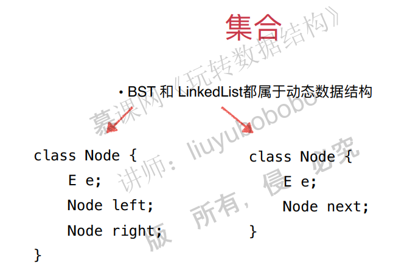

java代码：

~~~java
import java.util.ArrayList;

public class BSTSet<E extends Comparable<E>> implements Set<E> {

    private BST<E> bst;

    public BSTSet(){
        bst = new BST<>();
    }

    @Override
    public int getSize(){
        return bst.size();
    }

    @Override
    public boolean isEmpty(){
        return bst.isEmpty();
    }

    @Override
    public void add(E e){
        bst.add(e);
    }

    @Override
    public boolean contains(E e){
        return bst.contains(e);
    }

    @Override
    public void remove(E e){
        bst.remove(e);
    }
}
~~~

基于c++的实现，略。

### 3. 集合的复杂度分析

基于链表实现的集合和基于BST实现的集合时间复杂度是有很大差距的。


注意：链表添加元素的时间复杂度是O(1)，但是因为set中元素不能重复，所以在add的时候会调用contains函数。contains的时间复杂度是O(n)。

但是注意一个问题，**就是对于同一组数据，二分搜索树不是唯一的**。最差的情况，二分搜索树会退化成链表，比如数组有序的时候，二分搜索树进行添加元素之后就成了链表。


这样，复杂度进行重新分析：

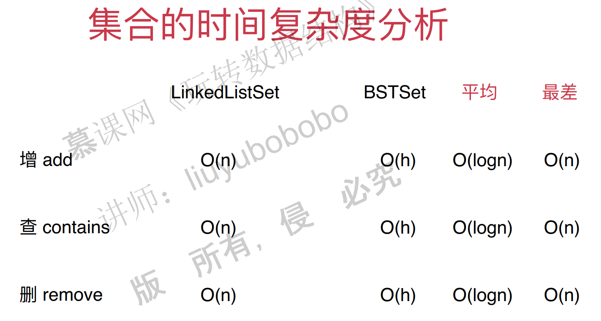

注意，这里的平均并不是平均，而是最好的情况，最好的情况就是二叉树是满二叉树的情况。

### 4. Leetcode中的集合问题和更多集合相关问题

804号问题。https://leetcode.com/problems/unique-morse-code-words/description/


java代码：

~~~java
// Leetcode 804. Unique Morse Code Words
// https://leetcode.com/problems/unique-morse-code-words/description/

import java.util.TreeSet;

public class Solution {

    public int uniqueMorseRepresentations(String[] words) {

        String[] codes = {".-","-...","-.-.","-..",".","..-.","--.","....","..",".---","-.-",".-..","--","-.","---",".--.","--.-",".-.","...","-","..-","...-",".--","-..-","-.--","--.."};
        TreeSet<String> set = new TreeSet<>();
        for(String word: words){
            StringBuilder res = new StringBuilder();
            for(int i = 0 ; i < word.length() ; i ++)
                res.append(codes[word.charAt(i) - 'a']);

            set.add(res.toString());
        }

        return set.size();
    }
}

~~~

c++代码：

~~~c++
//
// Created by hpf on 18-5-14.
//

#include <set>
#include <iostream>
#include <string>
#include <vector>

class Solution {
public:
    int uniqueMorseRepresentations(std::vector<std::string> &words) {
        std::vector<std::string> morse = {".-", "-...", "-.-.", "-..", ".", "..-.", "--.", "....", "..", ".---", "-.-",
                                          ".-..", "--", "-.", "---", ".--.", "--.-", ".-.", "...", "-", "..-", "...-",
                                          ".--", "-..-", "-.--", "--.."};
        std::set<std::string> Set;
        for (const std::string &word : words) {
            std::cout << '"' << word << '"' << " -> ";
            std::string code = "";
            for (char c : word) {
                code += morse[c - 'a'];
            }
            std::cout << '"' << code << '"' << std::endl;
            Set.insert(code);
        }
        return Set.size();
    }
};

~~~

**有序集合和无序集合**

集合按照有序无序可以分为有序集合和无序集合。

有序集合通常都是基于树来实现的，这个树除了是二分搜索树之外还可以是其他的。

通过链表实现的集合是无序的，不过基于链表实现的集合性能比较差，之后会讲基于哈希表实现的集合，性能好很多，它也是一种无序结合。

除此之外，还有一种集合叫做多重集合，它里边的元素是可以重复的，这里暂时不讲。

### 5. 映射基础

映射的概念很简单，实际上就是函数中的映射的意思，可以多对一，不能一对多。实际上，python中的字典就是映射，key是不能重复的，但是value是可以重复的。

映射可以通过链表和二分搜索树来实现，多增加一个value就行了：

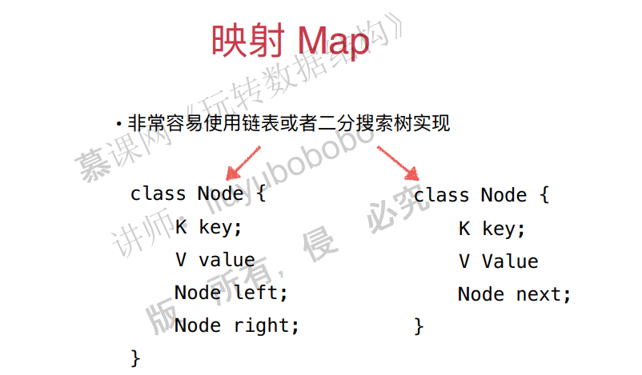

### 6. 基于链表的映射实现

映射可以有两种实现方式，一种是基于链表，一种是基于二分搜索树。

#### 

### 7. 基于二分搜索树的映射实现


### 8. 映射的复杂度分析和更多映射相关问题

本节主要考察使用链表和二分搜索树为底层的映射的性能。


有序映射和无序映射

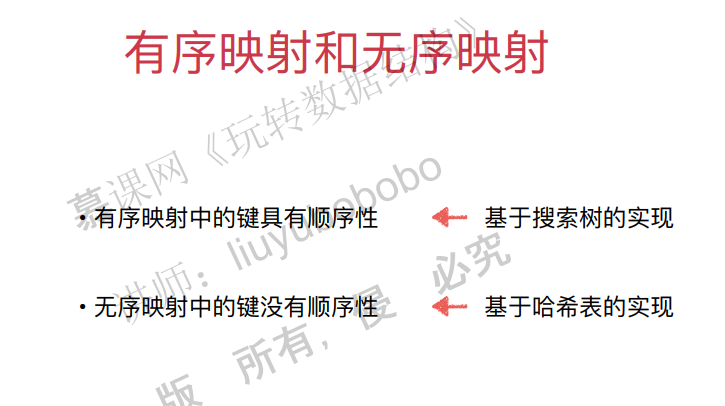

有序映射一般是基于搜索树实现的，无序映射可以基于链表实现，但是实在太慢了，因此可以考虑哈希表实现，后面会讲。

**多重映射**

有些情况键可以重复。不做要求。

**集合和映射的区别**

集合和映射实际上是差不多，只不过映射多了一个value。


### 9. Leetcode上更多集合和映射的问题

求数组的交集。

这个在算法课中有，略。

## 八、堆和优先队列

### 1. 什么是优先队列

普通队列：先进先出，后进后出。

优先队列：出队顺序和入队顺序无关，和优先级有关。

优先队列的例子

1. 医院中的排队的例子。排队进队列的时候和普通队列是一样的，但是出队就不一样了。出队按照病人的病情严重程度来优先出队。
2. 操作系统调度。操作系统需要优先选择优先级高的任务出队。

这两个例子中都有一个很关键的就是，队列是动态的，数据是会不断入队的，如果不是动态的，就不需要考虑优先队列这种数据结构了。

**优先队列功能**

```c++
class PriorityQueue
void enqueue();
T dequeue();
T getFront();
int getsize();
bool isEmpty();
```

其中和普通队列差别最大的就是出队操作。出队操作需要选择优先级最大的元素出队。

**使用不同底层数据结构的复杂度分析**


如果使用普通的线性结构，入队时间复杂度O(1)，但是出队的时候，要选择最大元素，这个时候的时间复杂度是O（n）。

如果使用顺序线性结构，那么入队的时候需要进行排序，因此时间复杂度是O(n)，因为已经排好了顺序，因此出队就是O(1)。

如果使用堆这种数据结构，那么入队和出队的时间复杂度都是O(log(n))，因此是一个很优秀的数据结构。

注：这里的普通线性结构指的是链表，顺序线性结构指的是有顺序的链表。

### 2. 堆的基础表示

堆的基本结构

堆实际上就是用树表示的，二叉堆就是满足某种特性的二叉树。二叉堆是一个完全二叉树。

**满二叉树**：每一层的节点都是满的。


**完全二叉树**：从根结点到倒数第二层满足满二叉树，最后一层可以不完全填充，其叶子结点都靠左对齐。

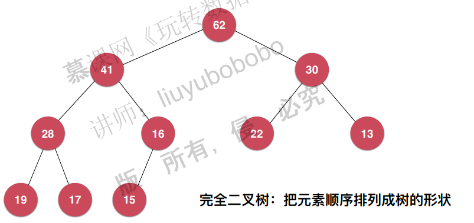

二叉堆可以分为最大堆和最小堆，定义分别为：

**最大堆**：如果一个二叉堆满足，所有的子节点都不比父节点大，那么称为最大堆。**左节点不一定**

**大于右节点！**

**最小堆**：如果一个二叉堆所有子节点都不比父节点小，那么其为最小堆。

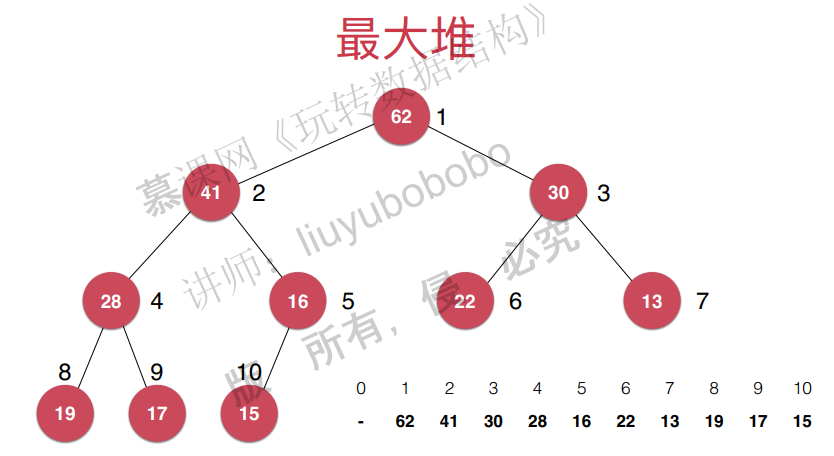


**用数组储存二叉堆**

我们知道，由于其独特结构，完全二叉树可以用数组很好地进行储存，那么很自然地可以用数组来表示二叉堆。用数组储存最大堆的时候，通常将数组的首元素空出来，因为这样可以让父节点和子节点的索引变得更简单。

> 父亲节点的索引是$i$ ，则子节点的索引分别是$2*i, 2*i+1$ 。
>
> 左子子节点的索引是$i$ ，则父亲节点的索引是$i/2$ 。
>
> 右子节点的索引是$i$ ，则父亲节点的索引是$(i-1)/2$ 。

当然，如果数组首元素不空出来也是可以的，只是相应的索引要发生改变。

### 3. 向堆中添加元素和sift up

这里以最大堆为例。

向堆中添加元素和sift up：一路和父亲节点进行比较。

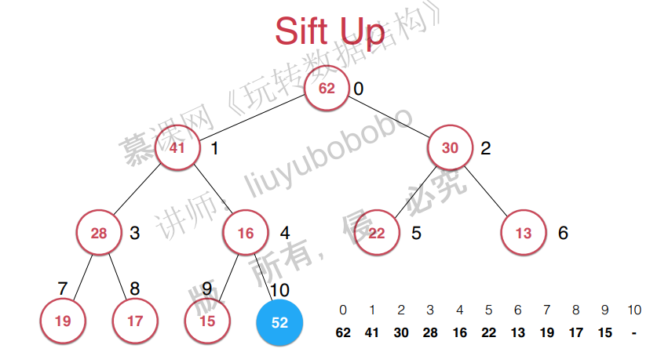

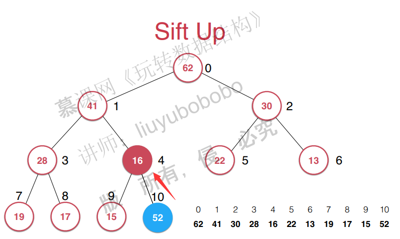

### 4. 从堆中取出元素Sift down

取出堆中的最大元素和sift Down：


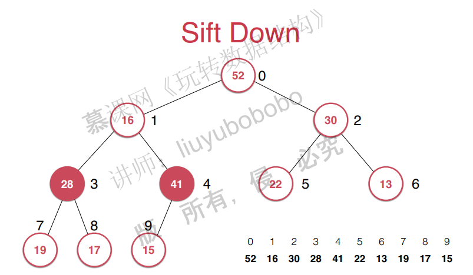

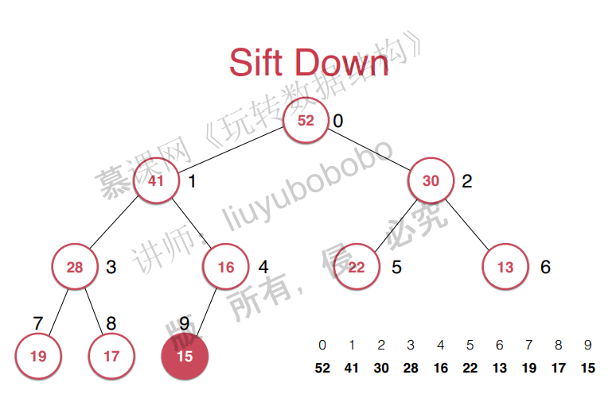

堆的复杂度分析

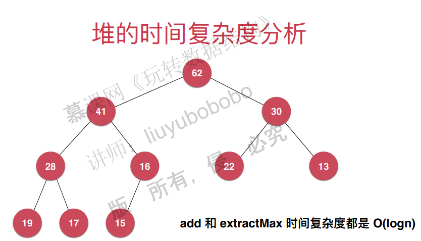


java代码：

~~~java
public class MaxHeap<E extends Comparable<E>> {

    private Array<E> data;

    public MaxHeap(int capacity){
        data = new Array<>(capacity);
    }

    public MaxHeap(){
        data = new Array<>();
    }

    // 返回堆中的元素个数
    public int size(){
        return data.getSize();
    }

    // 返回一个布尔值, 表示堆中是否为空
    public boolean isEmpty(){
        return data.isEmpty();
    }

    // 返回完全二叉树的数组表示中，一个索引所表示的元素的父亲节点的索引
    private int parent(int index){
        if(index == 0)
            throw new IllegalArgumentException("index-0 doesn't have parent.");
        return (index - 1) / 2;
    }

    // 返回完全二叉树的数组表示中，一个索引所表示的元素的左孩子节点的索引
    private int leftChild(int index){
        return index * 2 + 1;
    }

    // 返回完全二叉树的数组表示中，一个索引所表示的元素的右孩子节点的索引
    private int rightChild(int index){
        return index * 2 + 2;
    }

    // 向堆中添加元素
    public void add(E e){
        data.addLast(e);
        siftUp(data.getSize() - 1);
    }

    private void siftUp(int k){

        while(k > 0 && data.get(parent(k)).compareTo(data.get(k)) < 0 ){
            data.swap(k, parent(k));
            k = parent(k);
        }
    }

    // 看堆中的最大元素
    public E findMax(){
        if(data.getSize() == 0)
            throw new IllegalArgumentException("Can not findMax when heap is empty.");
        return data.get(0);
    }

    // 取出堆中最大元素
    public E extractMax(){

        E ret = findMax();

        data.swap(0, data.getSize() - 1);
        data.removeLast();
        siftDown(0);

        return ret;
    }

    private void siftDown(int k){

        while(leftChild(k) < data.getSize()){
            int j = leftChild(k); // 在此轮循环中,data[k]和data[j]交换位置
            if( j + 1 < data.getSize() &&
                    data.get(j + 1).compareTo(data.get(j)) > 0 )
                j ++;
            // data[j] 是 leftChild 和 rightChild 中的最大值

            if(data.get(k).compareTo(data.get(j)) >= 0 )
                break;

            data.swap(k, j);
            k = j;
        }
    }
}

~~~

c++代码实现：

~~~c++
#include<vector>
#include<algorithm>
#include<iostream>
#include<assert.h>
using std::vector;
template<typename T>
//这里使用vector作为动态数组使用
class MaxHeap{
private:
	vector<T> data;

public:
	MaxHeap(int capacity) {
		this->data = vector<T>(capacity);
	}

	MaxHeap() {
		this->data = vector<T>();
	}

	// 返回堆中的元素个数
	int size() {
		return this->data.size();
	}

	// 返回一个布尔值, 表示堆中是否为空
	bool sEmpty() {
		return this->data.empty();
	}

	// 返回完全二叉树的数组表示中，一个索引所表示的元素的父亲节点的索引
	// 这里的索引是从0开始的
	int parent(int index) {
		assert(index > 0);
		return (index - 1) / 2;
	}

	// 返回完全二叉树的数组表示中，一个索引所表示的元素的左孩子节点的索引
	int leftChild(int index) {
		return index * 2 + 1;
	}

	// 返回完全二叉树的数组表示中，一个索引所表示的元素的右孩子节点的索引
	int rightChild(int index) {
		return index * 2 + 2;
	}

	// 向堆中添加元素
	void add(T e) {
		this->data.push_back(e);
		this->siftUp(this->data.size() - 1);
	}

	void siftUp(int k) {
		//索引大于0，父亲节点比它大，则交换。
		while (k > 0 && this->data[this->parent(k)]<this->data[k] ) {
			std::swap(this->data[k], this->data[this->parent(k)]);
			k = parent(k);
		}
	}

	// 找堆中的最大元素
	T findMax() {
		assert(this->data.size() > 0);
		return this->data[0];
	}

	// 取出堆中最大元素
	T extractMax() {

		T ret =this-> findMax();
		std::swap(this->data[0], this->data[this->data.size() - 1]);
		this->data.pop_back();
		this->siftDown(0);
		return ret;
	}

	void siftDown(int k) {

		while (this->leftChild(k) < this->data.size()) {
			int j = this->leftChild(k); // 在此轮循环中,data[k]和data[j]交换位置
			if (j + 1 <this-> data.size() && this->data[j + 1]>this->data[j]) {
				j++;
				// data[j] 是 leftChild 和 rightChild 中的最大值
			}
			if (this->data[k]>=this->data[j])
				break;

			std::swap(this->data[k], this->data[j]);
			k = j;
		}
	}
	void print() {
		int size = this->data.size();
		for (int i = 0; i<size; i++) {
			std::cout << this->data[i] << " ";
		}
		std::cout << std::endl;
	}
};
//=======================================================
#include<vector>
#include<iostream>
#include"dataStructure.h"
using namespace std;
int main() {
	MaxHeap<int> *maxHeap = new MaxHeap<int>();
	std::vector<int> nums = { 5,3,8,9,2,7,4,2,7,8,3,10 };
	for (int i = 0; i < 12; i++) {
		maxHeap->add(nums[i]);
	}
	maxHeap->print();
	for (int i = 0; i < 12; i++) {
		int max = maxHeap->extractMax();
		std::cout << max << " ";
	}
	maxHeap->print();
}
~~~


### 5. Heapify和replace

视频缺失。。。

replace：


Heapify：

将任意元素整理成堆的形状

原始数组：

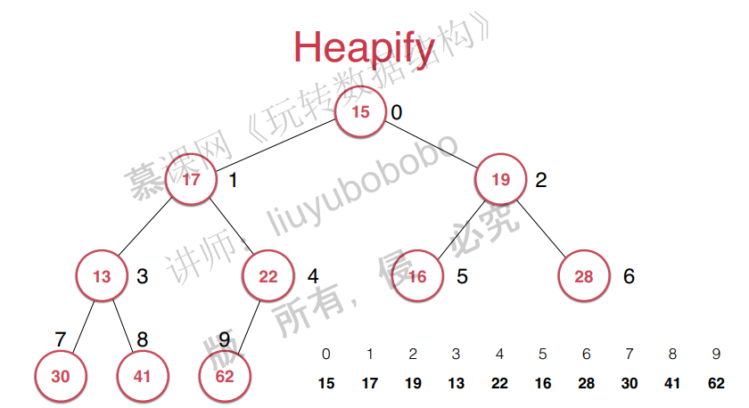

整理后的数组：

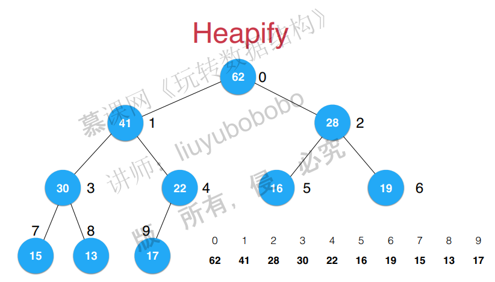

复杂度分析：

​	

### 6. 基于堆的优先队列的实现

java代码

~~~java
public class PriorityQueue<E extends Comparable<E>> implements Queue<E> {

    private MaxHeap<E> maxHeap;

    public PriorityQueue(){
        maxHeap = new MaxHeap<>();
    }

    @Override
    public int getSize(){
        return maxHeap.size();
    }

    @Override
    public boolean isEmpty(){
        return maxHeap.isEmpty();
    }

    @Override
    public E getFront(){
        return maxHeap.findMax();
    }

    @Override
    public void enqueue(E e){
        maxHeap.add(e);
    }

    @Override
    public E dequeue(){
        return maxHeap.extractMax();
    }
}
~~~

c++代码

~~~c++
#include"MaxHeap.h"
template<typename T>
class PriorityQueue {
private:
	MaxHeap<T> maxHeap;
public:
	PriorityQueue() {
		this->maxHeap =  MaxHeap<T>();
	}

	int getSize() {
		return maxHeap.size();
	}

	bool isEmpty() {
		return maxHeap.isEmpty();
	}

	T getFront() {
		return maxHeap.findMax();
	}

	void enqueue(T e) {
		maxHeap.add(e);
	}

	T dequeue() {
		return maxHeap.extractMax();
	}
};
~~~

### 7. Leetcode关于优先队列的题目

先来看一个面试题：


首先能想到的想法就是：将数组排序，这样的时间复杂度是O(nlogn)，然后选出前100个，时间复杂度还行。

但是能不能做得更好，答案就是使用优先队列。首先将100个元素加入到队列中，然后遍历数组，看是否比队列中的最小值大，大的话就加进队列。这样时间复杂度就变成了O(nlogM)。

看leetcode上的一道题：

求出一个数组的前k个高频数字。

### 8. 使用java标准库中的优先队列

pass

### 9. 和堆相关的更多话题和广义队列

这一章讲的是二叉堆，实际上还有：

d叉堆

索引堆（在图论中会用到）

二项堆

斐波那契堆

但这些不做要求，因此不要管。


广义队列：

只要出队入队就是队列，这样很多数据结构都可以看成队列，称为广义队列。

